# **Kubernetes – The Complete Interview Guide** 🚀

This ultimate guide covers Kubernetes from fundamentals to advanced concepts, with Java examples, industry best practices, and visual explanations to help you ace technical interviews.

---

## **Table of Contents** 📑
1. [What is Kubernetes?](#1-what-is-kubernetes)
2. [Kubernetes Architecture](#2-kubernetes-architecture)
3. [Core Components](#3-core-components)
4. [Workload Management](#4-workload-management)
5. [Networking](#5-networking)
6. [Storage](#6-storage)
7. [Java Application Deployment](#7-java-application-deployment)
8. [Scaling Strategies](#8-scaling-strategies)
9. [Security](#9-security)
10. [Monitoring & Logging](#10-monitoring--logging)
11. [Industry Best Practices](#11-industry-best-practices)
12. [When NOT to Use Kubernetes](#12-when-not-to-use-kubernetes)
13. [Big Company Approaches](#13-big-company-approaches)
14. [Visual Diagrams](#14-visual-diagrams)
15. [Comparison Tables](#15-comparison-tables)
16. [Interview Cheat Sheet](#16-interview-cheat-sheet)

---

## **1. What is Kubernetes?** 🏗️

Kubernetes (K8s) is an open-source container orchestration platform that automates deployment, scaling, and management of containerized applications.

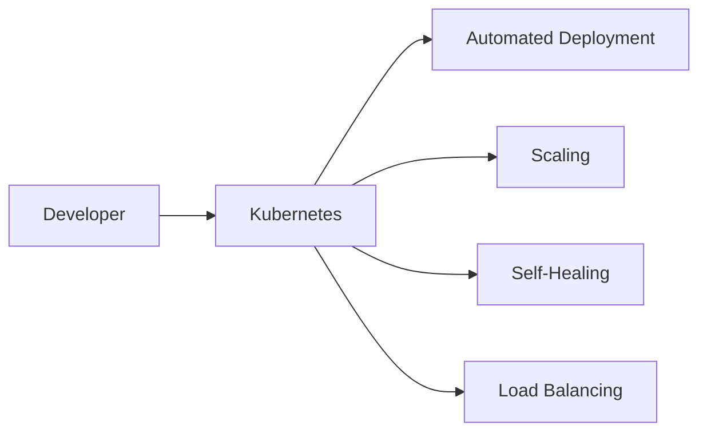

**Key Benefits:**
- High availability
- Horizontal scaling
- Disaster recovery
- Resource optimization

---

## **2. Kubernetes Architecture** 🏛️

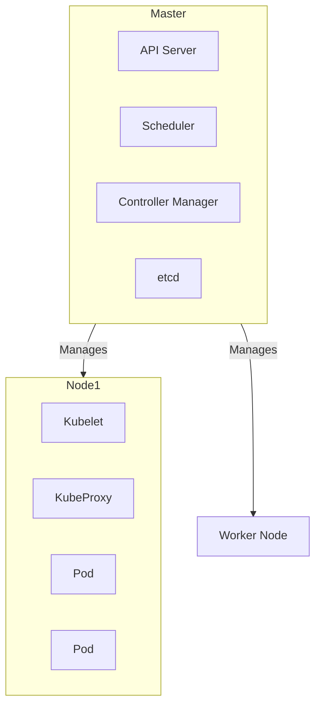

**Components:**
- **Control Plane**: Brain of K8s
- **Worker Nodes**: Run application workloads
- **Pods**: Smallest deployable units

---

## **3. Core Components** 🧩

### **3.1 Pods**
```yaml
apiVersion: v1
kind: Pod
metadata:
  name: java-app
spec:
  containers:
  - name: java-container
    image: my-java-app:1.0
    ports:
    - containerPort: 8080
```

### **3.2 Deployments**
```yaml
apiVersion: apps/v1
kind: Deployment
metadata:
  name: java-deployment
spec:
  replicas: 3
  selector:
    matchLabels:
      app: java-app
  template:
    metadata:
      labels:
        app: java-app
    spec:
      containers:
      - name: java
        image: my-java-app:1.0
```

### **3.3 Services**
```yaml
apiVersion: v1
kind: Service
metadata:
  name: java-service
spec:
  selector:
    app: java-app
  ports:
    - protocol: TCP
      port: 80
      targetPort: 8080
  type: LoadBalancer
```

---

## **4. Workload Management** 📦

### **4.1 Common Workload Types**
| Resource | Purpose | Java Use Case |
|----------|---------|--------------|
| Deployment | Stateless apps | REST APIs |
| StatefulSet | Stateful apps | Databases |
| DaemonSet | Node-level | Log collectors |
| Job/CronJob | Batch processing | Data pipelines |

### **4.2 Horizontal Pod Autoscaler**
```yaml
apiVersion: autoscaling/v2
kind: HorizontalPodAutoscaler
metadata:
  name: java-hpa
spec:
  scaleTargetRef:
    apiVersion: apps/v1
    kind: Deployment
    name: java-deployment
  minReplicas: 2
  maxReplicas: 10
  metrics:
  - type: Resource
    resource:
      name: cpu
      target:
        type: Utilization
        averageUtilization: 50
```

---

## **5. Networking** 🌐

### **5.1 Network Model**
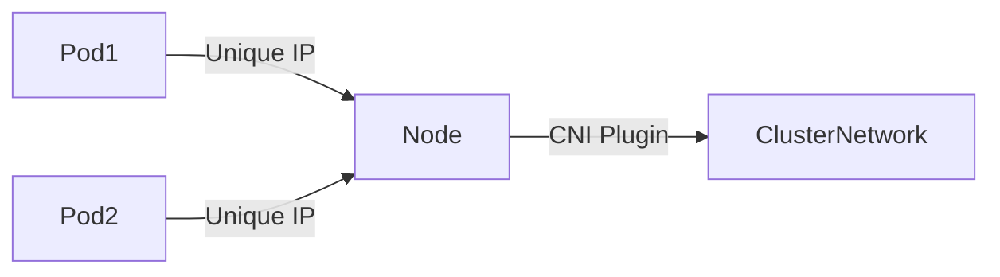

### **5.2 Ingress**
```yaml
apiVersion: networking.k8s.io/v1
kind: Ingress
metadata:
  name: java-ingress
  annotations:
    nginx.ingress.kubernetes.io/rewrite-target: /
spec:
  rules:
  - host: myjavaapp.com
    http:
      paths:
      - path: /
        pathType: Prefix
        backend:
          service:
            name: java-service
            port:
              number: 80
```

---

## **6. Storage** 💾

### **6.1 Persistent Volumes**
```yaml
apiVersion: v1
kind: PersistentVolumeClaim
metadata:
  name: java-pvc
spec:
  accessModes:
    - ReadWriteOnce
  resources:
    requests:
      storage: 5Gi
```

### **6.2 Using Volumes in Pods**
```yaml
spec:
  containers:
  - name: java
    image: my-java-app
    volumeMounts:
    - mountPath: "/data"
      name: storage
  volumes:
  - name: storage
    persistentVolumeClaim:
      claimName: java-pvc
```

---

## **7. Java Application Deployment** ☕

### **7.1 Spring Boot Deployment**
```yaml
apiVersion: apps/v1
kind: Deployment
metadata:
  name: springboot-app
spec:
  replicas: 3
  selector:
    matchLabels:
      app: springboot
  template:
    metadata:
      labels:
        app: springboot
    spec:
      containers:
      - name: springboot
        image: my-springboot-app:2.6.0
        ports:
        - containerPort: 8080
        env:
        - name: SPRING_PROFILES_ACTIVE
          value: "prod"
        resources:
          limits:
            memory: "1Gi"
            cpu: "500m"
```

### **7.2 ConfigMaps for Java Apps**
```yaml
apiVersion: v1
kind: ConfigMap
metadata:
  name: java-config
data:
  application.properties: |
    server.port=8080
    spring.datasource.url=jdbc:mysql://db-service:3306/mydb
```

---

## **8. Scaling Strategies** 📈

### **8.1 Horizontal Scaling**
```bash
kubectl scale deployment java-deployment --replicas=5
```

### **8.2 Cluster Autoscaling**
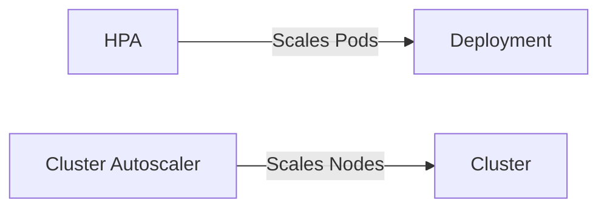

---

## **9. Security** 🔒

### **9.1 RBAC**
```yaml
apiVersion: rbac.authorization.k8s.io/v1
kind: Role
metadata:
  name: java-dev
rules:
- apiGroups: [""]
  resources: ["pods", "services"]
  verbs: ["get", "list", "create"]
```

### **9.2 Security Context**
```yaml
spec:
  securityContext:
    runAsNonRoot: true
    runAsUser: 1000
  containers:
  - name: java
    securityContext:
      allowPrivilegeEscalation: false
      capabilities:
        drop: ["ALL"]
```

---

## **10. Monitoring & Logging** 📊

### **10.1 Prometheus Monitoring**
```yaml
apiVersion: monitoring.coreos.com/v1
kind: ServiceMonitor
metadata:
  name: java-monitor
spec:
  selector:
    matchLabels:
      app: java-app
  endpoints:
  - port: http
    path: /actuator/prometheus
```

### **10.2 EFK Stack**
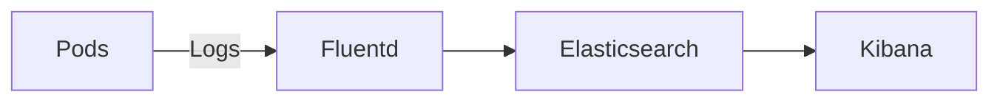

---

## **11. Industry Best Practices** 💡

1. **Use Readiness/Liveness Probes**
   ```yaml
   livenessProbe:
     httpGet:
       path: /actuator/health
       port: 8080
     initialDelaySeconds: 30
     periodSeconds: 10
   ```

2. **Resource Limits**
   ```yaml
   resources:
     limits:
       cpu: "1"
       memory: "1Gi"
     requests:
       cpu: "500m"
       memory: "512Mi"
   ```

3. **Immutable Deployments**
   ```bash
   kubectl set image deployment/java-deployment java=my-java-app:2.0
   ```

4. **Namespace Strategy**
   ```bash
   kubectl create namespace dev
   kubectl create namespace prod
   ```

---

## **12. When NOT to Use Kubernetes** ❌

| Scenario | Reason | Alternative |
|----------|--------|-------------|
| Small projects | Overhead | Docker Compose |
| Simple apps | Unnecessary complexity | PaaS |
| Monolithic apps | Not designed for K8s | Traditional VMs |
| Low budget | Costly to operate | Serverless |

---

## **13. Big Company Approaches** 🏢

### **13.1 Spotify**
- 1000+ microservices
- Custom operator for canary deployments

### **13.2 Airbnb**
- 2500+ nodes
- Service mesh with Istio

### **13.3 Goldman Sachs**
- Multi-cluster federation
- Strict network policies

---

## **14. Visual Diagrams** 📊

### **K8s Cluster Overview**
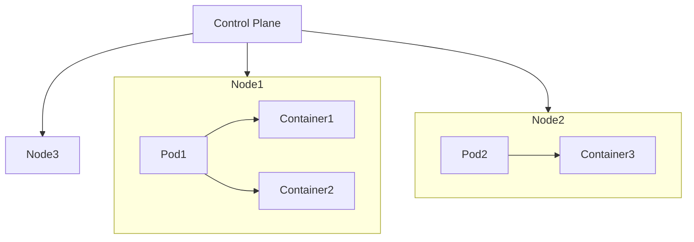

### **Request Flow**
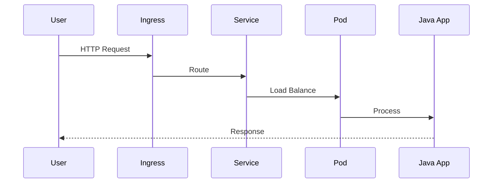

---

## **15. Comparison Tables** 📋

### **K8s vs Docker Swarm**
| Feature | Kubernetes | Docker Swarm |
|---------|------------|-------------|
| **Scaling** | Automatic | Manual |
| **Learning Curve** | Steep | Easy |
| **Enterprise Use** | Extensive | Limited |
| **Community** | Large | Smaller |

### **K8s Distributions**
| Distribution | Vendor | Best For |
|-------------|--------|----------|
| EKS | AWS | Cloud-native |
| GKE | Google | Managed K8s |
| AKS | Azure | Hybrid cloud |
| OpenShift | Red Hat | Enterprises |

---

## **16. Interview Cheat Sheet** 🎯

### **Key Concepts**
1. **Pods**: Smallest deployable units
2. **Deployments**: Manage pod replicas
3. **Services**: Network endpoints
4. **Controllers**: Maintain desired state

### **Common Questions**
1. Explain Kubernetes architecture
2. How do deployments work?
3. Difference between StatefulSet and Deployment
4. How to troubleshoot a crashing pod?
5. Explain Kubernetes networking

### **Pro Tips**
- Always mention real-world scale
- Discuss both pros AND cons
- Relate to business impact
- Know basic kubectl commands

```bash
# Essential Commands
kubectl get pods
kubectl describe pod <name>
kubectl logs <pod>
kubectl exec -it <pod> -- bash
kubectl apply -f file.yaml
```

# **Why Kubernetes? The Complete Guide with Cheat Sheet** 🚀

This comprehensive guide explains the critical problems Kubernetes solves, how large systems leverage it, and provides a complete interview cheat sheet with visual aids.

## **Table of Contents**
1. [The Pre-Kubernetes Problems](#1-the-pre-kubernetes-problems)
2. [How Kubernetes Solves These](#2-how-kubernetes-solves-these)
3. [Enterprise Adoption Patterns](#3-enterprise-adoption-patterns)
4. [Kubernetes Cheat Sheet](#4-kubernetes-cheat-sheet)
5. [Interview Q&A](#5-interview-qa)

---

## **1. The Pre-Kubernetes Problems** 🔥

### **1.1 The "Works in Dev, Fails in Prod" Nightmare**
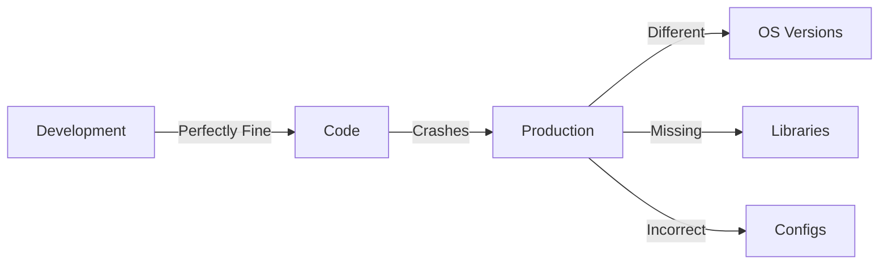

**Real Example:**  
A Java app works with OpenJDK 11.0.12 in dev but fails in prod with 11.0.9 due to GC behavior changes.

### **1.2 Manual Scaling Chaos**
```bash
# Traditional scaling (2010s)
1. SSH into each server
2. Start new JVM instances
3. Configure load balancer
4. Hope nothing crashes
5. Repeat during traffic spikes
```

### **1.3 Downtime Disasters**
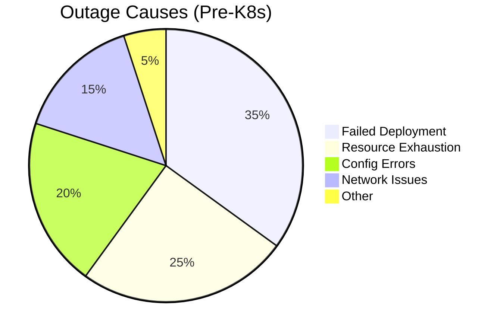

### **1.4 Resource Wastage**
```bash
# Typical 2015 infrastructure
10 servers @ 20% CPU utilization
$15,000/month wasted cloud spend
```

---

## **2. How Kubernetes Solves These** 🛠️

### **2.1 Declarative Deployments**
```yaml
# deployment.yaml
apiVersion: apps/v1
kind: Deployment
metadata:
  name: java-app
spec:
  replicas: 3  # Kubernetes ensures exactly 3 pods run
  template:
    spec:
      containers:
      - name: java
        image: my-java-app:1.5.0
        resources:
          limits:
            cpu: "1"
            memory: "1Gi"
```

### **2.2 Self-Healing Magic**
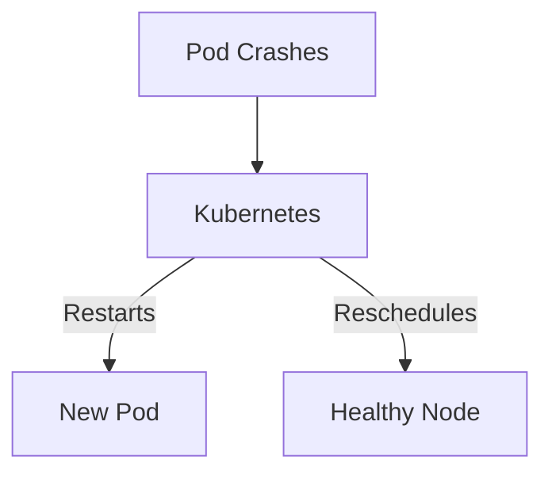

### **2.3 Efficient Scaling**
```bash
# Scale up during Black Friday
kubectl autoscale deployment java-app --min=5 --max=50 --cpu-percent=70
```

### **2.4 Multi-Cloud Portability**
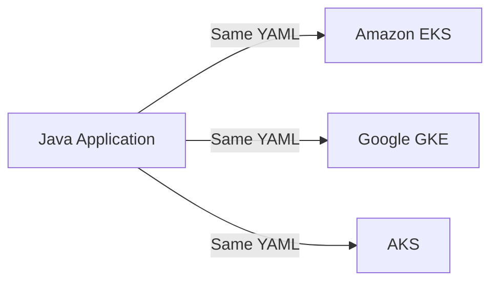

---

## **3. Enterprise Adoption Patterns** 🏢

### **3.1 Global Scale: Spotify**
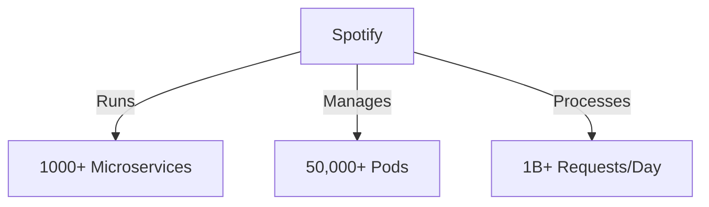

**Key Tools:**
- Custom operators for canary releases
- Backstage for developer portal

### **3.2 Financial Systems: Goldman Sachs**
```yaml
# security.yaml
apiVersion: networking.k8s.io/v1
kind: NetworkPolicy
metadata:
  name: java-policy
spec:
  podSelector:
    matchLabels:
      app: trading-engine
  policyTypes:
  - Ingress
  - Egress
  ingress:
  - from:
    - podSelector:
        matchLabels:
          role: risk-analysis
```

### **3.3 E-Commerce: Airbnb**
```bash
# Their scaling approach
kubectl get hpa -n payments
# NAME         REFERENCE               TARGETS   MINPODS MAXPODS
# payment-api  Deployment/payment-api  45%/50%   10      200
```

---

## **4. Kubernetes Cheat Sheet** 📋

### **4.1 Essential Commands**
| Command | Description |
|---------|-------------|
| `kubectl get pods` | List pods |
| `kubectl describe pod <name>` | Debug pod |
| `kubectl logs -f <pod>` | Stream logs |
| `kubectl exec -it <pod> -- bash` | Enter container |
| `kubectl apply -f file.yaml` | Declarative update |
| `kubectl rollout status deployment/<name>` | Check updates |

### **4.2 Key Components**
| Object | Purpose | Java Example |
|--------|---------|--------------|
| Pod | Smallest unit | JVM instance |
| Deployment | Stateless apps | Spring Boot |
| StatefulSet | Stateful apps | Kafka, DBs |
| Service | Networking | Load balancing |
| ConfigMap | Configuration | application.properties |

### **4.3 YAML Skeleton**
```yaml
apiVersion: apps/v1  # Version
kind: Deployment     # Object type
metadata:            # Identification
  name: java-app
spec:                # Desired state
  replicas: 3
  selector:          # Pod selection
    matchLabels:
      app: java-app
  template:          # Pod template
    metadata:
      labels:
        app: java-app
    spec:
      containers:
      - name: java
        image: my-java-app:1.5.0
        ports:
        - containerPort: 8080
```

---

## **5. Interview Q&A** 💡

### **Q1: Why use Kubernetes over Docker alone?**
**A:**
```markdown
- **Scaling**: K8s automatically scales apps vs manual Docker scaling
- **Self-healing**: Restarts failed containers vs Docker's manual recovery
- **Networking**: Built-in service discovery vs custom Docker links
- **Rollouts**: Blue-green deployments vs manual Docker container swaps
```

### **Q2: Explain Kubernetes architecture**
**A:**
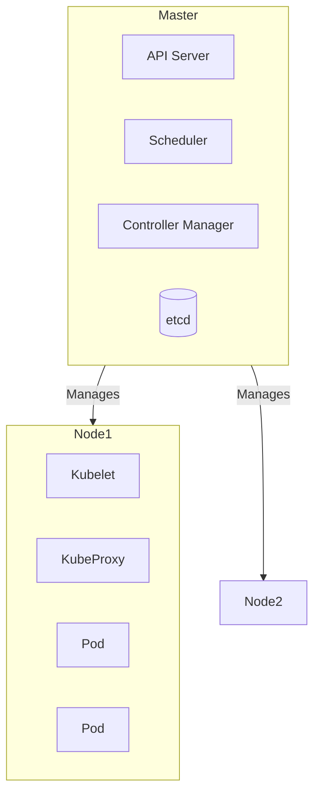

### **Q3: How do rolling updates work?**
**A:**
```yaml
# deployment.yaml
spec:
  strategy:
    type: RollingUpdate
    rollingUpdate:
      maxSurge: 25%
      maxUnavailable: 25%
```
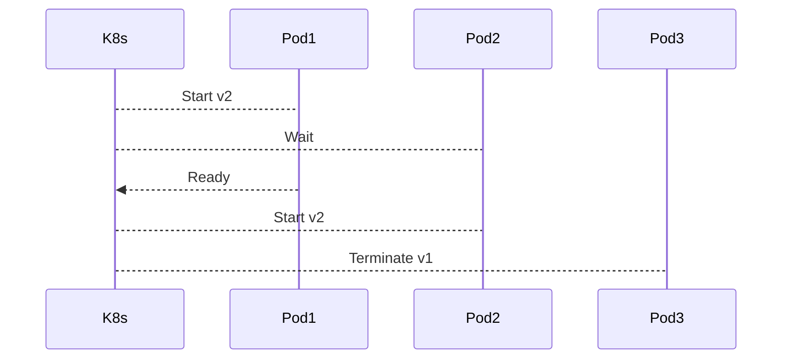

### **Q4: Debug a crashing pod**
**A:**
```bash
1. kubectl get pods -w            # Watch pod status
2. kubectl describe pod <name>    # Check events
3. kubectl logs <pod>             # View logs
4. kubectl exec -it <pod> -- bash # Inspect container
5. Check:
   - Resource limits
   - Liveness probes
   - Container exit code
```

### **Q5: Secure Kubernetes?**
**A:**
```markdown
1. **RBAC**: Limit user permissions
2. **Network Policies**: Restrict pod communication
3. **Pod Security**: Run as non-root
4. **Image Scanning**: Check for vulnerabilities
5. **Audit Logging**: Monitor API calls
```

### **Q6: Kubernetes vs Serverless?**
**A:**
| Factor | Kubernetes | Serverless |
|--------|------------|------------|
| **Control** | High | Low |
| **Scaling** | Manual/Auto | Fully Auto |
| **Cost** | Pay for nodes | Pay per exec |
| **Use Case** | Microservices | Event-driven |

### **Q7: What are Operators?**
**A:**
```yaml
# Example Java operator
apiVersion: apps/v1
kind: Deployment
metadata:
  name: java-operator
spec:
  template:
    spec:
      containers:
      - name: operator
        image: java-operator:1.0
        env:
        - name: WATCH_NAMESPACE
          value: "production"
```
**Purpose:** Custom controllers for complex apps (DBs, middleware)

---

## **Key Takeaways for Interviews** 🎯

1. **Understand Pain Points**: Explain pre-K8s problems clearly
2. **Architecture Diagrams**: Draw control plane + workers
3. **Real-World Scale**: Cite Spotify/Airbnb numbers
4. **Hands-On Commands**: Master `kubectl` basics
5. **Security Awareness**: Discuss RBAC, network policies

**Pro Tip:** Always connect answers to business value:
- Self-healing → reduced downtime → higher revenue
- Efficient scaling → cost savings → better margins
- Portability → no vendor lock-in → flexibility
