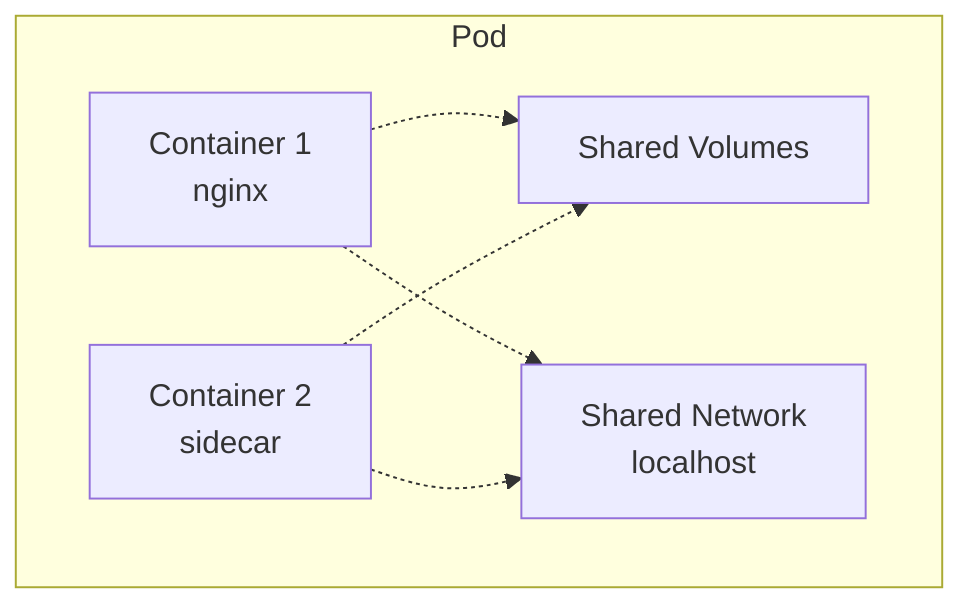
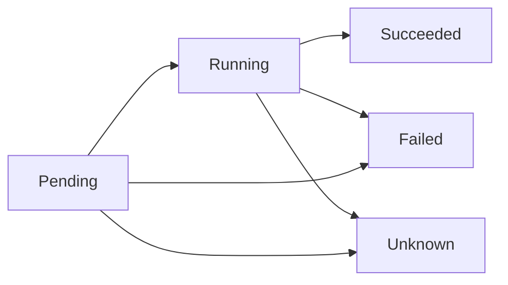
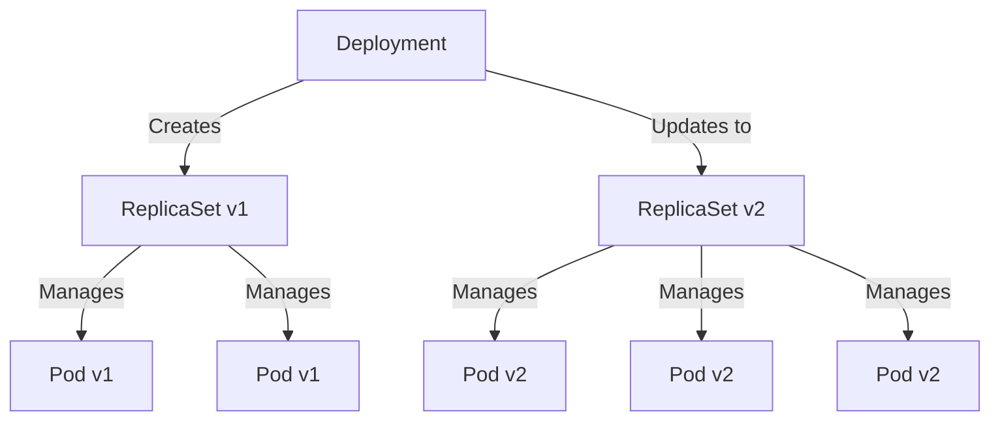

# **Kubernetes Pods & Deployments** 🐳

**Complete guide to Kubernetes workload resources - Pods, ReplicaSets, Deployments, StatefulSets, and DaemonSets**

---

## **Table of Contents** 📑
1. [Understanding Pods](#1-understanding-pods)
2. [Pod Lifecycle & Phases](#2-pod-lifecycle--phases)
3. [Multi-Container Pods](#3-multi-container-pods)
4. [ReplicaSets](#4-replicasets)
5. [Deployments](#5-deployments)
6. [StatefulSets](#6-statefulsets)
7. [DaemonSets](#7-daemonsets)
8. [Jobs & CronJobs](#8-jobs--cronjobs)
9. [DevOps Use Cases](#9-devops-use-cases)
10. [Troubleshooting](#10-troubleshooting)
11. [Best Practices](#11-best-practices)
12. [Interview Cheat Sheet](#12-interview-cheat-sheet)

---

## **1. Understanding Pods** 🐋

### **What is a Pod?**

A Pod is the smallest deployable unit in Kubernetes. It represents a single instance of a running process in your cluster.



**Key Characteristics**:
- Pods share network namespace (same  IP address)
- Pods share storage volumes
- Containers in a Pod can communicate via localhost
- Smallest scalable unit

### **Simple Pod Manifest**

```yaml
apiVersion: v1
kind: Pod
metadata:
  name: nginx-pod
  labels:
    app: nginx
    tier: frontend
spec:
  containers:
  - name: nginx
    image: nginx:1.21
    ports:
    - containerPort: 80
    resources:
      requests:
        memory: "64Mi"
        cpu: "250m"
      limits:
        memory: "128Mi"
        cpu: "500m"
```

### **Create and Manage Pods**

```bash
# Create pod from file
kubectl apply -f pod.yaml

# Create pod imperatively
kubectl run nginx --image=nginx:1.21

# List pods
kubectl get pods
kubectl get pods -o wide

# Describe pod
kubectl describe pod nginx-pod

# Delete pod
kubectl delete pod nginx-pod

# Get pod logs
kubectl logs nginx-pod

# Execute command in pod
kubectl exec -it nginx-pod -- /bin/bash
```

---

## **2. Pod Lifecycle & Phases** 🔄

### **Pod Phases**



| Phase | Description |
|-------|-------------|
| **Pending** | Pod accepted but not yet running (downloading images, waiting for scheduling) |
| **Running** | Pod bound to node, at least one container running |
| **Succeeded** | All containers terminated successfully (won't restart) |
| **Failed** | All containers terminated, at least one failed |
| **Unknown** | Pod state cannot be determined (node communication issue) |

### **Container States**

```yaml
# Check container state
kubectl get pod nginx-pod -o jsonpath='{.status.containerStatuses[*].state}'
```

**States**:
- **Waiting**: Container not yet running (pulling image, waiting for dependencies)
- **Running**: Container is executing
- **Terminated**: Container finished execution or failed

### **Pod Conditions**

```bash
# Check pod conditions
kubectl describe pod nginx-pod | grep -A 5 Conditions
```

| Condition | Description |
|-----------|-------------|
| **PodScheduled** | Pod has been scheduled to a node |
| **Initialized** | All init containers completed successfully |
| **ContainersReady** | All containers ready |
| **Ready** | Pod can serve requests |

### **Init Containers**

```yaml
apiVersion: v1
kind: Pod
metadata:
  name: myapp-pod
spec:
  initContainers:
  - name: init-myservice
    image: busybox:1.28
    command: ['sh', '-c', 'until nslookup myservice; do echo waiting for myservice; sleep 2; done;']
  - name: init-mydb
    image: busybox:1.28
    command: ['sh', '-c', 'until nslookup mydb; do echo waiting for mydb; sleep 2; done;']
  containers:
  - name: myapp-container
    image: busybox:1.28
    command: ['sh', '-c', 'echo The app is running! && sleep 3600']
```

### **Liveness & Readiness Probes**

```yaml
apiVersion: v1
kind: Pod
metadata:
  name: probe-demo
spec:
  containers:
  - name: app
    image: nginx:1.21
    ports:
    - containerPort: 80
    livenessProbe:
      httpGet:
        path: /healthz
        port: 80
      initialDelaySeconds: 3
      periodSeconds: 3
    readinessProbe:
      httpGet:
        path: /ready
        port: 80
      initialDelaySeconds: 5
      periodSeconds: 5
    startupProbe:
      httpGet:
        path: /startup
        port: 80
      failureThreshold: 30
      periodSeconds: 10
```

**Probe Types**:
- **Liveness**: Is container alive? (restart if fails)
- **Readiness**: Can container serve traffic? (remove from service if fails)
- **Startup**: Has container started? (for slow-starting apps)

**Probe Methods**:
- **httpGet**: HTTP GET request
- **tcpSocket**: TCP connection attempt
- **exec**: Execute command in container

---

## **3. Multi-Container Pods** 🔀

### **Sidecar Pattern**

```yaml
apiVersion: v1
kind: Pod
metadata:
  name: sidecar-pod
spec:
  containers:
  # Main application
  - name: app
    image: myapp:1.0
    volumeMounts:
    - name: shared-logs
      mountPath: /var/log/app
  # Sidecar: Log aggregator
  - name: log-aggregator
    image: fluentd:latest
    volumeMounts:
    - name: shared-logs
      mountPath: /var/log/app
  volumes:
  - name: shared-logs
    emptyDir: {}
```

**Use Cases**:
- Log shipping (Fluentd, Filebeat)
- Monitoring agents
- Service mesh proxies (Istio, Linkerd)

### **Ambassador Pattern**

```yaml
apiVersion: v1
kind: Pod
metadata:
  name: ambassador-pod
spec:
  containers:
  # Main application
  - name: app
    image: myapp:1.0
    env:
    - name: DATABASE_URL
      value: "localhost:5432"  # Connects via ambassador
  # Ambassador: Database proxy
  - name: db-proxy
    image: haproxy:latest
    ports:
    - containerPort: 5432
```

**Use Cases**:
- Database proxy
- Redis proxy
- External API proxy

### **Adapter Pattern**

```yaml
apiVersion: v1
kind: Pod
metadata:
  name: adapter-pod
spec:
  containers:
  # Main application (legacy format logs)
  - name: legacy-app
    image: legacy-app:1.0
    volumeMounts:
    - name: logs
      mountPath: /var/log
  # Adapter: Convert logs to standard format
  - name: log-adapter
    image: log-normalizer:latest
    volumeMounts:
    - name: logs
      mountPath: /var/log
  volumes:
  - name: logs
    emptyDir: {}
```

**Use Cases**:
- Log format normalization
- Metrics format conversion
- Protocol translation

---

## **4. ReplicaSets** 📦

### **What is a ReplicaSet?**

ReplicaSet ensures a specified number of pod replicas are running at any time.

```yaml
apiVersion: apps/v1
kind: ReplicaSet
metadata:
  name: nginx-replicaset
  labels:
    app: nginx
spec:
  replicas: 3
  selector:
    matchLabels:
      app: nginx
  template:
    metadata:
      labels:
        app: nginx
    spec:
      containers:
      - name: nginx
        image: nginx:1.21
        ports:
        - containerPort: 80
```

### **ReplicaSet Operations**

```bash
# Get ReplicaSets
kubectl get replicasets
kubectl get rs

# Describe ReplicaSet
kubectl describe rs nginx-replicaset

# Scale ReplicaSet
kubectl scale rs nginx-replicaset --replicas=5

# Delete ReplicaSet (and pods)
kubectl delete rs nginx-replicaset

# Delete ReplicaSet (keep pods)
kubectl delete rs nginx-replicaset --cascade=orphan
```

### **ReplicaSet vs Deployment**

```
DON'T use ReplicaSet directly in production!
USE Deployment instead.

Deployment = ReplicaSet + Rollout management + History + Rollback
```

---

## **5. Deployments** 🚀

### **What is a Deployment?**

Deployment provides declarative updates for Pods and ReplicaSets.



### **Deployment Manifest**

```yaml
apiVersion: apps/v1
kind: Deployment
metadata:
  name: nginx-deployment
  labels:
    app: nginx
spec:
  replicas: 3
  strategy:
    type: RollingUpdate
    rollingUpdate:
      maxSurge: 1
      maxUnavailable: 1
  selector:
    matchLabels:
      app: nginx
  template:
    metadata:
      labels:
        app: nginx
    spec:
      containers:
      - name: nginx
        image: nginx:1.21
        ports:
        - containerPort: 80
        resources:
          requests:
            memory: "64Mi"
            cpu: "250m"
          limits:
            memory: "128Mi"
            cpu: "500m"
        livenessProbe:
          httpGet:
            path: /
            port: 80
          initialDelaySeconds: 30
          periodSeconds: 10
        readinessProbe:
          httpGet:
            path: /
            port: 80
          initialDelaySeconds: 5
          periodSeconds: 5
```

### **Deployment Strategies**

**1. RollingUpdate (Default)**

```yaml
spec:
  strategy:
    type: RollingUpdate
    rollingUpdate:
      maxSurge: 1        # Max extra pods during update
      maxUnavailable: 1  # Max unavailable pods during update
```

**2. Recreate**

```yaml
spec:
  strategy:
    type: Recreate  # Kill all old pods, then create new ones
```

**Comparison**:

| Strategy | Downtime | Resource Usage | Use Case |
|----------|----------|----------------|----------|
| **RollingUpdate** | Zero downtime | Higher (overlapping versions) | Stateless apps, default choice |
| **Recreate** | Brief downtime | Lower | Stateful apps, database migrations |

### **Deployment Operations**

```bash
# Create deployment
kubectl create deployment nginx --image=nginx:1.21 --replicas=3

# Apply from file
kubectl apply -f deployment.yaml

# Get deployments
kubectl get deployments
kubectl get deploy

# Describe deployment
kubectl describe deployment nginx-deployment

# Scale deployment
kubectl scale deployment nginx-deployment --replicas=5

# Update image (rolling update)
kubectl set image deployment/nginx-deployment nginx=nginx:1.22

# Edit deployment
kubectl edit deployment nginx-deployment

# Delete deployment
kubectl delete deployment nginx-deployment
```

### **Rollout Management**

```bash
# Check rollout status
kubectl rollout status deployment/nginx-deployment

# View rollout history
kubectl rollout history deployment/nginx-deployment

# View specific revision
kubectl rollout history deployment/nginx-deployment --revision=2

# Pause rollout
kubectl rollout pause deployment/nginx-deployment

# Resume rollout
kubectl rollout resume deployment/nginx-deployment

# Rollback to previous version
kubectl rollout undo deployment/nginx-deployment

# Rollback to specific revision
kubectl rollout undo deployment/nginx-deployment --to-revision=2

# Restart deployment (rolling restart)
kubectl rollout restart deployment/nginx-deployment
```

### **Horizontal Pod Autoscaler (HPA)**

```yaml
apiVersion: autoscaling/v2
kind: HorizontalPodAutoscaler
metadata:
  name: nginx-hpa
spec:
  scaleTargetRef:
    apiVersion: apps/v1
    kind: Deployment
    name: nginx-deployment
  minReplicas: 2
  maxReplicas: 10
  metrics:
  - type: Resource
    resource:
      name: cpu
      target:
        type: Utilization
        averageUtilization: 80
  - type: Resource
    resource:
      name: memory
      target:
        type: Utilization
        averageUtilization: 80
```

```bash
# Create HPA imperatively
kubectl autoscale deployment nginx-deployment --min=2 --max=10 --cpu-percent=80

# Get HPA
kubectl get hpa

# Describe HPA
kubectl describe hpa nginx-hpa

# Delete HPA
kubectl delete hpa nginx-hpa
```

---

## **6. StatefulSets** 💾

### **What is a StatefulSet?**

StatefulSet manages stateful applications that require:
- Stable network identities
- Stable persistent storage
- Ordered deployment and scaling

```yaml
apiVersion: apps/v1
kind: StatefulSet
metadata:
  name: mysql
spec:
  serviceName: mysql
  replicas: 3
  selector:
    matchLabels:
      app: mysql
  template:
    metadata:
      labels:
        app: mysql
    spec:
      containers:
      - name: mysql
        image: mysql:8.0
        env:
        - name: MYSQL_ROOT_PASSWORD
          valueFrom:
            secretKeyRef:
              name: mysql-secret
              key: password
        ports:
        - containerPort: 3306
        volumeMounts:
        - name: mysql-storage
          mountPath: /var/lib/mysql
  volumeClaimTemplates:
  - metadata:
      name: mysql-storage
    spec:
      accessModes: [ "ReadWriteOnce" ]
      storageClassName: "standard"
      resources:
        requests:
          storage: 10Gi
```

### **StatefulSet vs Deployment**

| Feature | StatefulSet | Deployment |
|---------|-------------|------------|
| **Pod Names** | Predictable (mysql-0, mysql-1) | Random hash |
| **Storage** | Persistent per pod | Shared or ephemeral |
| **Scaling** | Ordered (0→1→2) | Parallel |
| **Updates** | Ordered rollout | Rolling update |
| **Use Case** | Databases, queues | Stateless apps |

### **Headless Service for StatefulSet**

```yaml
apiVersion: v1
kind: Service
metadata:
  name: mysql
spec:
  clusterIP: None  # Headless service
  selector:
    app: mysql
  ports:
  - port: 3306
```

**DNS Records**:
```
mysql-0.mysql.default.svc.cluster.local
mysql-1.mysql.default.svc.cluster.local
mysql-2.mysql.default.svc.cluster.local
```

---

## **7. DaemonSets** 👥

### **What is a DaemonSet?**

DaemonSet ensures a copy of a Pod runs on all (or selected) nodes.

```yaml
apiVersion: apps/v1
kind: DaemonSet
metadata:
  name: fluentd
  namespace: kube-system
spec:
  selector:
    matchLabels:
      app: fluentd
  template:
    metadata:
      labels:
        app: fluentd
    spec:
      containers:
      - name: fluentd
        image: fluentd:latest
        volumeMounts:
        - name: varlog
          mountPath: /var/log
        - name: varlibdockercontainers
          mountPath: /var/lib/docker/containers
          readOnly: true
      volumes:
      - name: varlog
        hostPath:
          path: /var/log
      - name: varlibdockercontainers
        hostPath:
          path: /var/lib/docker/containers
```

### **Common DaemonSet Use Cases**

- **Log collection**: Fluentd, Filebeat, Logstash
- **Monitoring**: Prometheus Node Exporter, Datadog agent
- **Network**: Calico, Weave, kube-proxy
- **Storage**: GlusterFS, Ceph

### **Node Selection**

```yaml
spec:
  template:
    spec:
      nodeSelector:
        disktype: ssd
      # Or use affinity
      affinity:
        nodeAffinity:
          requiredDuringSchedulingIgnoredDuringExecution:
            nodeSelectorTerms:
            - matchExpressions:
              - key: kubernetes.io/os
                operator: In
                values:
                - linux
```

---

## **8. Jobs & CronJobs** ⏰

### **Jobs**

```yaml
apiVersion: batch/v1
kind: Job
metadata:
  name: data-migration
spec:
  parallelism: 2            # Run 2 pods in parallel
  completions: 10           # Complete 10 successful pods
  backoffLimit: 4           # Retry 4 times on failure
  template:
    spec:
      containers:
      - name: migration
        image: migration-tool:1.0
        command: ["./migrate.sh"]
      restartPolicy: Never  # Or OnFailure
```

```bash
# Create job
kubectl apply -f job.yaml

# Get jobs
kubectl get jobs

# Get pods from job
kubectl get pods --selector=job-name=data-migration

# View job logs
kubectl logs job/data-migration

# Delete job
kubectl delete job data-migration
```

### **CronJobs**

```yaml
apiVersion: batch/v1
kind: CronJob
metadata:
  name: backup-job
spec:
  schedule: "0 2 * * *"  # Daily at 2 AM
  jobTemplate:
    spec:
      template:
        spec:
          containers:
          - name: backup
            image: backup-tool:1.0
            command:
            - /bin/sh
            - -c
            - ./backup.sh && echo "Backup completed"
          restartPolicy: OnFailure
  successfulJobsHistoryLimit: 3
  failedJobsHistoryLimit: 1
```

**Cron Schedule Format**:
```
# ┌───────────── minute (0 - 59)
# │ ┌───────────── hour (0 - 23)
# │ │ ┌───────────── day of month (1 - 31)
# │ │ │ ┌───────────── month (1 - 12)
# │ │ │ │ ┌───────────── day of week (0 - 6) (Sunday=0)
# │ │ │ │ │
# * * * * *

Examples:
"0 2 * * *"       # Daily at 2 AM
"30 */6 * * *"    # Every 6 hours at :30
"0 0 * * 0"       # Weekly on Sunday midnight
"0 0 1 * *"       # Monthly on 1st day
```

---

## **9. DevOps Use Cases** 🚀

### **Microservices Application**

```yaml
# Frontend Deployment
apiVersion: apps/v1
kind: Deployment
metadata:
  name: frontend
spec:
  replicas: 3
  selector:
    matchLabels:
      app: frontend
  template:
    metadata:
      labels:
        app: frontend
    spec:
      containers:
      - name: react-app
        image: company/frontend:v2.0
        ports:
        - containerPort: 3000
---
# API Deployment
apiVersion: apps/v1
kind: Deployment
metadata:
  name: api
spec:
  replicas: 5
  selector:
    matchLabels:
      app: api
  template:
    metadata:
      labels:
        app: api
    spec:
      containers:
      - name: api
        image: company/api:v3.1
        ports:
        - containerPort: 8080
        env:
        - name: DATABASE_URL
          valueFrom:
            secretKeyRef:
              name: db-credentials
              key: url
---
# Database StatefulSet
apiVersion: apps/v1
kind: StatefulSet
metadata:
  name: postgres
spec:
  serviceName: postgres
  replicas: 1
  selector:
    matchLabels:
      app: postgres
  template:
    metadata:
      labels:
        app: postgres
    spec:
      containers:
      - name: postgres
        image: postgres:14
        env:
        - name: POSTGRES_PASSWORD
          valueFrom:
            secretKeyRef:
              name: db-credentials
              key: password
        volumeMounts:
        - name: postgres-storage
          mountPath: /var/lib/postgresql/data
  volumeClaimTemplates:
  - metadata:
      name: postgres-storage
    spec:
      accessModes: ["ReadWriteOnce"]
      resources:
        requests:
          storage: 20Gi
```

### **Scheduled Database Backup**

```yaml
apiVersion: batch/v1
kind: CronJob
metadata:
  name: db-backup
spec:
  schedule: "0 3 * * *"  # Daily at 3 AM
  jobTemplate:
    spec:
      template:
        spec:
          containers:
          - name: backup
            image: postgres:14
            command:
            - /bin/bash
            - -c
            - |
              pg_dump -h postgres -U admin mydb > /backup/db-$(date +%Y%m%d).sql
              aws s3 cp /backup/db-$(date +%Y%m%d).sql s3://backups/
            env:
            - name: PGPASSWORD
              valueFrom:
                secretKeyRef:
                  name: db-credentials
                  key: password
            volumeMounts:
            - name: backup-dir
              mountPath: /backup
          restartPolicy: OnFailure
          volumes:
          - name: backup-dir
            emptyDir: {}
```

---

## **10. Troubleshooting** 🔧

### **Pod Not Starting**

```bash
# 1. Check pod status
kubectl get pods
kubectl describe pod <pod-name>

# Common issues:

# ImagePullBackOff
# - Wrong image name/tag
# - Authentication issues
# - Image doesn't exist
kubectl logs <pod-name>

# CrashLoopBackOff
# - Application crashing
# - Missing dependencies
kubectl logs <pod-name> --previous

# Pending
# - Insufficient resources
# - Node selector mismatch
kubectl describe pod <pod-name> | grep Events
kubectl describe nodes
```

### **Deployment Rollout Issues**

```bash
# Check rollout status
kubectl rollout status deployment/<name>

# Check replica sets
kubectl get rs

# Check events
kubectl get events --sort-by='.lastTimestamp'

# Rollback
kubectl rollout undo deployment/<name>
```

---

## **11. Best Practices** ⭐

```
✅ Always set resource requests and limits
✅ Use liveness and readiness probes
✅ Use Deployments, not bare Pods
✅ Label resources consistently
✅ Use namespaces for organization
✅ Implement proper logging
✅ Use init containers for setup tasks
✅ Set appropriate restart policies
✅ Use rolling updates for zero downtime
✅ Monitor pod health and metrics

❌ Don't use latest tag in production
❌ Don't skip resource limits (OOM kills)
❌ Don't ignore failed pods
❌ Don't run privileged containers unnecessarily
❌ Don't store data in ephemeral storage
❌ Don't use hostPath volumes in production
❌ Don't skip health checks
```

---

## **12. Interview Cheat Sheet** 🎯

### **Q1: Pod vs Container?**
```
Container:
- Single runtime instance
- Runs one process
- Docker/containerd concept

Pod:
- Group of 1+ containers
- Share network and storage
- Smallest unit in Kubernetes
- Can have main + sidecar containers
```

### **Q2: Deployment vs StatefulSet?**
```
Deployment (Stateless):
- Random pod names
- Interchangeable pods
- Shared storage (optional)
- Parallel scaling
- Use: Web apps, APIs

StatefulSet (Stateful):
- Predictable names (app-0, app-1)
- Unique persistent storage per pod
- Ordered deployment/scaling
- Use: Databases, Kafka, ZooKeeper
```

### **Q3: How does rolling update work?**
```
1. Creates new ReplicaSet with new version
2. Gradually scales up new, scales down old
3. Based on maxSurge and maxUnavailable
4. Health checks ensure stability
5. Old ReplicaSet kept for rollback

Example:
Replicas: 3, maxSurge: 1, maxUnavailable: 1

Step 1: 3 old, 1 new (4 total)
Step 2: 2 old, 2 new (4 total)
Step 3: 1 old, 3 new (4 total)
Step 4: 0 old, 3 new (3 total)
```

### **Q4: Liveness vs Readiness probes?**
```
Liveness Probe:
- Is container alive?
- Kubelet restarts if fails
- Use: Detect deadlocks

Readiness Probe:
- Can container serve traffic?
- Removed from Service if fails
- Use: Slow startup, dependencies

Startup Probe:
- Has container started?
- For slow-starting apps (minutes)
- Disables liveness until succeeds
```

### **Q5: How to troubleshoot CrashLoopBackOff?**
```bash
# 1. Check logs
kubectl logs <pod> --previous

# 2. Describe pod
kubectl describe pod <pod>

# 3. Check events
kubectl get events --sort-by='.lastTimestamp'

# 4. Common causes:
- Application error
- Missing config/secrets
- Insufficient resources
- Failed health checks

# 5. Debug with different command
kubectl exec -it <pod> -- /bin/sh
# Or edit deployment to sleep indefinitely
command: ["sleep", "infinity"]
```

---

**Related Guides**:
- [Kubernetes Fundamentals](Kubernetes_Fundamentals.md)
- [Kubernetes Commands Cheatsheet](Kubernetes_Commands_Cheatsheet.md)
- [Kubernetes Services & Networking](Kubernetes_Services_Networking.md)
- [Kubernetes Storage](Kubernetes_Storage.md)

---

**🐳 Master Kubernetes Pods & Deployments for Scalable Applications!**

*Workload resources are the heart of Kubernetes - understanding them is critical.*
