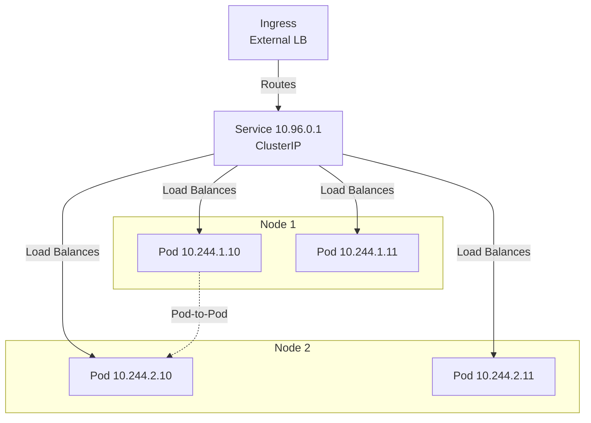
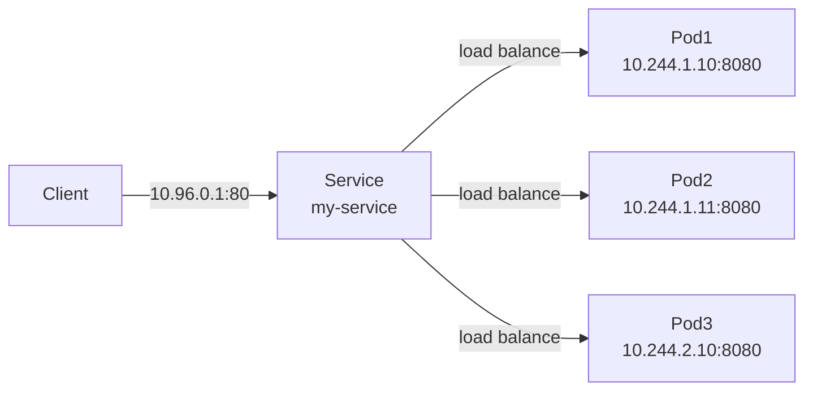
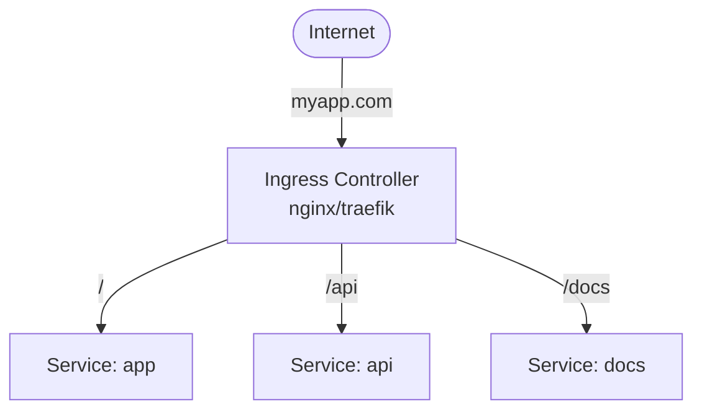

# **Kubernetes Services & Networking** 🌐

**Complete guide to Kubernetes networking - Services, Ingress, Network Policies, and DNS**

---

## **Table of Contents** 📑
1. [Kubernetes Networking Model](#1-kubernetes-networking-model)
2. [Services](#2-services)
3. [Service Types](#3-service-types)
4. [Ingress](#4-ingress)
5. [Network Policies](#5-network-policies)
6. [DNS in Kubernetes](#6-dns-in-kubernetes)
7. [Service Discovery](#7-service-discovery)
8. [Load Balancing](#8-load-balancing)
9. [DevOps Use Cases](#9-devops-use-cases)
10. [Troubleshooting](#10-troubleshooting)
11. [Best Practices](#11-best-practices)
12. [Interview Cheat Sheet](#12-interview-cheat-sheet)

---

## **1. Kubernetes Networking Model** 🔌

### **Networking Requirements**

```
1. Every Pod gets its own IP address
2. Pods can communicate with all other Pods without NAT
3. Nodes can communicate with all Pods without NAT
4. Pod sees its own IP address (no NAT)
```

### **Network Architecture**



### **CNI Plugins**

| Plugin | Features | Use Case |
|--------|----------|----------|
| **Calico** | Network policies, BGP, IPIP | Production, security |
| **Flannel** | Simple overlay network | Development, simplicity |
| **Weave** | Encrypted networking, multicast | Security-focused |
| **Cilium** | eBPF-based, advanced features | High performance |

---

## **2. Services** 🔗

### **What is a Service?**

A Service is an abstraction that exposes a set of Pods as a network service.

```yaml
apiVersion: v1
kind: Service
metadata:
  name: my-service
spec:
  selector:
    app: nginx  # Selects pods with this label
  ports:
  - protocol: TCP
    port: 80        # Service port
    targetPort: 8080  # Pod port
  type: ClusterIP
```

### **How Services Work**



**Components**:
- **Selector**: Matches pods by labels
- **Endpoints**: List of pod IPs that match selector
- **kube-proxy**: Implements service networking (iptables/IPVS)

### **Create Service**

```bash
# Expose deployment
kubectl expose deployment nginx --port=80 --target-port=8080

# From file
kubectl apply -f service.yaml

# Imperatively
kubectl create service clusterip my-svc --tcp=80:8080
```

---

## **3. Service Types** 📡

### **ClusterIP (Default)**

```yaml
apiVersion: v1
kind: Service
metadata:
  name: backend-service
spec:
  type: ClusterIP  # Internal only
  selector:
    app: backend
  ports:
  - port: 80
    targetPort: 8080
```

**Characteristics**:
- Internal cluster IP
- Not accessible from outside
- Default type
- Use: Internal microservice communication

### **NodePort**

```yaml
apiVersion: v1
kind: Service
metadata:
  name: frontend-service
spec:
  type: NodePort
  selector:
    app: frontend
  ports:
  - port: 80
    targetPort: 8080
    nodePort: 30080  # Optional (30000-32767)
```

**Access**: `<NodeIP>:30080`

**Characteristics**:
- Opens port on every node
- Routes to service
- Port range: 30000-32767
- Use: Development, simple external access

### **LoadBalancer**

```yaml
apiVersion: v1
kind: Service
metadata:
  name: app-service
spec:
  type: LoadBalancer
  selector:
    app: myapp
  ports:
  - port: 80
    targetPort: 8080
```

**Characteristics**:
- Cloud provider external load balancer
- Gets public IP
- Costs money (cloud LB)
- Use: Production external access

### **ExternalName**

```yaml
apiVersion: v1
kind: Service
metadata:
  name: external-db
spec:
  type: ExternalName
  externalName: db.example.com
```

**Characteristics**:
- Maps to external DNS name
- No proxy involved
- Use: External services, database endpoints

### **Headless Service**

```yaml
apiVersion: v1
kind: Service
metadata:
  name: mysql-headless
spec:
  clusterIP: None  # Headless
  selector:
    app: mysql
  ports:
  - port: 3306
```

**Characteristics**:
- No cluster IP assigned
- DNS returns pod IPs directly
- Use: StatefulSets, direct pod access

### **Service Type Comparison**

| Type | External Access | Use Case | Cost |
|------|----------------|----------|------|
| **ClusterIP** | No | Internal services | Free |
| **NodePort** | Yes (via node IP) | Development, simple apps | Free |
| **LoadBalancer** | Yes (cloud LB) | Production apps | Cloud costs |
| **ExternalName** | N/A (DNS alias) | External services | Free |
| **Headless** | No | StatefulSets | Free |

---

## **4. Ingress** 🌍

### **What is Ingress?**

Ingress exposes HTTP/HTTPS routes from outside the cluster to services.



### **Ingress Resource**

```yaml
apiVersion: networking.k8s.io/v1
kind: Ingress
metadata:
  name: my-ingress
  annotations:
    nginx.ingress.kubernetes.io/rewrite-target: /
    cert-manager.io/cluster-issuer: "letsencrypt-prod"
spec:
  ingressClassName: nginx
  tls:
  - hosts:
    - myapp.com
    secretName: tls-secret
  rules:
  - host: myapp.com
    http:
      paths:
      - path: /
        pathType: Prefix
        backend:
          service:
            name: frontend
            port:
              number: 80
      - path: /api
        pathType: Prefix
        backend:
          service:
            name: backend-api
            port:
              number: 8080
```

### **Path Types**

```yaml
# Exact match
pathType: Exact
path: /api/v1  # Matches /api/v1 only

# Prefix match
pathType: Prefix
path: /api  # Matches /api, /api/v1, /api/users

# ImplementationSpecific
pathType: ImplementationSpecific  # Controller-specific
```

### **Ingress Controllers**

```bash
# Install nginx ingress controller
kubectl apply -f https://raw.githubusercontent.com/kubernetes/ingress-nginx/controller-v1.8.0/deploy/static/provider/cloud/deploy.yaml

# Popular controllers:
# - nginx-ingress (most popular)
# - traefik
# - HAProxy
# - Istio Gateway
# - Kong
```

### **TLS/HTTPS**

```yaml
apiVersion: v1
kind: Secret
metadata:
  name: tls-secret
type: kubernetes.io/tls
data:
  tls.crt: <base64-encoded-cert>
  tls.key: <base64-encoded-key>
---
apiVersion: networking.k8s.io/v1
kind: Ingress
metadata:
  name: secure-ingress
spec:
  tls:
  - hosts:
    - secure.example.com
    secretName: tls-secret
  rules:
  - host: secure.example.com
    http:
      paths:
      - path: /
        pathType: Prefix
        backend:
          service:
            name: app
            port:
              number: 80
```

---

## **5. Network Policies** 🔒

### **What are Network Policies?**

Network Policies control pod-to-pod and pod-to-external communication.

```yaml
apiVersion: networking.k8s.io/v1
kind: NetworkPolicy
metadata:
  name: api-network-policy
spec:
  podSelector:
    matchLabels:
      app: api
  policyTypes:
  - Ingress
  - Egress
  ingress:
  - from:
    - podSelector:
        matchLabels:
          app: frontend
    ports:
    - protocol: TCP
      port: 8080
  egress:
  - to:
    - podSelector:
        matchLabels:
          app: database
    ports:
    - protocol: TCP
      port: 5432
```

### **Deny All Traffic**

```yaml
apiVersion: networking.k8s.io/v1
kind: NetworkPolicy
metadata:
  name: deny-all
spec:
  podSelector: {}  # All pods in namespace
  policyTypes:
  - Ingress
  - Egress
```

### **Allow from Namespace**

```yaml
apiVersion: networking.k8s.io/v1
kind: NetworkPolicy
metadata:
  name: allow-from-prod
spec:
  podSelector:
    matchLabels:
      app: api
  ingress:
  - from:
    - namespaceSelector:
        matchLabels:
          env: production
```

---

## **6. DNS in Kubernetes** 🔍

### **DNS Components**

```
CoreDNS runs as deployment in kube-system namespace
Provides DNS resolution for Services and Pods
```

```bash
# Check CoreDNS
kubectl get pods -n kube-system -l k8s-app=kube-dns
kubectl logs -n kube-system -l k8s-app=kube-dns
```

### **Service DNS Names**

```
Format: <service-name>.<namespace>.svc.cluster.local

Examples:
my-service.default.svc.cluster.local
api.production.svc.cluster.local
database.staging.svc.cluster.local

Short forms (within same namespace):
my-service
my-service.default
```

### **Pod DNS**

```
Format: <pod-ip>.<namespace>.pod.cluster.local

Example:
10-244-1-10.default.pod.cluster.local

For StatefulSet pods:
<pod-name>.<service-name>.<namespace>.svc.cluster.local
mysql-0.mysql.default.svc.cluster.local
```

### **Test DNS**

```bash
# Run DNS test pod
kubectl run busybox --image=busybox:1.28 -it --rm -- sh

# Inside pod:
nslookup my-service
nslookup my-service.default.svc.cluster.local
nslookup kubernetes.default
```

---

## **7. Service Discovery** 🔎

### **Environment Variables**

```bash
# Kubernetes injects service info as env vars
kubectl exec pod-name -- env | grep SERVICE

# Example:
MY_SERVICE_SERVICE_HOST=10.96.0.1
MY_SERVICE_SERVICE_PORT=80
```

### **DNS-Based Discovery**

```yaml
apiVersion: v1
kind: Pod
metadata:
  name: app
spec:
  containers:
  - name: app
    image: myapp:1.0
    env:
    - name: DATABASE_URL
      value: "postgres://postgres.default.svc.cluster.local:5432/mydb"
```

---

## **8. Load Balancing** ⚖️

### **Service Load Balancing**

```
kube-proxy implements load balancing:

iptables mode (default):
- Uses iptables rules
- Random selection
- Session affinity available

IPVS mode (better performance):
- Uses IPVS
- Multiple algorithms (rr, lc, dh, sh, sed, nq)
- Better for large clusters
```

### **Session Affinity**

```yaml
apiVersion: v1
kind: Service
metadata:
  name: sticky-service
spec:
  selector:
    app: myapp
  ports:
  - port: 80
  sessionAffinity: ClientIP  # Sticky sessions
  sessionAffinityConfig:
    clientIP:
      timeoutSeconds: 10800
```

---

## **9. DevOps Use Cases** 🚀

### **Three-Tier Application**

```yaml
# Frontend Service (LoadBalancer)
apiVersion: v1
kind: Service
metadata:
  name: frontend
spec:
  type: LoadBalancer
  selector:
    app: frontend
    tier: web
  ports:
  - port: 80
    targetPort: 3000
---
# API Service (ClusterIP)
apiVersion: v1
kind: Service
metadata:
  name: api
spec:
  type: ClusterIP
  selector:
    app: api
    tier: backend
  ports:
  - port: 8080
---
# Database Service (Headless for StatefulSet)
apiVersion: v1
kind: Service
metadata:
  name: postgres
spec:
  clusterIP: None
  selector:
    app: postgres
    tier: database
  ports:
  - port: 5432
```

### **Ingress with Multiple Hosts**

```yaml
apiVersion: networking.k8s.io/v1
kind: Ingress
metadata:
  name: multi-host-ingress
spec:
  rules:
  - host: app.example.com
    http:
      paths:
      - path: /
        pathType: Prefix
        backend:
          service:
            name: frontend
            port:
              number: 80
  - host: api.example.com
    http:
      paths:
      - path: /
        pathType: Prefix
        backend:
          service:
            name: backend-api
            port:
              number: 8080
  - host: admin.example.com
    http:
      paths:
      - path: /
        pathType: Prefix
        backend:
          service:
            name: admin-panel
            port:
              number: 3000
```

---

## **10. Troubleshooting** 🔧

### **Service Not Accessible**

```bash
# 1. Check service
kubectl get svc my-service
kubectl describe svc my-service

# 2. Check endpoints
kubectl get endpoints my-service
# If empty, selector doesn't match pods

# 3. Check pods have correct labels
kubectl get pods --show-labels
kubectl get pods -l app=nginx

# 4. Test from within cluster
kubectl run curl --image=curlimages/curl -it --rm -- sh
# curl http://my-service:80

# 5. Check network policies
kubectl get networkpolicies
kubectl describe networkpolicy <name>
```

### **DNS Issues**

```bash
# Check CoreDNS pods
kubectl get pods -n kube-system -l k8s-app=kube-dns

# Check CoreDNS logs
kubectl logs -n kube-system -l k8s-app=kube-dns

# Test DNS resolution
kubectl run busybox --image=busybox:1.28 -it --rm -- nslookup my-service
```

---

## **11. Best Practices** ⭐

```
✅ Use ClusterIP for internal services
✅ LoadBalancer for production external access
✅ Ingress for HTTP/HTTPS routing
✅ Implement network policies for security
✅ Use DNS names, not IPs
✅ Set appropriate session affinity
✅ Monitor service endpoints
✅ Use health checks (readiness probes)
✅ Label services consistently
✅ Document service dependencies

❌ Don't use NodePort in production
❌ Don't skip network policies
❌ Don't hardcode service IPs
❌ Don't expose unnecessary ports
❌ Don't ignore endpoint health
❌ Don't skip TLS for external services
```

---

## **12. Interview Cheat Sheet** 🎯

### **Q1: Service types and when to use?**
```
ClusterIP: Internal only (default)
  Use: Microservice communication

NodePort: External via node IP
  Use: Development, testing

LoadBalancer: Cloud load balancer
  Use: Production external access

ExternalName: DNS CNAME
  Use: External services

Headless (clusterIP: None):
  Use: StatefulSets, direct pod access
```

### **Q2: How does Service load balancing work?**
```
1. Service selector matches pod labels
2. Endpoints controller creates endpoint list
3. kube-proxy watches services/endpoints
4. kube-proxy configures iptables/IPVS rules
5. Traffic distributed across healthy pods

Load balancing modes:
- iptables: Random selection
- IPVS: Multiple algorithms (rr, lc, etc.)

Session affinity:
- ClientIP: Same client → same pod
```

### **Q3: Ingress vs LoadBalancer Service?**
```
LoadBalancer Service:
- L4 load balancing (TCP/UDP)
- One LB per service
- Costs multiply with services

Ingress:
- L7 load balancing (HTTP/HTTPS)
- One LB for multiple services
- Host/path-based routing
- TLS termination
- More cost-effective

Best practice: Ingress for HTTP/HTTPS apps
```

### **Q4: Explain Network Policies?**
```
Network Policies:
- Firewall rules for pods
- Control ingress/egress traffic
- Label-based selection
- Default: All traffic allowed
- Requires CNI plugin support (Calico, Cilium)

Common patterns:
1. Deny all, allow specific
2. Allow from namespace
3. Allow from specific pods
4. Restrict egress
```

### **Q5: DNS in Kubernetes?**
```
Service DNS:
<service>.<namespace>.svc.cluster.local
my-service.default.svc.cluster.local

Pod DNS:
<pod-ip>.<namespace>.pod.cluster.local

StatefulSet Pod DNS:
<pod-name>.<service>.<namespace>.svc.cluster.local

Short forms (same namespace):
- my-service
- my-service.default

CoreDNS provides DNS resolution
```

---

**Related Guides**:
- [Kubernetes Fundamentals](Kubernetes_Fundamentals.md)
- [Kubernetes Pods & Deployments](Kubernetes_Pods_Deployments.md)
- [Kubernetes ConfigMaps & Secrets](Kubernetes_ConfigMaps_Secrets.md)
- [Kubernetes RBAC & Security](Kubernetes_RBAC_Security.md)

---

**🌐 Master Kubernetes Networking for Scalable Microservices!**

*Networking is the backbone of distributed applications in Kubernetes.*
