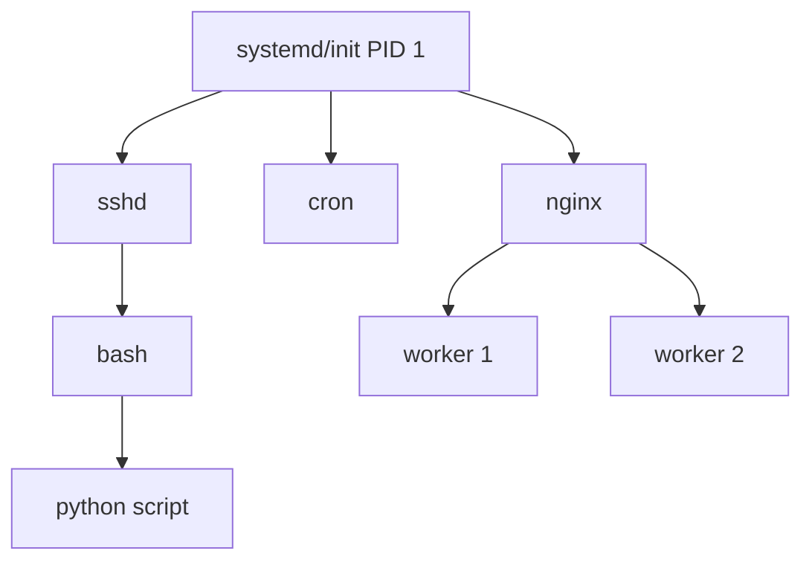

# **Linux Process Management – Complete Guide for DevOps** ⚙️🚀

Master essential process management commands for controlling, monitoring, and optimizing running processes - critical skills for DevOps engineers managing production systems and troubleshooting performance issues.

---

## **Table of Contents** 📑
1. [Process Fundamentals](#1-process-fundamentals)
2. [Process Control](#2-process-control)
3. [Job Control](#3-job-control)
4. [Process Priorities](#4-process-priorities)
5. [Service Management](#5-service-management)
6. [Cron and Scheduling](#6-cron-and-scheduling)
7. [Resource Limits](#7-resource-limits)
8. [Process Signals](#8-process-signals)
9. [Practical DevOps Scenarios](#9-practical-devops-scenarios)
10. [Industry Best Practices](#10-industry-best-practices)
11. [Interview Cheat Sheet](#11-interview-cheat-sheet)

---

## **1. Process Fundamentals** 🎯

### **Understanding Processes**

```
PID     Process ID (unique identifier)
PPID    Parent Process ID
UID     User ID (owner)
GID     Group ID
STAT    Process state
%CPU    CPU usage
%MEM    Memory usage
VSZ     Virtual memory size
RSS     Resident Set Size (physical memory)
TTY     Controlling terminal
```

**Process States:**
```
R    Running or runnable
S    Sleeping (waiting for event)
D    Uninterruptible sleep (usually I/O)
T    Stopped (by job control signal)
Z    Zombie (terminated but not reaped)
```

**Process Tree:**


### **View Processes**

**ps - Process Status:**
```bash
ps                          # Current user processes
ps aux                      # All processes (BSD style)
ps -ef                      # All processes (Unix style)
ps -u username              # User's processes
ps -p 1234                  # Specific process
ps --forest                 # Process tree
ps aux --sort=-%cpu         # Sort by CPU
ps aux --sort=-%mem         # Sort by memory
```

**Custom Format:**
```bash
ps -eo pid,ppid,user,%cpu,%mem,cmd
ps -eo pid,ppid,cmd,stat,pri,nice
ps -eo pid,comm,lstart,etime
```

**Real-world Examples:**
```bash
# Find all Java processes
ps aux | grep java

# Show process tree for specific process
ps -ef --forest | grep nginx

# Top CPU consumers
ps aux --sort=-%cpu | head -10

# Processes running for more than 1 day
ps -eo pid,etime,cmd | awk '$2 ~ /-/ {print}'
```

### **pgrep - Find Process by Name**
```bash
pgrep nginx                 # Find nginx PIDs
pgrep -u www-data           # Processes by user
pgrep -l java               # Show PIDs and names
pgrep -a postgres           # Full command line
pgrep -c httpd              # Count processes
pgrep -f "python script.py" # Match full command
pgrep -x nginx              # Exact match
pgrep -n nginx              # Newest process
pgrep -o nginx              # Oldest process
```

---

## **2. Process Control** 🎮

### **Starting Processes**

**Foreground:**
```bash
command                     # Run in foreground
./script.sh                 # Execute script
```

**Background:**
```bash
command &                   # Run in background
nohup command &             # Immune to hangups
nohup command > output.log 2>&1 &  # With output redirection
```

**Disown:**
```bash
command &
disown                      # Detach from current shell
disown %1                   # Disown specific job
disown -h %1                # Mark to not receive SIGHUP
```

### **Stopping Processes**

**kill - Send Signal to Process:**
```bash
kill PID                    # Send SIGTERM (graceful shutdown)
kill -9 PID                 # Send SIGKILL (force kill)
kill -15 PID                # SIGTERM (default)
kill -STOP PID              # Suspend process
kill -CONT PID              # Resume process
kill -HUP PID               # Reload configuration
kill -USR1 PID              # User-defined signal 1
kill -USR2 PID              # User-defined signal 2
```

**Common Signals:**
```
1   SIGHUP     Hangup (reload config)
2   SIGINT     Interrupt (Ctrl+C)
3   SIGQUIT    Quit
9   SIGKILL    Kill (cannot be caught)
15  SIGTERM    Terminate (default)
18  SIGCONT    Continue if stopped
19  SIGSTOP    Stop (cannot be caught)
20  SIGTSTP    Terminal stop (Ctrl+Z)
```

**pkill - Kill by Name:**
```bash
pkill nginx                 # Kill all nginx processes
pkill -u username           # Kill user's processes
pkill -f "python app.py"    # Match full command
pkill -9 java               # Force kill all java
pkill -SIGHUP nginx         # Send HUP to nginx
pkill -signal -u user       # Kill user processes with signal
```

**killall - Kill All by Name:**
```bash
killall nginx               # Kill all nginx processes
killall -9 httpd            # Force kill
killall -u username         # Kill user's processes
killall -w nginx            # Wait for processes to die
killall -q nginx            # Quiet mode
```

**Practical Examples:**
```bash
# Graceful restart of nginx
sudo pkill -HUP nginx

# Force kill stuck java process
pkill -9 java

# Kill all processes for user
sudo pkill -u username

# Kill process and children
kill -- -$(ps -o pgid= PID | grep -o '[0-9]*')
```

### **Process Termination Strategies**

**Graceful Shutdown:**
```bash
# 1. Try SIGTERM first
kill PID

# 2. Wait 10 seconds
sleep 10

# 3. If still running, force kill
kill -9 PID
```

**Script Example:**
```bash
#!/bin/bash
graceful_kill() {
    local pid=$1
    local timeout=${2:-10}
    
    if kill "$pid" 2>/dev/null; then
        echo "Sent SIGTERM to $pid"
        
        for i in $(seq 1 $timeout); do
            if ! kill -0 "$pid" 2>/dev/null; then
                echo "Process $pid terminated gracefully"
                return 0
            fi
            sleep 1
        done
        
        echo "Process $pid did not terminate, forcing..."
        kill -9 "$pid" 2>/dev/null
        return 1
    else
        echo "Process $pid does not exist"
        return 2
    fi
}

# Usage
graceful_kill $(pgrep nginx) 15
```

---

## **3. Job Control** 💼

### **Background and Foreground**

```bash
command &                   # Start in background
Ctrl+Z                      # Suspend current process
bg                          # Resume in background
fg                          # Bring to foreground
jobs                        # List jobs
```

**jobs - List Background Jobs:**
```bash
jobs                        # Show jobs
jobs -l                     # Show PIDs
jobs -r                     # Running jobs only
jobs -s                     # Stopped jobs only
```

**Job Specifications:**
```bash
%1                          # Job number 1
%+                          # Current job
%-                          # Previous job
%%                          # Current job (same as %+)
%string                     # Job starting with string
```

**Practical Examples:**
```bash
# Start multiple jobs
./long-task1.sh &
./long-task2.sh &
./long-task3.sh &

# List jobs
jobs -l

# Bring job 1 to foreground
fg %1

# Suspend current job
Ctrl+Z

# Resume in background
bg %1

# Kill background job
kill %2
```

### **Screen and tmux - Terminal Multiplexers**

**screen - Terminal Session Manager:**
```bash
screen                      # Start new session
screen -S session-name      # Named session
screen -ls                  # List sessions
screen -r session-name      # Reattach to session
screen -d -r session-name   # Detach and reattach

# Inside screen:
Ctrl+A D                    # Detach
Ctrl+A C                    # Create new window
Ctrl+A N                    # Next window
Ctrl+A P                    # Previous window
Ctrl+A K                    # Kill window
```

**tmux - Terminal Multiplexer:**
```bash
tmux                        # Start new session
tmux new -s session-name    # Named session
tmux ls                     # List sessions
tmux attach -t session-name # Attach to session
tmux kill-session -t name   # Kill session

# Inside tmux:
Ctrl+B D                    # Detach
Ctrl+B C                    # Create new window
Ctrl+B N                    # Next window
Ctrl+B P                    # Previous window
Ctrl+B %                    # Split vertically
Ctrl+B "                    # Split horizontally
Ctrl+B Arrow                # Navigate panes
```

**Use Cases:**
```bash
# Run long-running task
tmux new -s deployment
./deploy.sh
# Ctrl+B D to detach

# Later, reattach
tmux attach -t deployment

# Keep process running after logout
screen -S backup
./backup.sh
# Ctrl+A D to detach
```

---

## **4. Process Priorities** ⚖️

### **nice - Set Priority**

**Priority Range:**
```
-20  Highest priority (most CPU)
0    Default priority
19   Lowest priority (least CPU)
```

**Usage:**
```bash
nice command                # Default niceness (+10)
nice -n 10 command          # Set niceness to 10
nice --10 command           # Set niceness to -10 (requires root)
nice -n -10 command         # Same as above
```

**Examples:**
```bash
# Run low-priority backup
nice -n 19 ./backup.sh

# Run high-priority task (requires root)
sudo nice -n -10 ./important-task.sh

# CPU-intensive task with low priority
nice -n 15 gzip large-file.txt
```

### **renice - Change Priority of Running Process**

```bash
renice priority PID         # Change priority
renice -n 10 -p 1234        # Explicit syntax
renice -n 5 -u username     # All user processes
renice -n 10 -g groupname   # All group processes
renice +5 1234              # Increase niceness by 5
```

**Examples:**
```bash
# Find and lower priority of CPU hog
cpu_hog=$(ps aux --sort=-%cpu | awk 'NR==2{print $2}')
sudo renice -n 15 -p $cpu_hog

# Increase priority (requires root)
sudo renice -n -5 -p $(pgrep nginx)

# Lower priority of all user processes
sudo renice -n 10 -u backup-user
```

### **ionice - I/O Scheduling Priority**

**I/O Classes:**
```
0  None (default)
1  Real-time
2  Best-effort (default)
3  Idle
```

**Priority Range:** 0-7 (0 = highest)

```bash
ionice command              # Default
ionice -c 2 -n 7 command    # Best-effort, lowest priority
ionice -c 3 command         # Idle
ionice -c 1 -n 0 command    # Real-time, highest (requires root)

# Change running process
ionice -c 3 -p PID          # Set to idle
```

**Examples:**
```bash
# Low-priority backup
ionice -c 3 nice -n 19 rsync -av /data/ /backup/

# Check process I/O priority
ionice -p $(pgrep rsync)

# Database with high I/O priority
sudo ionice -c 1 -n 0 -p $(pgrep mysqld)
```

### **cpulimit - Limit CPU Usage**

```bash
cpulimit -l 50 command      # Limit to 50% CPU
cpulimit -l 50 -p PID       # Limit running process
cpulimit -l 100 -p PID      # Limit to 100% (1 core)
cpulimit -l 200 -p PID      # Limit to 200% (2 cores)
```

Install cpulimit:
```bash
sudo apt install cpulimit
```

**Example:**
```bash
# Limit video encoding to 50% CPU
cpulimit -l 50 ffmpeg -i input.mp4 output.mp4

# Limit running process
cpulimit -l 30 -p $(pgrep compression-task)
```

---

## **5. Service Management** 🔧

### **systemctl - Systemd Service Control**

**Service Operations:**
```bash
systemctl start service     # Start service
systemctl stop service      # Stop service
systemctl restart service   # Restart service
systemctl reload service    # Reload config (no downtime)
systemctl status service    # Show status
systemctl enable service    # Enable on boot
systemctl disable service   # Disable on boot
systemctl is-active service # Check if active
systemctl is-enabled service # Check if enabled
```

**System Management:**
```bash
systemctl list-units        # List all units
systemctl list-units --type=service  # List services
systemctl list-units --state=running # Running units
systemctl list-units --failed        # Failed units
systemctl list-unit-files            # All unit files
systemctl daemon-reload              # Reload systemd config
```

**Practical Examples:**
```bash
# Restart nginx
sudo systemctl restart nginx

# Check nginx status
systemctl status nginx

# Enable service to start on boot
sudo systemctl enable mysql

# Disable and stop service
sudo systemctl disable apache2
sudo systemctl stop apache2

# Show failed services
systemctl --failed

# View service logs
journalctl -u nginx -f

# Reload service configuration
sudo systemctl reload nginx
```

### **service - Service Control (Legacy)**

```bash
service nginx start         # Start
service nginx stop          # Stop
service nginx restart       # Restart
service nginx status        # Status
service --status-all        # All services status
```

### **Creating Systemd Service**

**Sample Service File (/etc/systemd/system/myapp.service):**
```ini
[Unit]
Description=My Application
After=network.target

[Service]
Type=simple
User=appuser
WorkingDirectory=/opt/myapp
ExecStart=/usr/bin/python3 /opt/myapp/app.py
ExecReload=/bin/kill -HUP $MAINPID
Restart=on-failure
RestartSec=10s
StandardOutput=journal
StandardError=journal

[Install]
WantedBy=multi-user.target
```

**Service Types:**
```
simple      Process doesn't fork (default)
forking     Process forks (traditional daemon)
oneshot     Short-lived process
notify      Process sends notification
```

**Commands:**
```bash
# Create service file
sudo nano /etc/systemd/system/myapp.service

# Reload systemd
sudo systemctl daemon-reload

# Start service
sudo systemctl start myapp

# Enable on boot
sudo systemctl enable myapp

# Check status
systemctl status myapp

# View logs
journalctl -u myapp -f
```

---

## **6. Cron and Scheduling** 📅

### **crontab - Schedule Tasks**

**Cron Format:**
```
* * * * * command
│ │ │ │ │
│ │ │ │ └─── Day of week (0-7, 0 and 7 = Sunday)
│ │ │ └───── Month (1-12)
│ │ └─────── Day of month (1-31)
│ └───────── Hour (0-23)
└─────────── Minute (0-59)
```

**crontab Commands:**
```bash
crontab -e                  # Edit crontab
crontab -l                  # List crontab
crontab -r                  # Remove crontab
crontab -u username -e      # Edit user's crontab (root only)
```

**Examples:**
```bash
# Every minute
* * * * * /path/to/script.sh

# Every hour at minute 0
0 * * * * /path/to/script.sh

# Every day at 2:30 AM
30 2 * * * /path/to/backup.sh

# Every Monday at 9:00 AM
0 9 * * 1 /path/to/weekly-task.sh

# Every 15 minutes
*/15 * * * * /path/to/script.sh

# First day of every month
0 0 1 * * /path/to/monthly.sh

# Weekdays at 6:00 PM
0 18 * * 1-5 /path/to/script.sh

# Multiple times
0 9,12,18 * * * /path/to/script.sh
```

**Special Strings:**
```bash
@reboot     Run at startup
@yearly     0 0 1 1 *
@annually   0 0 1 1 *
@monthly    0 0 1 * *
@weekly     0 0 * * 0
@daily      0 0 * * *
@midnight   0 0 * * *
@hourly     0 * * * *
```

**Best Practices:**
```bash
# Always use absolute paths
0 2 * * * /usr/bin/python3 /home/user/backup.py

# Redirect output
0 2 * * * /path/to/backup.sh >> /var/log/backup.log 2>&1

# Email output
MAILTO=admin@example.com
0 2 * * * /path/to/backup.sh

# Set environment
PATH=/usr/local/bin:/usr/bin:/bin
0 * * * * /path/to/script.sh
```

### **anacron - Run Periodic Tasks**

**For systems not running 24/7:**
```bash
# /etc/anacrontab
period  delay  job-identifier  command
1       5      daily-backup    /path/to/backup.sh
7       10     weekly-update   /path/to/update.sh
@monthly 15    monthly-report  /path/to/report.sh
```

### **at - One-time Scheduled Tasks**

```bash
at 2:00 PM                  # Schedule at specific time
at now + 1 hour             # Schedule relative time
at now + 30 minutes
at tomorrow 9:00 AM
at 9:00 AM tomorrow
at 5:00 PM Friday

# Interactive mode
at 2:00 PM
> /path/to/script.sh
> Ctrl+D

# From file
at 2:00 PM -f script.sh

# List scheduled tasks
atq

# Remove task
atrm job_number
```

---

## **7. Resource Limits** 📊

### **ulimit - User Limits**

```bash
ulimit -a                   # Show all limits
ulimit -n                   # Max open files
ulimit -u                   # Max user processes
ulimit -m                   # Max memory size
ulimit -v                   # Max virtual memory
ulimit -t                   # Max CPU time

# Set limits
ulimit -n 10000             # Set max open files
ulimit -u 500               # Set max processes
ulimit -f 1000000           # Max file size (blocks)
```

**Hard vs Soft Limits:**
```bash
ulimit -Sn                  # Soft limit for open files
ulimit -Hn                  # Hard limit for open files
ulimit -Sn 8192             # Set soft limit
ulimit -Hn 10240            # Set hard limit (root only)
```

### **Persistent Limits - /etc/security/limits.conf**

```bash
# Edit limits.conf
sudo nano /etc/security/limits.conf

# Format:
# <domain> <type> <item> <value>

# Examples:
*        soft   nofile   10000
*        hard   nofile   65536
mysql    soft   nproc    4096
mysql    hard   nproc    8192
@devs    soft   cpu      unlimited
user1    hard   memlock  unlimited
```

**Apply immediately:**
```bash
# Logout and login, or
su - username
```

### **cgroups - Control Groups**

**Limit resources for processes:**
```bash
# Create cgroup
sudo cgcreate -g cpu,memory:/myapp

# Set CPU limit (50%)
sudo cgset -r cpu.cfs_quota_us=50000 myapp

# Set memory limit (1GB)
sudo cgset -r memory.limit_in_bytes=1G myapp

# Run process in cgroup
sudo cgexec -g cpu,memory:myapp /path/to/app

# View cgroup stats
cat /sys/fs/cgroup/cpu/myapp/cpuacct.usage
```

---

## **8. Process Signals** 📡

### **Signal Handling**

**Common Signals:**
```bash
kill -l                     # List all signals

# Usage examples
kill -SIGTERM PID           # Graceful shutdown
kill -SIGKILL PID           # Force kill
kill -SIGHUP PID            # Reload config
kill -SIGUSR1 PID           # User-defined
```

**Signal Trapping in Scripts:**
```bash
#!/bin/bash

cleanup() {
    echo "Caught signal, cleaning up..."
    rm -f /tmp/lockfile
    exit 0
}

# Trap signals
trap cleanup SIGINT SIGTERM

# Main script
echo "Running... (Press Ctrl+C to stop)"
while true; do
    echo "Working..."
    sleep 1
done
```

**Ignore Signals:**
```bash
#!/bin/bash

# Ignore Ctrl+C
trap '' SIGINT

echo "Cannot interrupt with Ctrl+C"
sleep 30

# Restore default
trap - SIGINT
```

---

## **9. Practical DevOps Scenarios** 🛠️

### **Scenario 1: Process Consuming High CPU**

```bash
# 1. Identify process
top -b -n 1 | head -20
ps aux --sort=-%cpu | head -5

# 2. Get details
ps -fp PID
lsof -p PID

# 3. Lower priority
sudo renice -n 15 -p PID

# 4. Limit CPU
cpulimit -l 50 -p PID

# 5. Trace system calls
sudo strace -p PID -c

# 6. If needed, restart
sudo systemctl restart service
```

### **Scenario 2: Memory Leak Detection**

```bash
# 1. Monitor memory over time
watch -n 1 "ps -p PID -o pid,vsz,rss,%mem,cmd"

# 2. Detailed memory info
pmap -x PID
cat /proc/PID/status | grep -i mem

# 3. Track growth
pidstat -r -p PID 1 60

# 4. If confirmed leak, restart
sudo systemctl restart service

# 5. Set up monitoring
# Add to cron:
*/15 * * * * ps -p PID -o %mem | tail -1 > /var/log/app-mem.log
```

### **Scenario 3: Zombie Processes**

```bash
# 1. Find zombies
ps aux | awk '$8=="Z"'
ps -eo pid,ppid,stat,cmd | grep "^Z"

# 2. Find parent process
ps -ef | grep defunct

# 3. Kill parent (zombies will be reaped)
sudo kill PPID

# 4. If parent is essential, restart it
sudo systemctl restart parent-service
```

### **Scenario 4: Process Not Responding**

```bash
# 1. Check process status
ps -fp PID

# 2. Check if in uninterruptible sleep
ps -eo pid,stat,cmd | grep "D "

# 3. Try graceful termination
kill PID

# 4. Wait 10 seconds
sleep 10

# 5. Force kill if needed
kill -9 PID

# 6. Check for stuck I/O
sudo cat /proc/PID/io
```

### **Scenario 5: Automated Process Management**

**Monitor and Restart Script:**
```bash
#!/bin/bash
# monitor-service.sh

SERVICE_NAME="myapp"
CHECK_INTERVAL=60

while true; do
    if ! systemctl is-active --quiet $SERVICE_NAME; then
        echo "$(date): $SERVICE_NAME is down, restarting..."
        systemctl start $SERVICE_NAME
        
        # Send alert
        echo "$SERVICE_NAME was down and restarted" | \
            mail -s "Service Alert" admin@example.com
    fi
    
    sleep $CHECK_INTERVAL
done
```

**Process Health Check:**
```bash
#!/bin/bash
# healthcheck.sh

PID=$(pgrep -f "myapp")

if [ -z "$PID" ]; then
    echo "Process not running"
    exit 1
fi

# Check CPU usage
CPU=$(ps -p $PID -o %cpu= | awk '{print int($1)}')
if [ $CPU -gt 80 ]; then
    echo "High CPU usage: $CPU%"
    # Take action
fi

# Check memory usage
MEM=$(ps -p $PID -o %mem= | awk '{print int($1)}')
if [ $MEM -gt 80 ]; then
    echo "High memory usage: $MEM%"
    # Take action
fi

echo "Process healthy"
```

---

## **10. Industry Best Practices** 🏆

### **Process Management Strategy**

**1. Always Use Graceful Shutdown:**
```bash
# Bad
kill -9 PID

# Good
kill PID
sleep 5
if kill -0 PID 2>/dev/null; then
    kill -9 PID
fi
```

**2. Use Systemd for Services:**
```bash
# Create proper service files
# Enable auto-restart
# Use proper dependencies
# Implement health checks
```

**3. Monitor Regularly:**
```bash
# Set up monitoring
*/5 * * * * /path/to/healthcheck.sh

# Log process metrics
*/15 * * * * ps aux --sort=-%mem | head -10 >> /var/log/top-processes.log
```

**4. Set Resource Limits:**
```bash
# Prevent resource exhaustion
# Set ulimits in limits.conf
# Use cgroups for containers
```

**5. Use Process Supervisors:**
```bash
# supervisord
# systemd
# Docker restart policies
# Kubernetes liveness/readiness probes
```

### **Troubleshooting Checklist**

```
□ Is process running? (ps, pgrep)
□ What's the CPU/memory usage? (top, ps)
□ Any error in logs? (journalctl, tail)
□ Is it a zombie? (ps stat column)
□ Parent process? (ps ppid)
□ Open files/connections? (lsof)
□ Resource limits? (ulimit, cgroups)
□ System calls? (strace)
```

---

## **11. Interview Cheat Sheet** 📝

### **Quick Commands**

```bash
# View processes
ps aux                      # All processes
top                         # Interactive monitor
htop                        # Enhanced monitor

# Find process
pgrep nginx                 # Find by name
pidof nginx                 # Get PID

# Kill process
kill PID                    # Graceful
kill -9 PID                 # Force
pkill nginx                 # Kill by name
killall nginx               # Kill all instances

# Job control
command &                   # Background
Ctrl+Z, bg                  # Suspend and background
fg                          # Foreground
jobs                        # List jobs

# Priority
nice -n 10 command          # Set priority
renice -n 5 -p PID          # Change priority

# Service management
systemctl start service     # Start
systemctl stop service      # Stop
systemctl status service    # Status
systemctl enable service    # Enable on boot

# Scheduling
crontab -e                  # Edit cron jobs
at 2:00 PM                  # One-time task
```

### **Common Interview Questions**

**Q1: How to find and kill a process?**
```bash
# Find
pgrep process-name
ps aux | grep process-name

# Kill
kill $(pgrep process-name)
pkill process-name
```

**Q2: Difference between kill and kill -9?**
- **kill (SIGTERM)**: Graceful shutdown, process can cleanup
- **kill -9 (SIGKILL)**: Force kill, immediate, no cleanup

**Q3: How to keep process running after logout?**
```bash
nohup command &
screen or tmux
systemd service
```

**Q4: What is a zombie process?**
- Terminated process with exit status not read by parent
- Shows as `<defunct>` in ps
- Fix: Kill parent or reboot

**Q5: How to change process priority?**
```bash
# Start with priority
nice -n 10 command

# Change running process
renice -n 5 -p PID
```

**Q6: How to schedule tasks?**
```bash
# Recurring
crontab -e

# One-time
at 2:00 PM

# System-level
/etc/cron.daily/
/etc/cron.weekly/
```

**Q7: How to limit process resources?**
```bash
ulimit -n 1000              # File descriptors
cpulimit -l 50 -p PID       # CPU
cgroups                     # Memory, CPU, I/O
```

**Q8: Difference between & and nohup?**
- **&**: Background, terminates when shell closes
- **nohup**: Immune to hangups, continues after logout

---

## **Summary** ✅

Process management is fundamental for DevOps:

1. **Control**: `ps`, `kill`, `pkill`, `nice`
2. **Job Control**: `bg`, `fg`, `jobs`, `screen`, `tmux`
3. **Services**: `systemctl`, service files
4. **Scheduling**: `cron`, `at`, `anacron`
5. **Limits**: `ulimit`, `cgroups`
6. **Signals**: `SIGTERM`, `SIGKILL`, `SIGHUP`

**Key Principles:**
- Always try graceful shutdown first
- Monitor processes regularly
- Set appropriate resource limits
- Use systemd for service management
- Implement proper logging and alerting

---

**Next Topics**: [User & Permissions Management](User_Permissions_Management.md) | [Package Management](Package_Management.md)
