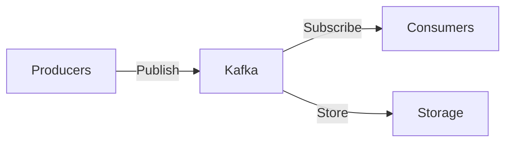
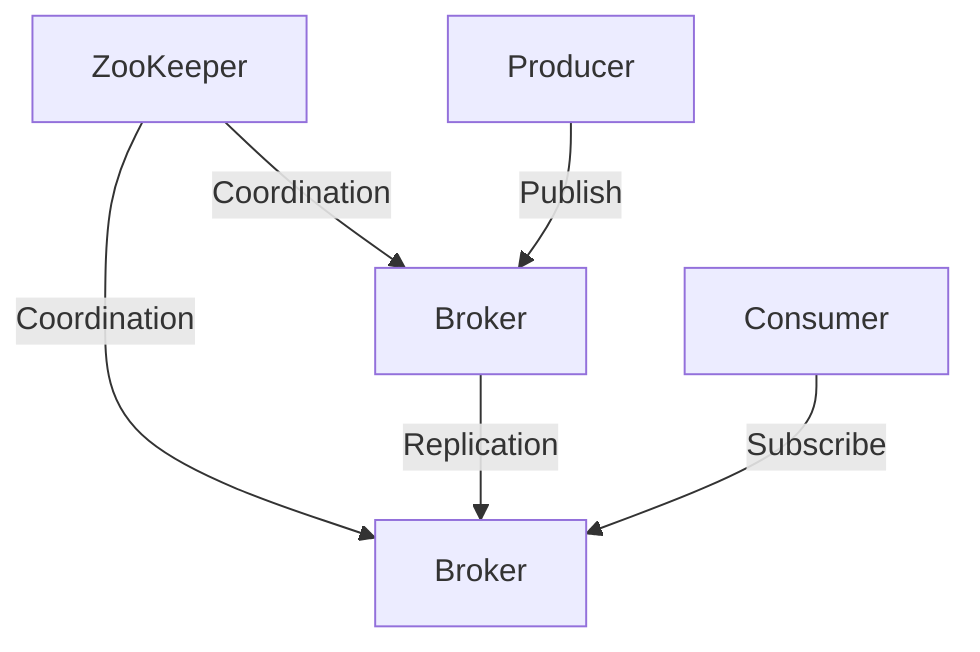
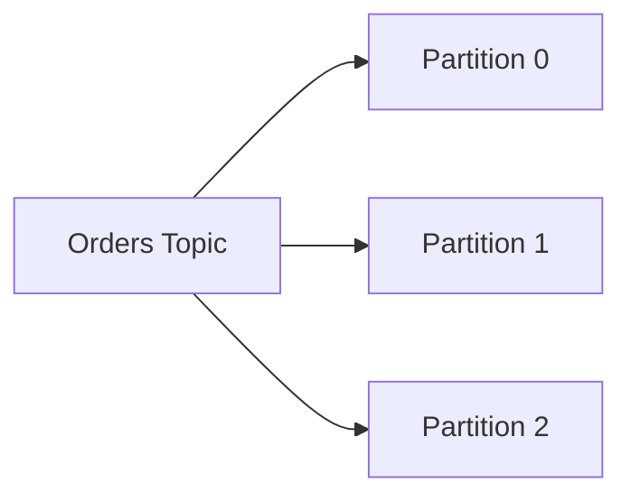
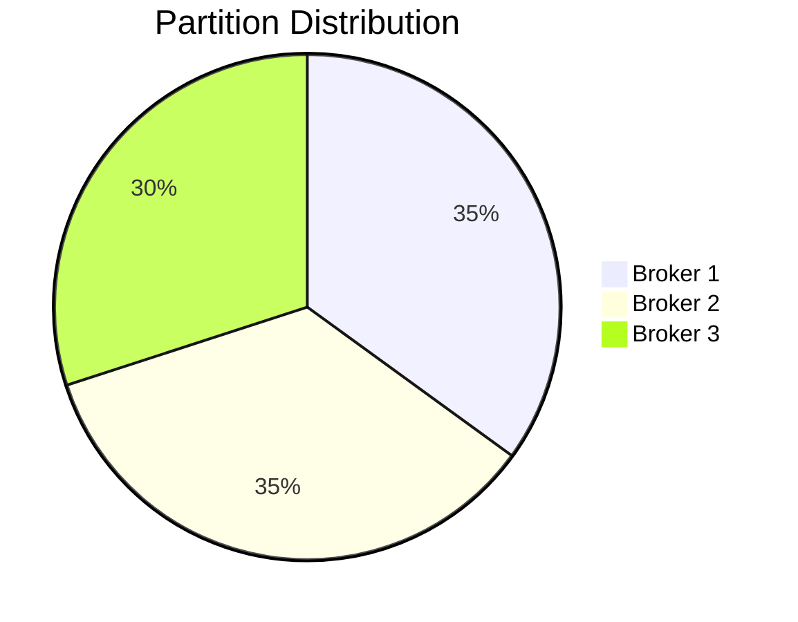
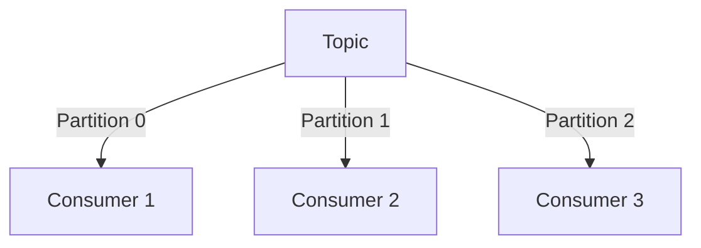
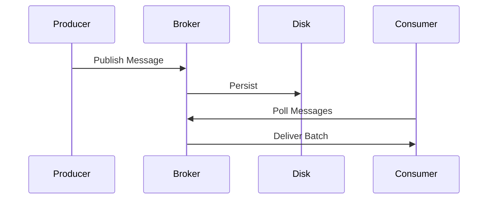
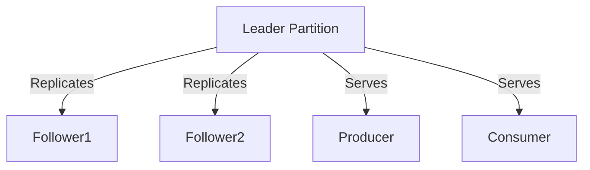

# **Apache Kafka - The Complete Interview Guide** 🚀

This comprehensive guide covers everything you need to know about Apache Kafka for technical interviews, including architecture, core concepts, Java implementations, and real-world industry applications.

## Table of Contents
1. [What is Kafka?](#1-what-is-kafka)
2. [Core Architecture](#2-core-architecture)
3. [Key Components](#3-key-components)
4. [Producer API](#4-producer-api)
5. [Consumer API](#5-consumer-api)
6. [Streams API](#6-streams-api)
7. [Connect API](#7-connect-api)
8. [Industry Best Practices](#8-industry-best-practices)
9. [Performance Optimization](#9-performance-optimization)
10. [When NOT to Use Kafka](#10-when-not-to-use-kafka)
11. [Big Company Usage](#11-big-company-usage)
12. [Interview Q&A](#12-interview-qa)
13. [Comparison Tables](#13-comparison-tables)
14. [Visual Diagrams](#14-visual-diagrams)

---

## 1. What is Kafka? 🏗️

Apache Kafka is a distributed event streaming platform capable of handling trillions of events per day.



**Key Features:**
- High throughput (millions/sec)
- Low latency (ms)
- Fault-tolerant
- Horizontally scalable

**Industry Adoption:**
- LinkedIn (originally created Kafka)
- Netflix (750B+ messages/day)
- Uber (4T+ messages/day)
- Walmart (real-time inventory)

---

## 2. Core Architecture 🏛️

### 2.1 Cluster Components


### 2.2 Topic Partitioning


**Key Concepts:**
- **Topics**: Categories/feeds for messages
- **Partitions**: Ordered, immutable sequences
- **Offsets**: Unique message IDs within partitions
- **Replicas**: Fault-tolerant copies

---

## 3. Key Components 🧩

### 3.1 Brokers
```java
// server.properties
broker.id=1
listeners=PLAINTEXT://:9092
log.dirs=/tmp/kafka-logs
num.partitions=3
```

### 3.2 Topics
```bash
# Create topic
kafka-topics --create --topic orders \
             --partitions 3 --replication-factor 2 \
             --bootstrap-server localhost:9092
```

### 3.3 Partitions


---

## 4. Producer API 📤

### 4.1 Java Producer
```java
Properties props = new Properties();
props.put("bootstrap.servers", "localhost:9092");
props.put("key.serializer", "org.apache.kafka.common.serialization.StringSerializer");
props.put("value.serializer", "org.apache.kafka.common.serialization.StringSerializer");

Producer<String, String> producer = new KafkaProducer<>(props);

ProducerRecord<String, String> record = 
    new ProducerRecord<>("orders", "order-123", "{\"item\":\"book\"}");

producer.send(record, (metadata, exception) -> {
    if (exception == null) {
        System.out.printf("Sent to partition %d at offset %d%n",
                         metadata.partition(), metadata.offset());
    } else {
        exception.printStackTrace();
    }
});

producer.close();
```

### 4.2 Producer Configurations
| Parameter | Recommended Value | Purpose |
|-----------|-------------------|---------|
| `acks` | `all` | Message durability |
| `retries` | `Integer.MAX_VALUE` | Ensure delivery |
| `batch.size` | `16384` (16KB) | Batch efficiency |
| `linger.ms` | `5` | Wait for batch |

---

## 5. Consumer API 📥

### 5.1 Java Consumer
```java
Properties props = new Properties();
props.put("bootstrap.servers", "localhost:9092");
props.put("group.id", "order-processors");
props.put("key.deserializer", "org.apache.kafka.common.serialization.StringDeserializer");
props.put("value.deserializer", "org.apache.kafka.common.serialization.StringDeserializer");

Consumer<String, String> consumer = new KafkaConsumer<>(props);
consumer.subscribe(Collections.singletonList("orders"));

try {
    while (true) {
        ConsumerRecords<String, String> records = consumer.poll(Duration.ofMillis(100));
        for (ConsumerRecord<String, String> record : records) {
            System.out.printf("Consumed: partition=%d, offset=%d, key=%s, value=%s%n",
                            record.partition(), record.offset(), 
                            record.key(), record.value());
        }
    }
} finally {
    consumer.close();
}
```

### 5.2 Consumer Groups


---

## 6. Streams API 🔄

### 6.1 Word Count Example
```java
Properties props = new Properties();
props.put("bootstrap.servers", "localhost:9092");
props.put("application.id", "word-count");

StreamsBuilder builder = new StreamsBuilder();
KStream<String, String> textLines = builder.stream("text-lines");

textLines
    .flatMapValues(line -> Arrays.asList(line.split("\\W+")))
    .groupBy((key, word) -> word)
    .count(Materialized.as("word-counts"))
    .toStream()
    .to("word-count-output");

KafkaStreams streams = new KafkaStreams(builder.build(), props);
streams.start();
```

### 6.2 Stream Processing Patterns
| Pattern | Kafka Feature |
|---------|--------------|
| Filtering | `filter()`, `filterNot()` |
| Mapping | `map()`, `flatMap()` |
| Aggregation | `groupBy()`, `aggregate()` |
| Joining | `join()`, `leftJoin()` |

---

## 7. Connect API 🔌

### 7.1 File Source Connector
```json
{
  "name": "file-source",
  "config": {
    "connector.class": "FileStreamSource",
    "tasks.max": "1",
    "file": "/tmp/input.txt",
    "topic": "connect-test"
  }
}
```

### 7.2 JDBC Sink Connector
```json
{
  "name": "jdbc-sink",
  "config": {
    "connector.class": "io.confluent.connect.jdbc.JdbcSinkConnector",
    "connection.url": "jdbc:mysql://localhost:3306/mydb",
    "topics": "orders",
    "table.name.format": "orders",
    "insert.mode": "upsert"
  }
}
```

---

## 8. Industry Best Practices 💡

### 8.1 Topic Design
- **Naming**: `<domain>.<dataset>.<event-type>`
    - `commerce.orders.created`
    - `inventory.stock.updated`
- **Partitioning**:
    - Key-based for ordering
    - 3-6x consumer count

### 8.2 Monitoring
| Metric | Tool | Alert Threshold |
|--------|------|-----------------|
| Lag | Burrow | >1000 messages |
| Throughput | JMX | >80% capacity |
| Disk Usage | Prometheus | >75% |

### 8.3 Security
```properties
# server.properties
security.protocol=SASL_SSL
sasl.mechanism=SCRAM-SHA-256
ssl.truststore.location=/path/to/truststore.jks
```

---

## 9. Performance Optimization ⚡

### 9.1 Producer Tuning
| Parameter | Optimization | Impact |
|-----------|--------------|--------|
| `compression.type` | `snappy` | +30% throughput |
| `batch.size` | `65536` (64KB) | Fewer requests |
| `linger.ms` | `10-100` | Better batching |

### 9.2 Consumer Tuning
| Parameter | Optimization | Impact |
|-----------|--------------|--------|
| `fetch.min.bytes` | `1024` | Fewer fetches |
| `max.poll.records` | `500` | Batch processing |
| `auto.offset.reset` | `latest` | Skip old messages |

---

## 10. When NOT to Use Kafka ❌

| Scenario | Problem | Alternative |
|----------|---------|-------------|
| Small datasets | Overhead | RabbitMQ |
| Simple RPC | Complexity | gRPC |
| Batch processing | Not optimized | Spark/Flink |
| Strong ordering | Partition limits | Single partition |

---

## 11. Big Company Usage 🏢

### 11.1 LinkedIn (Origin)
- 7M+ messages/sec
- 5PB+ data/day
- 4000+ brokers

### 11.2 Netflix
- 750B+ events/day
- 36M+ partitions
- 7000+ producers

### 11.3 Uber
- 4T+ messages/day
- 100+ microservices
- 50ms P99 latency

---

## 12. Interview Q&A 💡

### Q1: Explain Kafka architecture
**A:** Kafka consists of:
- **Brokers**: Servers storing data
- **Topics**: Categories for messages
- **Partitions**: Ordered message sequences
- **Producers**: Publish messages
- **Consumers**: Subscribe to topics
- **ZooKeeper**: Coordination service

### Q2: Why partitions?
**A:** Partitions enable:
- Parallelism (multiple consumers)
- Horizontal scaling
- Ordered processing per partition

### Q3: How to ensure message ordering?
**A:**
1. Single partition per topic
2. Same key → same partition
```java
producer.send(new ProducerRecord<>("orders", "user123", orderData));
```

### Q4: Explain consumer groups
**A:**
- Consumers in group share topic partitions
- Each partition consumed by only one group member
- Enables horizontal scaling

### Q5: What is ISR?
**A:** In-Sync Replicas - replicas currently syncing with leader. Used for:
- Leader election
- Determining availability

### Q6: How to prevent data loss?
**A:**
- Producer: `acks=all`, `retries=MAX_INT`
- Broker: `min.insync.replicas=2`
- Consumer: Manual commits after processing

### Q7: Explain exactly-once semantics
**A:** Achieved via:
- Idempotent producer (`enable.idempotence=true`)
- Transactions (`isolation.level=read_committed`)
```java
producer.initTransactions();
producer.beginTransaction();
producer.send(record);
producer.commitTransaction();
```

### Q8: Kafka vs RabbitMQ?
**A:**
| Feature | Kafka | RabbitMQ |
|---------|-------|----------|
| Throughput | High (MB/s) | Medium |
| Latency | ms | μs |
| Ordering | Per-partition | Per-queue |
| Retention | Disk-based | Memory-based |

### Q9: What is log compaction?
**A:** Retention policy keeping last value per key:
```properties
log.cleanup.policy=compact
```

### Q10: How to monitor Kafka?
**A:**
- **Metrics**: JMX, Prometheus
- **Lag**: Burrow, Consumer offsets
- **Logs**: Broker logs, Connect logs
- **Tools**: Confluent Control Center, LinkedIn Cruise Control

---

## 13. Comparison Tables 📋

### Messaging Systems
| System | Throughput | Latency | Ordering | Retention |
|--------|-----------|---------|----------|-----------|
| Kafka | Very High | Low | Partition | Configurable |
| RabbitMQ | Medium | Very Low | Queue | Memory-based |
| AWS SQS | Low | Variable | FIFO option | 14 days |

### Kafka Clients
| Client | Language | Features |
|--------|----------|----------|
| Java | Official | Full API support |
| librdkafka | C/C++ | High performance |
| kafka-python | Python | Simple API |
| sarama | Go | Balanced |

---

## 14. Visual Diagrams 📊

### Data Flow


### Replication


---

## Key Takeaways 🎯
1. **Partitions** enable scaling and ordering
2. **Consumer groups** allow parallel processing
3. **Replication** ensures fault tolerance
4. **Tune producers/consumers** for performance
5. **Monitor** lag, throughput, and disk usage

**Pro Tip:** Always relate Kafka features to business needs:
- High throughput → real-time analytics
- Durability → financial transactions
- Scalability → handling growth

---

# **ActiveMQ vs RabbitMQ vs Kafka: A Comprehensive Comparison**

When choosing a messaging system for distributed applications, **ActiveMQ, RabbitMQ, and Kafka** are three of the most popular options. Each has unique strengths and trade-offs. This guide provides a **detailed comparison**, including **use cases, advantages, disadvantages, and when to use which technology**.

---

## **1. Overview of Messaging Systems**
| **Feature**       | **ActiveMQ** | **RabbitMQ** | **Kafka** |
|------------------|------------|------------|---------|
| **Type** | Traditional JMS-based broker | AMQP-based broker | Distributed event streaming |
| **Messaging Model** | Queue, Pub-Sub | Queue, Pub-Sub | Pub-Sub (with persistence) |
| **Persistence** | Supports JDBC, KahaDB | Supports disk, in-memory | Disk-based (append-only log) |
| **Protocols** | JMS, AMQP, STOMP, MQTT | AMQP, STOMP, MQTT | Custom protocol (TCP-based) |
| **Scalability** | Moderate (vertical scaling) | Moderate (horizontal scaling possible) | High (built for horizontal scaling) |
| **Latency** | Low to moderate | Low | Higher (batch processing) |
| **Use Case** | Enterprise messaging, JMS apps | Lightweight messaging, task queues | Real-time event streaming, big data |

---

## **2. Comparison Table**
| **Criteria** | **ActiveMQ** | **RabbitMQ** | **Kafka** |
|-------------|------------|------------|---------|
| **Message Retention** | Configurable (persistent/non-persistent) | Configurable (TTL-based) | Long-term storage (retention policies) |
| **Throughput** | Moderate (~10K msgs/sec) | Moderate (~20K msgs/sec) | Very High (~1M+ msgs/sec) |
| **Consumer Model** | Pull-based (queues) | Push & Pull-based | Pull-based (consumer groups) |
| **Ordering Guarantee** | Per-queue ordering | Per-queue ordering | Per-partition ordering |
| **Fault Tolerance** | Master-slave, network of brokers | Mirrored queues, quorum queues | Replicated partitions (ISR) |
| **Complexity** | Medium (JMS concepts) | Low (simple setup) | High (requires tuning) |

---

## **3. When to Use Which?**
### **✅ Use ActiveMQ When:**
✔ You need **JMS compliance** (legacy enterprise apps).  
✔ You require **flexible messaging models** (queues & topics).  
✔ You need **multi-protocol support** (STOMP, MQTT, AMQP).

### **✅ Use RabbitMQ When:**
✔ You need **simple, fast, and lightweight messaging**.  
✔ You are using **microservices with task queues**.  
✔ You need **complex routing (exchanges, bindings)**.

### **✅ Use Kafka When:**
✔ You need **high-throughput event streaming**.  
✔ You require **real-time analytics & big data pipelines**.  
✔ You need **durable, replayable logs** (event sourcing).

---

## **4. Detailed Differences**
### **🔹 Messaging Model**
| **Feature** | **ActiveMQ** | **RabbitMQ** | **Kafka** |
|------------|------------|------------|---------|
| **Primary Model** | Queues & Topics (JMS) | Queues & Exchanges (AMQP) | Topics (Partitioned Logs) |
| **Message Retention** | Configurable (persistent/non-persistent) | TTL-based (auto-delete) | Long-term storage (configurable retention) |
| **Consumer Groups** | No (JMS has subscribers) | No (but has competing consumers) | Yes (scalable parallel processing) |

### **🔹 Performance & Scalability**
| **Feature** | **ActiveMQ** | **RabbitMQ** | **Kafka** |
|------------|------------|------------|---------|
| **Max Throughput** | ~10K msgs/sec | ~20K msgs/sec | ~1M+ msgs/sec |
| **Horizontal Scaling** | Limited (network of brokers) | Possible (federation) | Built-in (partitioning) |
| **Latency** | Low (in-memory) | Very Low (optimized for speed) | Higher (disk-based batching) |

### **🔹 Fault Tolerance**
| **Feature** | **ActiveMQ** | **RabbitMQ** | **Kafka** |
|------------|------------|------------|---------|
| **Replication** | Master-slave | Quorum queues, mirrored queues | ISR (In-Sync Replicas) |
| **Data Loss Risk** | Medium (depends on config) | Low (with mirrored queues) | Very Low (replicated logs) |

---

## **5. Performance & Scalability**
### **ActiveMQ**
- **Best for**: Moderate workloads, enterprise integrations.
- **Limitation**: Not ideal for extreme horizontal scaling.

### **RabbitMQ**
- **Best for**: Low-latency, high-availability messaging.
- **Limitation**: Performance drops under extreme load (~50K+ msgs/sec).

### **Kafka**
- **Best for**: High-throughput, distributed event streaming.
- **Limitation**: Higher latency due to disk writes.

---

## **6. Use Cases & Industry Examples**
### **🔸 ActiveMQ Use Cases**
- **Financial Systems** (JMS-based transaction processing).
- **Legacy Enterprise Apps** (IBM WebSphere, TIBCO integration).

### **🔸 RabbitMQ Use Cases**
- **Task Queues** (Celery in Python, background jobs).
- **Microservices Communication** (HTTP alternative).
- **IoT Messaging** (MQTT support).

### **🔸 Kafka Use Cases**
- **Real-Time Analytics** (clickstream, logs).
- **Event Sourcing** (microservices state management).
- **Data Pipelines** (ETL, Spark/Flink integration).

---

## **7. Advantages & Disadvantages**
### **ActiveMQ**
| **Pros** | **Cons** |
|---------|---------|
| ✔ JMS compliance | ❌ Complex setup |
| ✔ Multi-protocol support | ❌ Not as fast as RabbitMQ |
| ✔ Good for legacy systems | ❌ Limited horizontal scaling |

### **RabbitMQ**
| **Pros** | **Cons** |
|---------|---------|
| ✔ Easy to use | ❌ Not ideal for huge throughput |
| ✔ Flexible routing | ❌ Requires careful queue management |
| ✔ Low latency | ❌ No built-in replayability |

### **Kafka**
| **Pros** | **Cons** |
|---------|---------|
| ✔ Extremely high throughput | ❌ Higher latency |
| ✔ Durable, replayable logs | ❌ Complex to manage |
| ✔ Horizontal scalability | ❌ Overkill for simple messaging |

---

## **8. Interview Questions & Answers**
### **Q1: When would you choose RabbitMQ over Kafka?**
**A:** RabbitMQ is better for **low-latency, simple messaging** (task queues, microservices), while Kafka is for **high-throughput event streaming** (logs, real-time analytics).

### **Q2: How does Kafka achieve high throughput?**
**A:** Kafka uses **partitioned logs, batching, and zero-copy I/O**, allowing millions of messages per second.

### **Q3: What is the biggest drawback of ActiveMQ?**
**A:** It **doesn’t scale as well as Kafka** and has **higher latency than RabbitMQ** in some cases.

### **Q4: Can RabbitMQ replace Kafka?**
**A:** No, RabbitMQ is **not designed for event streaming**—it lacks Kafka’s **long-term storage, replayability, and partitioning**.

### **Q5: Which is better for microservices—RabbitMQ or Kafka?**
**A:**
- **RabbitMQ**: Better for **RPC-style, task-based communication**.
- **Kafka**: Better for **event-driven architectures**.

---

## **9. Conclusion**
| **Tool** | **Best For** | **Avoid When** |
|---------|------------|--------------|
| **ActiveMQ** | JMS-based enterprise apps | High scalability needed |
| **RabbitMQ** | Lightweight, fast messaging | Extreme throughput required |
| **Kafka** | Event streaming, big data | Simple messaging suffices |

### **Final Recommendation**
- **Use RabbitMQ** for **simple, fast, and reliable messaging**.
- **Use Kafka** for **real-time event streaming & big data**.
- **Use ActiveMQ** only if **JMS compliance is required**.
