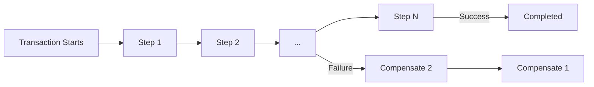
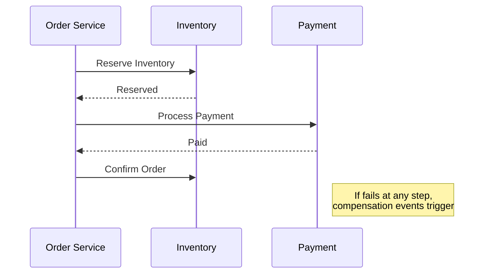
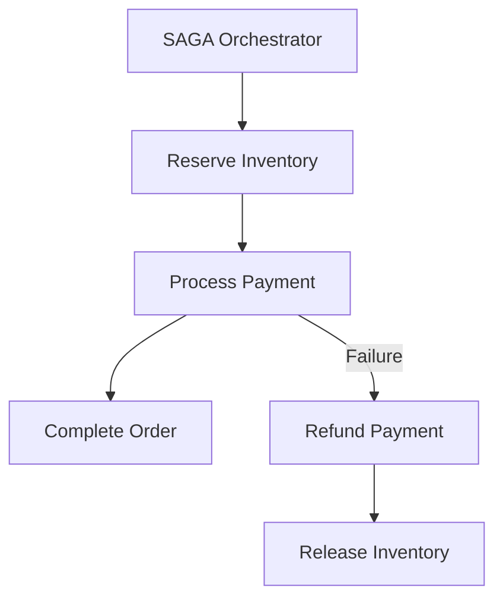

# **SAGA Pattern – The Ultimate Guide for Interview Preparation** 🚀

The SAGA pattern is a critical architectural approach for managing distributed transactions in microservices. This comprehensive guide covers everything from fundamentals to advanced implementations, with **Java examples, industry case studies, and visual explanations**.

---

## **Table of Contents** 📑
1. [What is SAGA?](#1-what-is-saga)
2. [Core Principles](#2-core-principles)
3. [Why Use SAGA?](#3-why-use-saga)
4. [When to Avoid SAGA](#4-when-to-avoid-saga)
5. [Implementation Approaches](#5-implementation-approaches)
6. [Java Code Examples](#6-java-code-examples)
7. [Industry Use Cases](#7-industry-use-cases)
8. [Best Practices](#8-best-practices)
9. [Technology Stack](#9-technology-stack)
10. [Visual Diagrams](#10-visual-diagrams)
11. [Comparison Table](#11-comparison-table)

---

## **1. What is SAGA?** 🏗️

SAGA is a pattern that **manages distributed transactions by breaking them into a sequence of local transactions**, each with its own compensating action for failure recovery.



---

## **2. Core Principles** 🧠

### **Two Implementation Styles**
1. **Choreography** (Event-driven)
    - Services emit events
    - Decentralized control

2. **Orchestration** (Command-driven)
    - Central coordinator
    - More control flow visibility

### **Compensating Transactions**
- Each step has inverse operation
- Must be idempotent
- Example: `ReserveSeat()` ↔ `CancelReservation()`

### **Eventual Consistency**
- System reaches consistency over time
- Temporary inconsistencies allowed

---

## **3. Why Use SAGA?** ✅

| Advantage | Explanation | Industry Example |
|-----------|-------------|------------------|
| **No Distributed Locks** | Avoids 2PC bottlenecks | Uber ride processing |
| **Scalability** | Services remain autonomous | Amazon order fulfillment |
| **Failure Recovery** | Explicit compensation logic | Airbnb booking reversals |
| **Domain Alignment** | Matches business processes | Ticketmaster seat allocation |

---

## **4. When to Avoid SAGA** ❌

| Situation | Reason | Alternative |
|-----------|--------|-------------|
| ACID requirements | SAGA is eventually consistent | Distributed transactions |
| Simple workflows | Overengineering | Local transactions |
| Non-reversible operations | Can't compensate | Banking transfers |
| Tight coupling | Defeats microservices purpose | Monolithic transaction |

**Quote from Chris Richardson:**  
*"SAGAs trade immediate consistency for availability and partition tolerance - choose wisely."*

---

## **5. Implementation Approaches** ⚙️

### **Choreography (Event-Driven)**
```java
// Order Service
public void createOrder() {
    orderRepository.save(order);
    eventBus.publish(new OrderCreatedEvent(orderId));
}

// Payment Service (Subscriber)
@EventListener
public void handle(OrderCreatedEvent event) {
    try {
        paymentService.charge(event.orderId());
        eventBus.publish(new PaymentProcessedEvent());
    } catch (Exception e) {
        eventBus.publish(new PaymentFailedEvent());
    }
}
```

### **Orchestration (Centralized)**
```java
public class OrderOrchestrator {
    
    @Transactional
    public void createOrder(OrderDTO order) {
        sagaQueue.add(new SagaStep(
            "reserve-inventory", 
            () -> inventoryClient.reserve(order.items()),
            () -> inventoryClient.cancelReservation(order.items())
        ));
        
        sagaQueue.add(new SagaStep(
            "process-payment",
            () -> paymentClient.charge(order.payment()),
            () -> paymentClient.refund(order.payment())
        ));
        
        executeSaga();
    }
}
```

---

## **6. Java Code Examples** ☕

### **Compensation Handler**
```java
public class OrderSagaCompensator {
    
    public void compensate(String orderId) {
        orderRepository.findById(orderId).ifPresent(order -> {
            if (order.isInventoryReserved()) {
                inventoryService.cancelReservation(order);
            }
            if (order.isPaymentProcessed()) {
                paymentService.issueRefund(order);
            }
            order.markAsFailed();
        });
    }
}
```

### **SAGA State Machine (Using Spring State Machine)**
```java
@Configuration
@EnableStateMachineFactory
public class SagaStateMachineConfig extends StateMachineConfigurerAdapter<String, String> {

    @Override
    public void configure(StateMachineStateConfigurer<String, String> states) {
        states
            .withStates()
            .initial("START")
            .state("INVENTORY_RESERVED")
            .state("PAYMENT_PROCESSED")
            .end("COMPLETED")
            .end("FAILED");
    }

    @Override
    public void configure(StateMachineTransitionConfigurer<String, String> transitions) {
        transitions
            .withExternal()
            .source("START").target("INVENTORY_RESERVED")
            .event("RESERVE_INVENTORY")
            .and()
            .withExternal()
            .source("INVENTORY_RESERVED").target("PAYMENT_PROCESSED")
            .event("PROCESS_PAYMENT")
            .and()
            .withExternal()
            .source("PAYMENT_PROCESSED").target("COMPLETED")
            .event("FINALIZE_ORDER");
    }
}
```

---

## **7. Industry Use Cases** 🏢

| Company | Implementation | Benefit |
|---------|---------------|---------|
| **Uber** | Ride processing | Handles 15M+ daily trips |
| **Netflix** | Content licensing | Cross-border transactions |
| **Airbnb** | Booking system | Multi-service coordination |
| **Walmart** | Inventory management | Black Friday surge handling |

---

## **8. Best Practices** 💡

1. **Design Compensations First**  
   Ensure every transaction has a rollback path

2. **Idempotency Keys**  
   Prevent duplicate compensations

3. **SAGA Log**  
   Persist each step for recovery

4. **Timeout Management**  
   Set reasonable deadlines for steps

5. **Circuit Breakers**  
   Prevent cascade failures

---

## **9. Technology Stack** ⚡

| Component | Technologies |
|-----------|--------------|
| **Choreography** | Kafka, RabbitMQ, Spring Cloud Stream |
| **Orchestration** | Camunda, Temporal, AWS Step Functions |
| **State Tracking** | MongoDB, Cassandra |
| **Framework** | Axon Framework, Eventuate |
| **Monitoring** | Prometheus, Grafana |

---

## **10. Visual Diagrams** 📊

### **Choreography SAGA**


### **Orchestration SAGA**


---

## **11. Comparison Table** 📋

| Aspect | Choreography | Orchestration |
|--------|--------------|---------------|
| **Complexity** | Lower | Higher |
| **Coupling** | Loose | Tight to orchestrator |
| **Visibility** | Hard to track | Centralized logs |
| **Recovery** | Event-driven | Orchestrator-managed |
| **Best For** | Simple flows | Complex business processes |

---

## **Final Thoughts** 🎯

Key interview talking points:
1. Explain CAP theorem implications
2. Compare to 2PC/TCC patterns
3. Discuss idempotency strategies
4. Share real compensation challenges

**"The SAGA pattern isn't about avoiding failures - it's about embracing them as a natural system state."** - Bernd Rücker

Would you like me to expand on any particular area? Perhaps deep dive into handling concurrent SAGAs or specific framework implementations?
