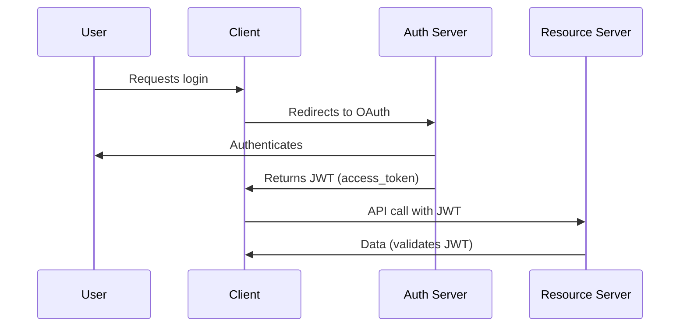

# **OAuth 2.0 in Spring Boot – The Ultimate Interview Guide** 🔐

🚀 **OAuth 2.0** is the industry-standard protocol for **authorization**, allowing secure access to resources without sharing passwords. **Spring Boot** simplifies OAuth2 implementation with **Spring Security OAuth2**.

This guide covers:  
✅ **OAuth 2.0 Core Concepts**  
✅ **Grant Types (When to Use Which?)**  
✅ **Spring Boot OAuth2 Implementation**  
✅ **Industry Best Practices**  
✅ **Big Tech Case Studies**  
✅ **Code Examples (Step-by-Step)**  
✅ **Interview Q&A**

---

## **1. What is OAuth 2.0?** 🔑
OAuth 2.0 is an **authorization framework** that allows third-party apps to access user data **without exposing passwords**.

### **Key Roles in OAuth 2.0**
| Role | Description |  
|------|-------------|  
| **Resource Owner** | User (owns the data) |  
| **Client** | App requesting access (e.g., a web/mobile app) |  
| **Authorization Server** | Issues tokens (e.g., Keycloak, Okta) |  
| **Resource Server** | API hosting protected data |  

---

## **2. OAuth 2.0 Grant Types** 🔄
Different ways to obtain an **access token** based on the client type:

| Grant Type | Use Case |  
|------------|----------|  
| **Authorization Code** | Web apps (most secure) |  
| **Implicit (Legacy)** | Single-page apps (deprecated in favor of PKCE) |  
| **Password (Deprecated)** | Trusted 1st-party apps (not recommended) |  
| **Client Credentials** | Machine-to-machine (service auth) |  
| **Refresh Token** | Renew expired access tokens |  

---

## **3. Why Use OAuth 2.0?** 🚀

### **Advantages**
✔ **No Password Sharing** → More secure than Basic Auth.  
✔ **Fine-Grained Permissions** → Scopes (`read`, `write`).  
✔ **Industry Standard** → Used by Google, Facebook, GitHub.

### **Disadvantages**
❌ **Complexity** → Hard to implement correctly.  
❌ **Token Management** → Need to handle expiry, revocation.

### **When NOT to Use OAuth 2.0?**
- **Internal microservices** (Use JWT or API keys).
- **Simple apps** (Basic Auth may suffice).

---

## **4. Industry Use Cases** 🏭

### **How Big Companies Use OAuth 2.0?**
| Company | Implementation |  
|---------|----------------|  
| **Google** | Authorization Code + PKCE |  
| **Facebook** | Implicit → Migrated to Code + PKCE |  
| **GitHub** | Personal Access Tokens (PATs) |  

### **Best Practices**
🔹 **Always use HTTPS** (Tokens must be encrypted).  
🔹 **Use short-lived tokens + refresh tokens**.  
🔹 **Avoid storing tokens in localStorage** (Use HTTP-only cookies).

---

## **5. Implementing OAuth 2.0 in Spring Boot** ⚙️

### **Option 1: Spring Security OAuth2 (Deprecated in Spring 5.x)**
```java
@Configuration
@EnableAuthorizationServer
public class AuthServerConfig extends AuthorizationServerConfigurerAdapter {
    @Override
    public void configure(ClientDetailsServiceConfigurer clients) throws Exception {
        clients.inMemory()
            .withClient("client")
            .secret("{noop}secret")
            .authorizedGrantTypes("authorization_code", "refresh_token")
            .scopes("read");
    }
}
```

### **Option 2: Spring Security 5 + OAuth2 (Recommended)**
```java
@Configuration
public class SecurityConfig extends WebSecurityConfigurerAdapter {

    @Override
    protected void configure(HttpSecurity http) throws Exception {
        http
            .authorizeRequests()
                .antMatchers("/public").permitAll()
                .anyRequest().authenticated()
            .and()
            .oauth2Login() // OAuth2 Login
            .and()
            .oauth2ResourceServer() // JWT Validation
                .jwt();
    }
}
```

### **Option 3: Using Keycloak (External Auth Server)**
```yaml
# application.yml
spring:
  security:
    oauth2:
      client:
        registration:
          keycloak:
            client-id: spring-client
            client-secret: secret
            scope: openid,profile,email
        provider:
          keycloak:
            issuer-uri: http://localhost:8080/auth/realms/master
```

---

## **6. Interview Q&A** 🎤

### **Q1: What is the difference between OAuth 2.0 and JWT?**
**A:**
- **OAuth 2.0** → Authorization framework.
- **JWT** → Token format (can be used in OAuth).

### **Q2: Why is the Implicit flow deprecated?**
**A:** Tokens exposed in URLs (vulnerable to attacks). **PKCE** is now preferred.

### **Q3: What is PKCE?**
**A:** Proof Key for Code Exchange – prevents authorization code interception.

### **Q4: How do you secure OAuth 2.0 tokens?**
**A:**  
✔ **Use short expiry times**.  
✔ **Store refresh tokens securely (HTTP-only cookies)**.  
✔ **Use PKCE for public clients**.

### **Q5: What are OAuth 2.0 scopes?**
**A:** Permissions (`read`, `write`) that limit what a client can do.

---

## **7. Summary Table** 📊

| Feature | Description |  
|---------|-------------|  
| **Purpose** | Secure delegated authorization |  
| **Best Grant Type** | Authorization Code + PKCE |  
| **Token Storage** | HTTP-only cookies (avoid localStorage) |  
| **Spring Boot Support** | `spring-security-oauth2` (legacy), `spring-security-oauth2-resource-server` (new) |  

---

## **Final Thoughts** 🎯
- **Use OAuth 2.0** for **3rd-party app access**.
- **Avoid deprecated flows** (Implicit, Password).
- **Spring Security 5+** simplifies OAuth2 integration.

🚀 **Now you’re ready to answer any OAuth 2.0 interview question!**

---

# **JWT vs OAuth 2.0 – Deep Dive Comparison** 🔐🆚🔑

Understanding the difference between **JWT (JSON Web Tokens)** and **OAuth 2.0** is crucial for modern authentication/authorization systems. Let's break them down in detail.

## **1. Fundamental Differences** 🏗️

| Feature        | JWT | OAuth 2.0 |
|--------------|-----|----------|
| **Type** | Token format (JSON-based) | Authorization framework |
| **Purpose** | Secure data transmission | Delegated access control |
| **Contains** | Claims (user info, expiry) | No token format (uses Bearer tokens, often JWTs) |
| **Encryption** | Can be signed (JWS) or encrypted (JWE) | Relies on HTTPS |
| **Usage** | Authentication & stateless sessions | Authorization between apps |

### **Key Insight** 💡
- **OAuth 2.0** defines **how** apps get access.
- **JWT** defines **what** the token looks like.

---

## **2. When to Use Which?** 🤔

### **✅ Use JWT When:**
✔ You need **stateless authentication** (Microservices, APIs).  
✔ You want **self-contained tokens** (no DB calls for validation).  
✔ You need **custom claims** (user roles, metadata).

### **✅ Use OAuth 2.0 When:**
✔ You need **delegated authorization** (e.g., "Login with Google").  
✔ You manage **3rd-party app access**.  
✔ You need **refresh tokens** for long-lived sessions.

### **❌ Don’t Use JWT If:**
- You need **token revocation** (JWTs are valid until expiry).
- You handle **sensitive data without encryption** (use JWE).

### **❌ Don’t Use OAuth 2.0 If:**
- You only need **simple API-to-API auth** (use API keys/JWT).

---

## **3. How They Work Together?** 🤝

### **OAuth 2.0 + JWT = Best of Both Worlds**


1. **OAuth 2.0** handles the **authorization flow** (e.g., Google login).
2. The **access_token** returned is often a **JWT**.
3. The **Resource Server** validates the JWT **without calling the Auth Server** (stateless).

---

## **4. Security Comparison** 🔒

| Security Aspect | JWT | OAuth 2.0 |
|----------------|-----|----------|
| **Token Revocation** | ❌ (Hard) | ✅ (Refresh token invalidation) |
| **Token Hijacking** | ❌ (If stolen, valid until expiry) | ✅ (Short-lived tokens) |
| **Encryption** | ✅ (JWE) | ✅ (HTTPS mandatory) |
| **CSRF Protection** | ✅ (Stored in memory, not cookies) | ✅ (PKCE for public clients) |

### **Best Practices for Both** 🛡️
- **For JWT**:  
  ✔ Use **short expiry** (15-30 mins).  
  ✔ Always **validate signatures** (avoid `none` alg).  
  ✔ Store in **memory, not localStorage**.

- **For OAuth 2.0**:  
  ✔ Use **PKCE** for mobile/SPA apps.  
  ✔ **Rotate refresh tokens**.  
  ✔ **Limit scopes** (`read` vs `write`).

---

## **5. Code Examples** 💻

### **JWT Generation in Java (jjwt)**
```java
import io.jsonwebtoken.Jwts;
import io.jsonwebtoken.SignatureAlgorithm;

String jwt = Jwts.builder()
    .setSubject("user123")
    .claim("role", "admin") // Custom claim
    .setExpiration(new Date(System.currentTimeMillis() + 900000)) // 15 mins
    .signWith(SignatureAlgorithm.HS256, "secretKey") // Sign with HMAC
    .compact();
```

### **OAuth 2.0 + JWT in Spring Boot**
```yaml
# application.yml
spring:
  security:
    oauth2:
      resourceserver:
        jwt:
          issuer-uri: https://auth-server.com
          jwk-set-uri: https://auth-server.com/.well-known/jwks.json
```

---

## **6. Industry Adoption** 🏢

| Company | Approach |
|---------|----------|
| **Google** | OAuth 2.0 + JWT (access_token is JWT) |
| **AWS Cognito** | Issues JWTs after OAuth flow |
| **Auth0** | Hybrid (OAuth 2.0 + JWT sessions) |

---

## **7. Interview Q&A** 🎤

### **Q1: Can OAuth 2.0 work without JWT?**
**A:** Yes! OAuth 2.0 tokens can be **opaque** (random strings). But JWTs are common because they’re **self-contained**.

### **Q2: Why not use JWT for everything?**
**A:** JWTs can’t be **revoked** easily. OAuth 2.0’s **refresh tokens** solve this.

### **Q3: Is JWT more secure than OAuth 2.0?**
**A:** No—they solve different problems. OAuth 2.0 is a **framework**, while JWT is a **token format**. Often used together.

### **Q4: How do you invalidate a JWT?**
**A:** You can’t easily. Workarounds:  
✔ Short expiry + refresh tokens.  
✔ Blacklist tokens in Redis (loses statelessness).

### **Q5: What’s the biggest OAuth 2.0 vulnerability?**
**A:** **Token leakage** (e.g., in logs). Mitigation:  
✔ Use PKCE.  
✔ Store tokens securely (not in localStorage).

---

## **8. Summary Table** 📊

| Aspect | JWT | OAuth 2.0 |
|--------|-----|----------|
| **Format** | JSON token | Framework |
| **Stateless** | ✅ | ❌ (Needs auth server) |
| **Revocable** | ❌ | ✅ |
| **Best For** | APIs, Microservices | 3rd-party access |
| **Common Pairing** | Used as OAuth 2.0 tokens | Uses JWTs as tokens |

---

## **Final Verdict** 🏆
- **Use JWT** for **stateless APIs**.
- **Use OAuth 2.0** for **delegated auth** (e.g., social login).
- **Combine them** for secure, scalable auth.

🚀 **Now you can confidently explain the difference in interviews!**

Need a **JWT security deep dive** next? Let me know! 🔐
