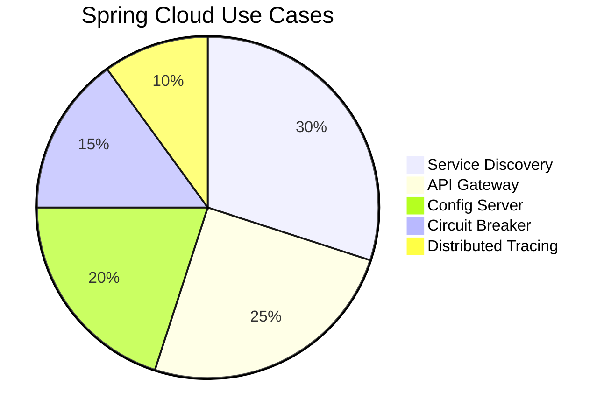

# **Spring Cloud – The Ultimate Interview Guide** ☁️🛠️

## **1. Introduction to Spring Cloud** 🌐
Spring Cloud provides tools for developers to quickly build **distributed systems** and **microservices architectures**. It solves common patterns in distributed systems like **configuration management**, **service discovery**, **circuit breakers**, and more.

### **Why Spring Cloud?**
✔ **Simplifies Microservices Development**  
✔ **Integrates with Netflix OSS & Other Cloud Providers**  
✔ **Provides Ready-Made Solutions for Distributed Systems**



---

## **2. Core Spring Cloud Components** 🧩

| Component | Purpose | Key Annotation |
|-----------|---------|----------------|
| **Eureka** | Service Discovery | `@EnableEurekaServer` |
| **Zuul** | API Gateway (Legacy) | `@EnableZuulProxy` |
| **Spring Cloud Gateway** | Modern API Gateway | `@EnableDiscoveryClient` |
| **Hystrix** | Circuit Breaker (Legacy) | `@EnableHystrix` |
| **Resilience4j** | Fault Tolerance | `@CircuitBreaker` |
| **Config Server** | Centralized Config | `@EnableConfigServer` |
| **Sleuth + Zipkin** | Distributed Tracing | `@EnableSleuth` |

---

## **3. Industry Use Cases & Best Practices** 🏭

### **How Big Companies Use Spring Cloud?**
| Company | Implementation |
|---------|----------------|
| **Netflix** | Eureka + Zuul + Hystrix |
| **Uber** | Spring Cloud Gateway + Resilience4j |
| **Airbnb** | Config Server + Sleuth/Zipkin |

### **Best Practices**
✔ **Use Service Mesh (Istio) for Advanced Traffic Management**  
✔ **Externalize Configs for Different Environments**  
✔ **Implement Circuit Breakers for Fault Tolerance**

---

## **4. Advantages & Disadvantages** ⚖️

### **✅ Advantages**
✔ **Standardized Microservices Development**  
✔ **Seamless Integration with Spring Boot**  
✔ **Rich Ecosystem (Netflix OSS, Kubernetes Support)**

### **❌ Disadvantages**
❌ **Steep Learning Curve for Beginners**  
❌ **Some Components (Hystrix) Are in Maintenance Mode**

### **When NOT to Use Spring Cloud?**
- **Monolithic Applications**
- **Serverless Architectures (Use AWS Lambda/Cloud Functions)**

---

## **5. Code Examples** 💻

### **Example 1: Eureka Service Discovery**
```java
// Eureka Server
@SpringBootApplication
@EnableEurekaServer
public class EurekaServer {
    public static void main(String[] args) {
        SpringApplication.run(EurekaServer.class, args);
    }
}

// Eureka Client (Microservice)
@SpringBootApplication
@EnableDiscoveryClient
public class UserService {
    public static void main(String[] args) {
        SpringApplication.run(UserService.class, args);
    }
}
```

### **Example 2: Spring Cloud Config Server**
```yaml
# application.yml (Config Server)
spring:
  cloud:
    config:
      server:
        git:
          uri: https://github.com/your-repo/config-repo
```

```java
@SpringBootApplication
@EnableConfigServer
public class ConfigServer {
    public static void main(String[] args) {
        SpringApplication.run(ConfigServer.class, args);
    }
}
```

### **Example 3: Resilience4j Circuit Breaker**
```java
@RestController
public class UserController {
    
    @GetMapping("/users/{id}")
    @CircuitBreaker(name = "userService", fallbackMethod = "getUserFallback")
    public User getUser(@PathVariable Long id) {
        // Call external service
    }
    
    public User getUserFallback(Long id, Exception e) {
        return new User(id, "Fallback User");
    }
}
```

---

## **6. Interview Q&A** 🎤

### **Q1: What is the difference between Spring Cloud and Spring Boot?**
**A:**
- **Spring Boot** simplifies standalone app development.
- **Spring Cloud** builds on Boot to provide distributed system tools.

### **Q2: Why use Spring Cloud Gateway instead of Zuul?**
**A:**  
✔ **Better Performance (Async Non-Blocking)**  
✔ **Actively Maintained**  
✔ **Native Spring Integration**

### **Q3: How does Eureka handle service discovery?**
**A:**
- Services register with Eureka Server (`@EnableDiscoveryClient`).
- Clients query Eureka to locate services.

### **Q4: What are the alternatives to Hystrix?**
**A:**  
✔ **Resilience4j** (Recommended)  
✔ **Sentinel** (Alibaba)

### **Q5: How do you manage distributed configurations?**
**A:** Using **Spring Cloud Config Server** with Git backend.

---

## **7. Summary Table** 📊

| Feature | Spring Cloud | Alternatives |
|---------|-------------|--------------|
| **Service Discovery** | Eureka | Consul, Zookeeper |
| **API Gateway** | Spring Cloud Gateway | Kong, Nginx |
| **Config Management** | Config Server | Vault, Kubernetes ConfigMaps |
| **Circuit Breaker** | Resilience4j | Hystrix, Sentinel |

---

## **Final Thoughts** 🎯
- **Use Spring Cloud** for **microservices & distributed systems**.
- **Combine with Kubernetes** for cloud-native deployments.
- **Stay updated** as the ecosystem evolves rapidly.

🚀 **Now you're ready to ace Spring Cloud interviews!**

---

# Most Frequently Asked Questions about Spring Cloud

## Fundamentals

1. **What is Spring Cloud?**
   Spring Cloud provides tools for developers to quickly build common distributed system patterns for their applications. It's built on top of Spring Boot and offers modules for service discovery, load balancing, configuration management, circuit breaking, and more.

2. **How does Spring Cloud relate to microservices?**
   Spring Cloud provides implementation tools that make it easier to build and manage microservices architectures, handling cross-cutting concerns like service discovery, configuration management, and resilience patterns.

3. **What's the difference between Spring Boot and Spring Cloud?**
   Spring Boot is a framework to build standalone Spring applications with minimal configuration, while Spring Cloud builds on top of Spring Boot to provide tools for distributed systems and microservices.

## Components and Services

4. **What is Netflix Eureka in Spring Cloud?**
   Eureka is a service registry that allows microservices to register themselves and discover other services. It provides a REST API for service registration, query and health monitoring.

5. **How does Spring Cloud Config work?**
   Spring Cloud Config provides centralized external configuration management. Configuration files are stored in a Git repository and can be accessed via a REST API or directly by Spring Cloud Config clients.

6. **What is Spring Cloud Gateway?**
   Spring Cloud Gateway is a library for building API gateways on top of Spring WebFlux. It provides routing mechanisms, filters, and security features to control and monitor requests to your microservices.

7. **What is Ribbon in Spring Cloud?**
   Ribbon is a client-side load balancer that gives you control over the behavior of HTTP and TCP clients. It automatically integrates with service discovery tools like Eureka.

8. **What is Hystrix and what problem does it solve?**
   Hystrix is a latency and fault tolerance library designed to isolate points of access to remote systems, stop cascading failures, and enable resilience. It implements the Circuit Breaker pattern to prevent system overload during failures.

## Implementation Questions

9. **How do I implement service discovery with Spring Cloud?**
   Add Spring Cloud Netflix Eureka Client dependency, annotate your main class with `@EnableDiscoveryClient`, and configure your application to register with Eureka server via properties.

10. **How can I implement centralized configuration with Spring Cloud?**
    Set up a Spring Cloud Config Server pointing to a Git repository, then configure your microservices as config clients that can fetch their configuration from this central location.

11. **How do I implement circuit breaking in Spring Cloud?**
    Use Spring Cloud Circuit Breaker with your preferred implementation (Resilience4J, Hystrix, etc.), then annotate methods with `@CircuitBreaker` or use the CircuitBreakerFactory in your code.

12. **How can I trace requests across microservices?**
    Use Spring Cloud Sleuth with Zipkin for distributed tracing. Sleuth adds trace and span IDs to your logs, and Zipkin provides visualization and analysis of these trace data.

## Troubleshooting

13. **My service isn't registering with Eureka - what could be wrong?**
    Check if Eureka server is running, verify your client configuration (service URL, application name), ensure network connectivity, and check if `eureka.client.register-with-eureka` property is set to true.

14. **Configuration changes in Config Server aren't reflecting in my services - why?**
    Services only fetch configuration at startup by default. Use Spring Cloud Bus to broadcast configuration changes, or implement refresh endpoints using `@RefreshScope`.

15. **How can I debug issues with Feign clients?**
    Enable Feign logging by setting the appropriate logger level, check if service names are correct, verify if your service is properly registered with Eureka, and inspect network connectivity.

## Advanced Topics

16. **How do I secure my microservices with Spring Cloud?**
    Use Spring Cloud Security with OAuth2/JWT for authentication and authorization across services. Spring Cloud Gateway can also enforce security at the API gateway level.

17. **How can Spring Cloud help with resilience?**
    Spring Cloud provides circuit breakers, retry mechanisms, rate limiters, bulkheads, and fallback methods through projects like Resilience4J and previously Hystrix.

18. **What is the best way to handle inter-service communication?**
    Use declarative REST clients with Feign, or reactive programming with WebClient. Both can integrate with service discovery and load balancing.

19. **How do I manage transactions across microservices?**
    Use the Saga pattern or eventual consistency instead of distributed transactions. Spring Cloud Stream with Kafka/RabbitMQ can help implement event-driven approaches.

20. **How can I deploy Spring Cloud applications to Kubernetes?**
    Use Spring Cloud Kubernetes to integrate with Kubernetes' native service discovery and configuration management, replacing Eureka and Config Server with Kubernetes equivalents.

---

# More Spring Cloud Questions with Examples

## Spring Cloud Config

**21. How do I set up a Spring Cloud Config Server?**

```java
// Step 1: Add dependency in pom.xml
<dependency>
    <groupId>org.springframework.cloud</groupId>
    <artifactId>spring-cloud-config-server</artifactId>
</dependency>

// Step 2: Enable Config Server in main application class
@SpringBootApplication
@EnableConfigServer
public class ConfigServerApplication {
    public static void main(String[] args) {
        SpringApplication.run(ConfigServerApplication.class, args);
    }
}

// Step 3: Configure in application.properties
spring.application.name=config-server
server.port=8888
spring.cloud.config.server.git.uri=https://github.com/myuser/config-repo
spring.cloud.config.server.git.default-label=main
```

**22. How do I configure a client to use Spring Cloud Config Server?**

```java
// Step 1: Add dependencies in pom.xml
<dependency>
    <groupId>org.springframework.cloud</groupId>
    <artifactId>spring-cloud-starter-config</artifactId>
</dependency>
<dependency>
    <groupId>org.springframework.boot</groupId>
    <artifactId>spring-boot-starter-actuator</artifactId>
</dependency>

// Step 2: Configure bootstrap.properties or application.properties
spring.application.name=order-service
spring.config.import=optional:configserver:http://localhost:8888
spring.cloud.config.fail-fast=true

// Step 3: Create @ConfigurationProperties class
@Component
@ConfigurationProperties(prefix = "order")
public class OrderProperties {
    private int pageSize;
    private boolean caching;
    // getters and setters
}
```

## Service Discovery

**23. How do I implement a Eureka Server?**

```java
// Step 1: Add dependency in pom.xml
<dependency>
    <groupId>org.springframework.cloud</groupId>
    <artifactId>spring-cloud-starter-netflix-eureka-server</artifactId>
</dependency>

// Step 2: Enable Eureka Server in main application class
@SpringBootApplication
@EnableEurekaServer
public class EurekaServerApplication {
    public static void main(String[] args) {
        SpringApplication.run(EurekaServerApplication.class, args);
    }
}

// Step 3: Configure in application.properties
server.port=8761
eureka.client.register-with-eureka=false
eureka.client.fetch-registry=false
```

**24. How do I register my service with Eureka and discover other services?**

```java
// Step 1: Add dependency in pom.xml
<dependency>
    <groupId>org.springframework.cloud</groupId>
    <artifactId>spring-cloud-starter-netflix-eureka-client</artifactId>
</dependency>

// Step 2: Enable Discovery Client in main application class
@SpringBootApplication
@EnableDiscoveryClient
public class UserServiceApplication {
    public static void main(String[] args) {
        SpringApplication.run(UserServiceApplication.class, args);
    }
}

// Step 3: Configure in application.properties
spring.application.name=user-service
server.port=8081
eureka.client.service-url.defaultZone=http://localhost:8761/eureka/

// Step 4: Use DiscoveryClient to find services
@RestController
public class UserController {
    @Autowired
    private DiscoveryClient discoveryClient;
    
    @GetMapping("/service-instances")
    public List<ServiceInstance> serviceInstances() {
        return this.discoveryClient.getInstances("order-service");
    }
}
```

## Circuit Breaker

**25. How do I implement circuit breaking with Resilience4J?**

```java
// Step 1: Add dependencies in pom.xml
<dependency>
    <groupId>org.springframework.cloud</groupId>
    <artifactId>spring-cloud-starter-circuitbreaker-resilience4j</artifactId>
</dependency>
<dependency>
    <groupId>org.springframework.boot</groupId>
    <artifactId>spring-boot-starter-aop</artifactId>
</dependency>

// Step 2: Configure circuit breaker properties
resilience4j.circuitbreaker.instances.paymentService.slidingWindowSize=10
resilience4j.circuitbreaker.instances.paymentService.failureRateThreshold=50
resilience4j.circuitbreaker.instances.paymentService.waitDurationInOpenState=5000
resilience4j.circuitbreaker.instances.paymentService.permittedNumberOfCallsInHalfOpenState=3

// Step 3: Use circuit breaker in a service
@Service
public class OrderService {
    @CircuitBreaker(name = "paymentService", fallbackMethod = "paymentServiceFallback")
    public OrderDto processOrder(OrderDto order) {
        // Call to payment service that might fail
        PaymentResponse response = paymentClient.processPayment(order.getPaymentDetails());
        
        // Process response
        return order;
    }
    
    public OrderDto paymentServiceFallback(OrderDto order, Exception e) {
        order.setStatus("PENDING");
        order.setMessage("Payment service unavailable, order saved for later processing");
        return order;
    }
}
```

## Feign Client

**26. How do I use Feign clients for service-to-service communication?**

```java
// Step 1: Add dependency in pom.xml
<dependency>
    <groupId>org.springframework.cloud</groupId>
    <artifactId>spring-cloud-starter-openfeign</artifactId>
</dependency>

// Step 2: Enable Feign Clients in main application class
@SpringBootApplication
@EnableFeignClients
public class OrderServiceApplication {
    public static void main(String[] args) {
        SpringApplication.run(OrderServiceApplication.class, args);
    }
}

// Step 3: Create Feign client interface
@FeignClient(name = "user-service")
public interface UserClient {
    @GetMapping("/users/{id}")
    UserDto getUserById(@PathVariable("id") Long id);
    
    @PostMapping("/users")
    UserDto createUser(@RequestBody UserDto user);
}

// Step 4: Use the Feign client in a service
@Service
public class OrderService {
    @Autowired
    private UserClient userClient;
    
    public OrderDto createOrder(OrderDto order) {
        // Verify user exists
        UserDto user = userClient.getUserById(order.getUserId());
        
        // Process order...
        return order;
    }
}
```

## API Gateway

**27. How do I set up Spring Cloud Gateway?**

```java
// Step 1: Add dependency in pom.xml
<dependency>
    <groupId>org.springframework.cloud</groupId>
    <artifactId>spring-cloud-starter-gateway</artifactId>
</dependency>
<dependency>
    <groupId>org.springframework.cloud</groupId>
    <artifactId>spring-cloud-starter-netflix-eureka-client</artifactId>
</dependency>

// Step 2: Configure in application.yml
spring:
  application:
    name: api-gateway
  cloud:
    gateway:
      discovery:
        locator:
          enabled: true
      routes:
        - id: user-service
          uri: lb://USER-SERVICE
          predicates:
            - Path=/users/**
        - id: order-service
          uri: lb://ORDER-SERVICE
          predicates:
            - Path=/orders/**
          filters:
            - RewritePath=/orders/(?<segment>.*), /$\{segment}
            - AddRequestHeader=X-Gateway-Source, api-gateway

eureka:
  client:
    service-url:
      defaultZone: http://localhost:8761/eureka/
```

## Load Balancing

**28. How can I implement client-side load balancing?**

```java
// Step 1: Add dependencies in pom.xml
<dependency>
    <groupId>org.springframework.cloud</groupId>
    <artifactId>spring-cloud-starter-loadbalancer</artifactId>
</dependency>

// Step 2: Configure RestTemplate with load balancing
@Configuration
public class RestTemplateConfig {
    @Bean
    @LoadBalanced
    public RestTemplate restTemplate() {
        return new RestTemplate();
    }
}

// Step 3: Use the load-balanced RestTemplate
@Service
public class ProductService {
    @Autowired
    private RestTemplate restTemplate;
    
    public ProductDto getProductDetails(Long productId) {
        // The URL uses the service name registered with Eureka instead of hostname:port
        return restTemplate.getForObject("http://inventory-service/products/" + productId, ProductDto.class);
    }
}
```

## Distributed Tracing

**29. How do I implement distributed tracing with Spring Cloud Sleuth and Zipkin?**

```java
// Step 1: Add dependencies in pom.xml
<dependency>
    <groupId>org.springframework.cloud</groupId>
    <artifactId>spring-cloud-starter-sleuth</artifactId>
</dependency>
<dependency>
    <groupId>org.springframework.cloud</groupId>
    <artifactId>spring-cloud-sleuth-zipkin</artifactId>
</dependency>

// Step 2: Configure in application.properties
spring.application.name=payment-service
spring.sleuth.sampler.probability=1.0
spring.zipkin.base-url=http://localhost:9411

// Step 3: Create example controller to see tracing in action
@RestController
@RequestMapping("/payments")
public class PaymentController {
    private static final Logger logger = LoggerFactory.getLogger(PaymentController.class);
    
    @Autowired
    private PaymentService paymentService;
    
    @PostMapping
    public ResponseEntity<PaymentResponse> processPayment(@RequestBody PaymentRequest request) {
        logger.info("Received payment request for order: {}", request.getOrderId());
        PaymentResponse response = paymentService.processPayment(request);
        logger.info("Payment processed: {}", response.getTransactionId());
        return ResponseEntity.ok(response);
    }
}
```

## Spring Cloud Bus

**30. How do I implement dynamic configuration updates with Spring Cloud Bus?**

```java
// Step 1: Add dependencies in pom.xml
<dependency>
    <groupId>org.springframework.cloud</groupId>
    <artifactId>spring-cloud-starter-config</artifactId>
</dependency>
<dependency>
    <groupId>org.springframework.cloud</groupId>
    <artifactId>spring-cloud-starter-bus-amqp</artifactId>
</dependency>
<dependency>
    <groupId>org.springframework.boot</groupId>
    <artifactId>spring-boot-starter-actuator</artifactId>
</dependency>

// Step 2: Configure in application.properties
spring.application.name=catalog-service
spring.config.import=optional:configserver:http://localhost:8888
spring.rabbitmq.host=localhost
spring.rabbitmq.port=5672
spring.rabbitmq.username=guest
spring.rabbitmq.password=guest

management.endpoints.web.exposure.include=busrefresh

// Step 3: Use @RefreshScope for beans that need to refresh on config changes
@RestController
@RefreshScope
public class CatalogController {
    @Value("${catalog.showPrices:true}")
    private boolean showPrices;
    
    @GetMapping("/products")
    public List<ProductDto> getProducts() {
        List<ProductDto> products = productService.getProducts();
        
        if (!showPrices) {
            products.forEach(p -> p.setPrice(null));
        }
        
        return products;
    }
}
```

## Spring Cloud Stream

**31. How do I implement event-driven microservices with Spring Cloud Stream?**

```java
// Step 1: Add dependencies in pom.xml
<dependency>
    <groupId>org.springframework.cloud</groupId>
    <artifactId>spring-cloud-stream</artifactId>
</dependency>
<dependency>
    <groupId>org.springframework.cloud</groupId>
    <artifactId>spring-cloud-stream-binder-kafka</artifactId>
</dependency>

// Step 2: Define message channels
public interface OrderChannels {
    String OUTPUT = "order-created-output";
    String INPUT = "order-created-input";
    
    @Output(OUTPUT)
    MessageChannel orderCreatedOutput();
    
    @Input(INPUT)
    SubscribableChannel orderCreatedInput();
}

// Step 3: Configure in application.properties
spring.cloud.stream.bindings.order-created-output.destination=orders
spring.cloud.stream.bindings.order-created-input.destination=orders
spring.cloud.stream.bindings.order-created-input.group=notification-service
spring.cloud.stream.kafka.binder.brokers=localhost:9092

// Step 4: Create publisher
@Service
@EnableBinding(OrderChannels.class)
public class OrderEventPublisher {
    @Autowired
    private OrderChannels channels;
    
    public void publishOrderCreated(OrderCreatedEvent event) {
        channels.orderCreatedOutput().send(MessageBuilder.withPayload(event).build());
    }
}

// Step 5: Create consumer
@Service
@EnableBinding(OrderChannels.class)
public class OrderEventConsumer {
    private static final Logger logger = LoggerFactory.getLogger(OrderEventConsumer.class);
    
    @StreamListener(OrderChannels.INPUT)
    public void handleOrderCreated(OrderCreatedEvent event) {
        logger.info("Received order created event: {}", event.getOrderId());
        // Process the event
    }
}
```

## Vault Integration

**32. How do I secure sensitive configuration with Spring Cloud Vault?**

```java
// Step 1: Add dependencies in pom.xml
<dependency>
    <groupId>org.springframework.cloud</groupId>
    <artifactId>spring-cloud-starter-vault-config</artifactId>
</dependency>

// Step 2: Configure in bootstrap.properties
spring.application.name=payment-service
spring.cloud.vault.host=localhost
spring.cloud.vault.port=8200
spring.cloud.vault.scheme=http
spring.cloud.vault.authentication=token
spring.cloud.vault.token=hvs.xyzAbcTokenFromVault123
spring.cloud.vault.kv.enabled=true
spring.cloud.vault.kv.default-context=payment-service

// Step 3: Access the secrets in your application
@RestController
public class SecretController {
    @Value("${payment.gateway.key}")
    private String paymentGatewayKey;
    
    @Value("${payment.gateway.secret}")
    private String paymentGatewaySecret;
    
    @GetMapping("/secret-status")
    public String secretStatus() {
        return "Secrets are loaded: " + (paymentGatewayKey != null && paymentGatewaySecret != null);
    }
}
```

## Spring Cloud Kubernetes

**33. How do I integrate Spring Cloud with Kubernetes?**

```java
// Step 1: Add dependencies in pom.xml
<dependency>
    <groupId>org.springframework.cloud</groupId>
    <artifactId>spring-cloud-starter-kubernetes-client-config</artifactId>
</dependency>
<dependency>
    <groupId>org.springframework.cloud</groupId>
    <artifactId>spring-cloud-starter-kubernetes-client</artifactId>
</dependency>

// Step 2: Configure in application.properties
spring.application.name=inventory-service
spring.cloud.kubernetes.config.name=inventory-config
spring.cloud.kubernetes.config.namespace=microservices
spring.cloud.kubernetes.discovery.all-namespaces=true

// Step 3: Configure Kubernetes ConfigMap (inventory-config.yml)
apiVersion: v1
kind: ConfigMap
metadata:
  name: inventory-config
  namespace: microservices
data:
  application.properties: |-
    inventory.cache.ttl=30
    inventory.pagination.size=50

// Step 4: Use DiscoveryClient to find services in Kubernetes
@RestController
public class ServiceController {
    @Autowired
    private DiscoveryClient discoveryClient;
    
    @GetMapping("/k8s-services")
    public List<String> getServices() {
        return discoveryClient.getServices();
    }
}
```
