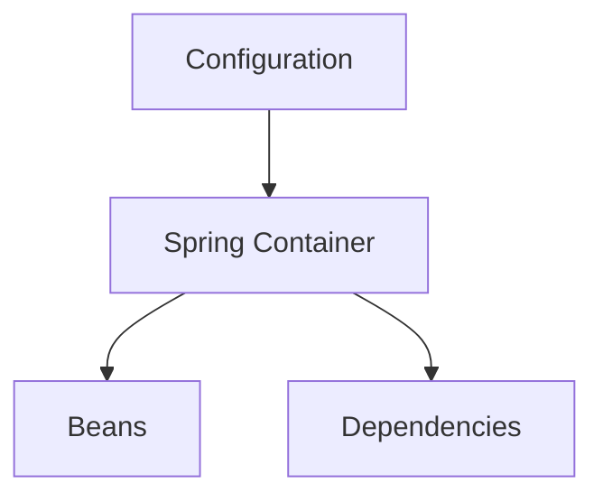
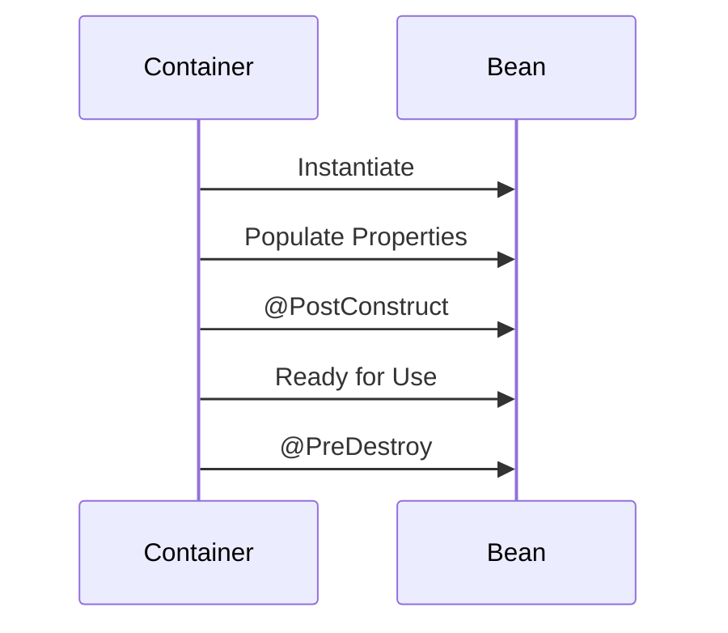
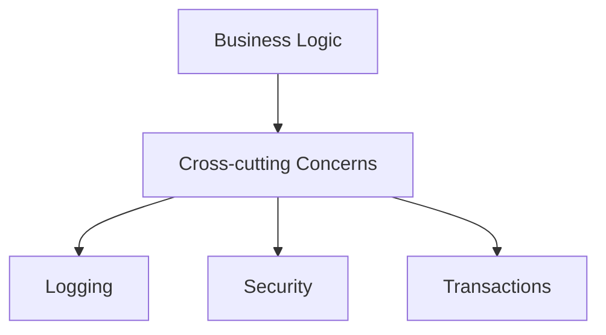
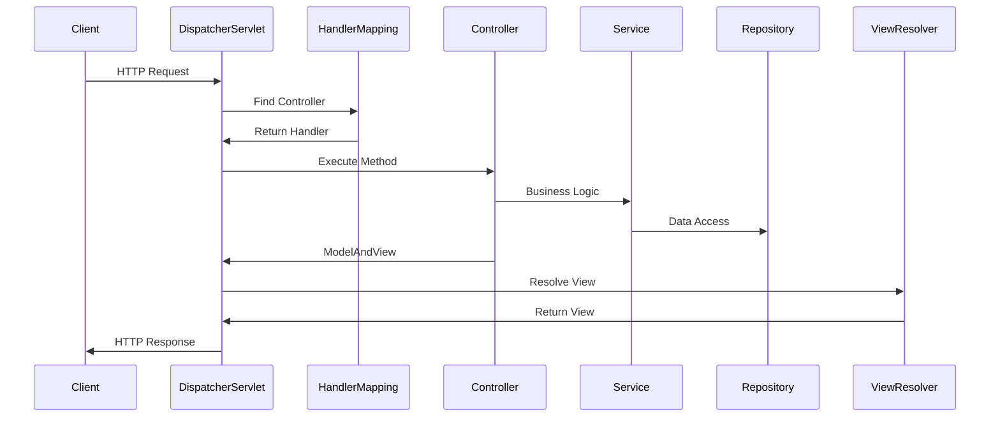
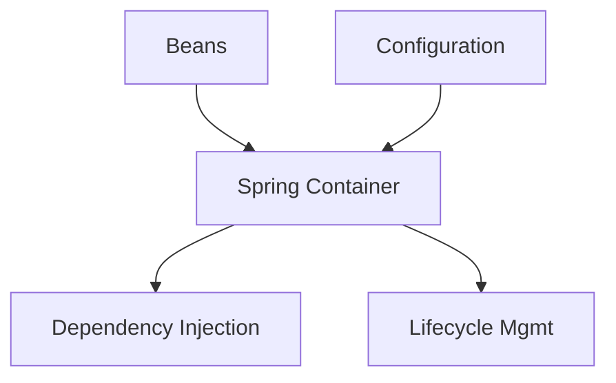
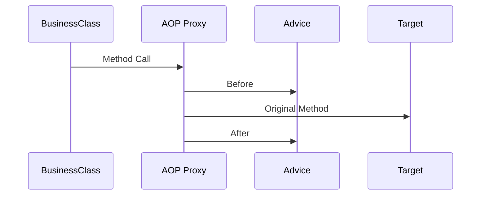

# **Spring Core Container: Beans, Context, AOP & MVC - Complete Guide** 🚀

This comprehensive guide covers Spring's core container concepts with detailed explanations, industry best practices, Java examples, and interview-focused content.

## Table of Contents
1. [Spring Container Overview](#1-spring-container-overview)
2. [Bean Management](#2-bean-management)
3. [ApplicationContext](#3-applicationcontext)
4. [Dependency Injection](#4-dependency-injection)
5. [Aspect-Oriented Programming](#5-aspect-oriented-programming-aop)
6. [Spring MVC](#6-spring-mvc)
7. [Best Practices](#7-best-practices)
8. [Interview Q&A](#8-interview-qa)
9. [Comparison Tables](#9-comparison-tables)
10. [Visual Diagrams](#10-visual-diagrams)

---

## 1. Spring Container Overview 🏗️

### 1.1 What is Spring Container?


**Key Responsibilities:**
- Creating objects (beans)
- Wiring dependencies
- Managing lifecycle
- Providing configuration

### 1.2 Core Modules
| Module | Purpose |
|--------|---------|
| Beans | Bean definition and wiring |
| Core | IoC foundation |
| Context | Application context |
| AOP | Aspect-oriented programming |
| MVC | Web framework |

---

## 2. Bean Management 🧩

### 2.1 Bean Definition
```java
@Configuration
public class AppConfig {
    
    @Bean(name = "paymentService")
    @Scope("singleton")
    @Lazy
    public PaymentService paymentService() {
        return new CreditCardService();
    }
}
```

### 2.2 Bean Scopes
| Scope | Description | Use Case |
|-------|-------------|----------|
| Singleton | One instance per container | Stateless services |
| Prototype | New instance each request | Stateful beans |
| Request | HTTP request lifecycle | Web controllers |
| Session | User session lifecycle | User preferences |

### 2.3 Bean Lifecycle


---

## 3. ApplicationContext 🏛️

### 3.1 Context Types
| Context | Purpose | Example |
|---------|---------|---------|
| AnnotationConfig | Java config | `AnnotationConfigApplicationContext` |
| ClassPathXml | XML config | `ClassPathXmlApplicationContext` |
| WebApplication | Web apps | `AnnotationConfigWebApplicationContext` |

### 3.2 Context Hierarchy
```java
// Parent context
ApplicationContext parent = new AnnotationConfigApplicationContext(ParentConfig.class);

// Child context
AnnotationConfigApplicationContext child = new AnnotationConfigApplicationContext();
child.setParent(parent);
child.register(ChildConfig.class);
child.refresh();
```

---

## 4. Dependency Injection 💉

### 4.1 Injection Types
```java
// Constructor Injection (Recommended)
@Service
public class OrderService {
    private final PaymentService paymentService;
    
    @Autowired
    public OrderService(PaymentService paymentService) {
        this.paymentService = paymentService;
    }
}

// Setter Injection
@Controller
public class UserController {
    private UserService userService;
    
    @Autowired
    public void setUserService(UserService userService) {
        this.userService = userService;
    }
}
```

### 4.2 Qualifiers
```java
@Bean @Qualifier("creditCard")
public PaymentService creditCardService() {
    return new CreditCardService();
}

@Bean @Qualifier("paypal")
public PaymentService paypalService() {
    return new PayPalService();
}

@Service
public class CheckoutService {
    @Autowired @Qualifier("paypal")
    private PaymentService paymentService;
}
```

---

## 5. Aspect-Oriented Programming (AOP) ✂️

### 5.1 Core Concepts


### 5.2 Implementation
```java
@Aspect
@Component
public class LoggingAspect {
    
    @Before("execution(* com.example.service.*.*(..))")
    public void logBefore(JoinPoint joinPoint) {
        System.out.println("Executing: " + joinPoint.getSignature());
    }
    
    @Around("@annotation(LogExecutionTime)")
    public Object logExecutionTime(ProceedingJoinPoint joinPoint) throws Throwable {
        long start = System.currentTimeMillis();
        Object result = joinPoint.proceed();
        System.out.println("Execution time: " + (System.currentTimeMillis() - start));
        return result;
    }
}
```

---

## 6. Spring MVC 🌐

### 6.1 Request Flow


### 6.2 REST Controller
```java
@RestController
@RequestMapping("/api/users")
public class UserController {
    
    @Autowired
    private UserService userService;
    
    @GetMapping("/{id}")
    public ResponseEntity<User> getUser(@PathVariable Long id) {
        return ResponseEntity.ok(userService.findById(id));
    }
    
    @PostMapping
    public ResponseEntity<User> createUser(@RequestBody @Valid User user) {
        return ResponseEntity.created(URI.create("/users/" + user.getId()))
                           .body(userService.save(user));
    }
}
```

---

## 7. Best Practices 💡

### 7.1 Configuration
- Prefer Java config over XML
- Use `@Profile` for environment-specific beans
- Externalize properties with `@Value`

### 7.2 Performance
- Mark singleton beans as `@Lazy` when appropriate
- Use `@Async` for long-running tasks
- Cache frequently accessed data with `@Cacheable`

### 7.3 Security
```java
@Configuration
@EnableWebSecurity
public class SecurityConfig extends WebSecurityConfigurerAdapter {
    
    @Override
    protected void configure(HttpSecurity http) throws Exception {
        http.authorizeRequests()
            .antMatchers("/api/public/**").permitAll()
            .anyRequest().authenticated()
            .and()
            .httpBasic();
    }
}
```

---

## 8. Interview Q&A 💬

### Q1: Explain Spring IoC container
**A:** The IoC container is the core of Spring that:
- Manages bean lifecycle (create, configure, wire)
- Implements DI pattern
- Provides configuration through XML, annotations, or Java config
- Types: `BeanFactory` (basic), `ApplicationContext` (advanced)

### Q2: What is bean wiring?
**A:** The process of connecting collaborating beans together. Types:
- Constructor-based (recommended)
- Setter-based
- Field-based (discouraged)

### Q3: Difference between @Component and @Bean?
**A:**
- `@Component`: Class-level annotation for auto-detection
- `@Bean`: Method-level annotation in `@Configuration` classes for explicit bean definition

### Q4: How does Spring MVC work?
**A:**
1. `DispatcherServlet` receives request
2. Consults `HandlerMapping` to find controller
3. Executes controller method
4. Processes view resolution (for traditional MVC)
5. Returns response

### Q5: Explain AOP join points vs pointcuts
**A:**
- **Join Point**: Runtime event (method execution, exception)
- **Pointcut**: Expression matching join points
```java
@Before("execution(* com.example.service.*.*(..))") // Pointcut
public void logBefore(JoinPoint joinPoint) { ... }  // JoinPoint
```

### Q6: What are Spring stereotypes?
**A:** Specialized `@Component` annotations:
- `@Service`: Business logic layer
- `@Repository`: Data access layer
- `@Controller`: Web controller
- `@RestController`: REST API controller

### Q7: How to handle circular dependencies?
**A:**
1. Refactor code (best solution)
2. Use `@Lazy` on one dependency
3. Setter/field injection instead of constructor
4. `@DependsOn` to control initialization order

### Q8: What is Spring bean lifecycle?
**A:**
1. Instantiation
2. Populate properties
3. `BeanNameAware` callbacks
4. `BeanFactoryAware` callbacks
5. Pre-initialization (`BeanPostProcessor`)
6. `@PostConstruct`
7. After-initialization (`BeanPostProcessor`)
8. Ready for use
9. `@PreDestroy`
10. Destruction

### Q9: Difference between @RequestParam and @PathVariable?
**A:**
- `@RequestParam`: Extracts query parameters  
  `GET /users?name=John`
- `@PathVariable`: Extracts URI template variables  
  `GET /users/123`

### Q10: How to implement global exception handling?
**A:** Use `@ControllerAdvice`:
```java
@ControllerAdvice
public class GlobalExceptionHandler {
    
    @ExceptionHandler(UserNotFoundException.class)
    public ResponseEntity<ErrorResponse> handleUserNotFound(UserNotFoundException ex) {
        return ResponseEntity.status(HttpStatus.NOT_FOUND)
                           .body(new ErrorResponse(ex.getMessage()));
    }
}
```

---

## 9. Comparison Tables 📊

### IoC Containers
| Feature | BeanFactory | ApplicationContext |
|---------|------------|--------------------|
| Bean Instantiation | Lazy | Eager |
| AOP Support | No | Yes |
| Internationalization | No | Yes |
| Event Publishing | No | Yes |

### DI Types
| Type | Testability | Immutability | Circular Deps | Readability |
|------|------------|--------------|---------------|-------------|
| Constructor | High | Yes | Hard | Best |
| Setter | Medium | No | Easy | Good |
| Field | Low | No | Easy | Poor |

---

## 10. Visual Diagrams 📉

### Spring Container Architecture


### AOP Weaving Process


---

## Key Takeaways 🎯
1. **IoC Container** is Spring's heart managing beans
2. **DI** promotes loose coupling and testability
3. **AOP** separates cross-cutting concerns
4. **MVC** provides robust web framework
5. **Best practices** ensure maintainable apps

**Pro Tip:** Always relate Spring features to business value:
- DI → Faster development cycles
- AOP → Cleaner architecture
- MVC → Rapid API development
- Container → Simplified enterprise development
