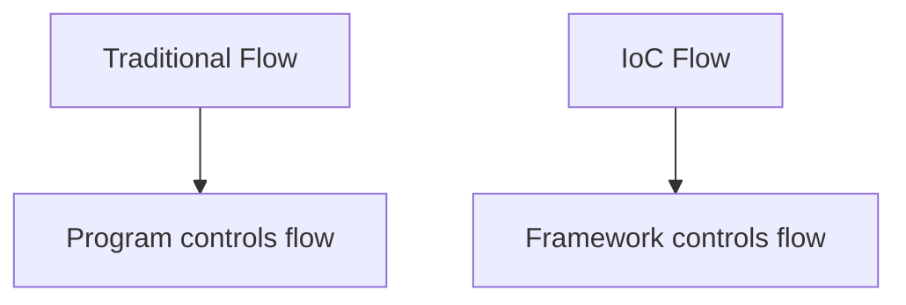
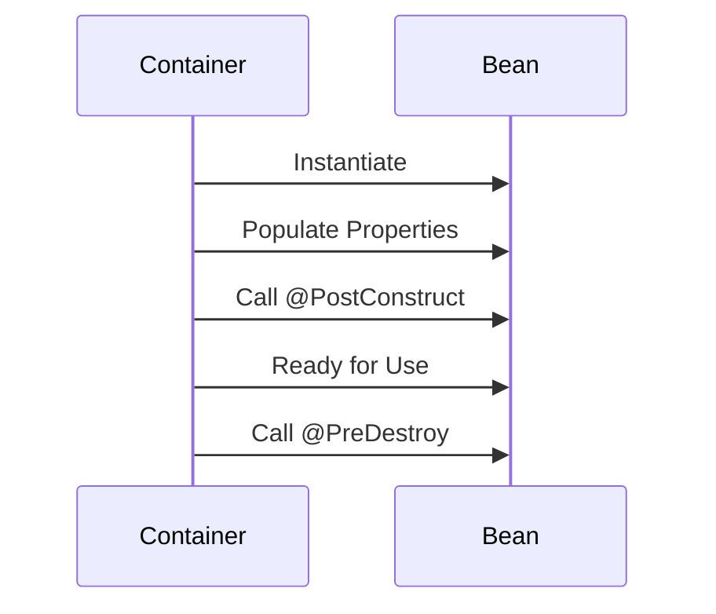
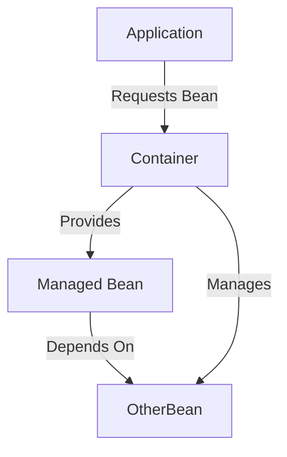
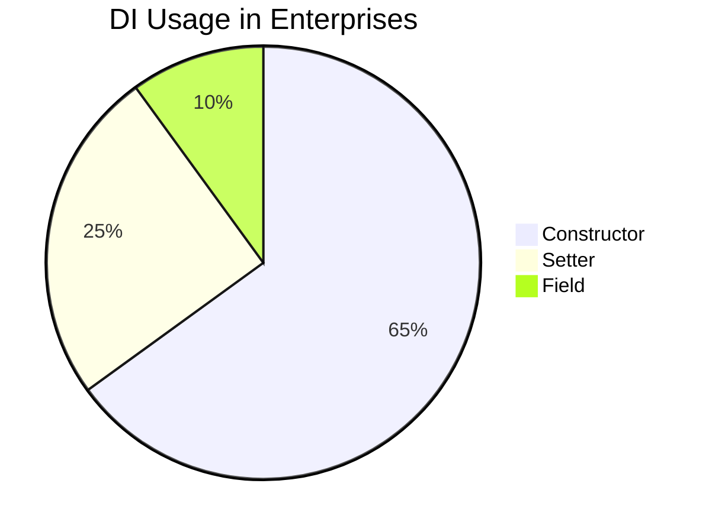

# **Dependency Injection & IoC in Spring Boot - Complete Guide** 🚀

This comprehensive guide covers Dependency Injection (DI) and Inversion of Control (IoC) in Spring Boot, with interview-focused explanations, code examples, and industry best practices.

## Table of Contents
1. [Core Concepts](#1-core-concepts)
2. [Spring IoC Container](#2-spring-ioc-container)
3. [Dependency Injection Types](#3-dependency-injection-types)
4. [Annotations Deep Dive](#4-annotations-deep-dive)
5. [Best Practices](#5-best-practices)
6. [Advanced Topics](#6-advanced-topics)
7. [Interview Q&A](#7-interview-qa)
8. [Comparison Tables](#8-comparison-tables)
9. [Visual Diagrams](#9-visual-diagrams)

---

## 1. Core Concepts

### 1.1 Inversion of Control (IoC)


**Key Idea:** Framework manages object creation and wiring instead of application code.

### 1.2 Dependency Injection
```java
// Without DI
class Service {
    private Repository repo = new RepositoryImpl(); // Tight coupling
}

// With DI
class Service {
    private Repository repo;
    public Service(Repository repo) { // Loose coupling
        this.repo = repo;
    }
}
```

**Benefits:**
- Loose coupling
- Easier testing
- Configurable components
- Parallel development

---

## 2. Spring IoC Container

### 2.1 ApplicationContext
```java
@SpringBootApplication
public class MyApp {
    public static void main(String[] args) {
        ApplicationContext ctx = SpringApplication.run(MyApp.class, args);
        MyService service = ctx.getBean(MyService.class);
    }
}
```

### 2.2 Bean Lifecycle


---

## 3. Dependency Injection Types

### 3.1 Constructor Injection (Recommended)
```java
@Service
public class OrderService {
    private final PaymentService paymentService;
    
    @Autowired // Optional in Spring 4.3+
    public OrderService(PaymentService paymentService) {
        this.paymentService = paymentService;
    }
}
```

### 3.2 Setter Injection
```java
@RestController
public class UserController {
    private UserService userService;
    
    @Autowired
    public void setUserService(UserService userService) {
        this.userService = userService;
    }
}
```

### 3.3 Field Injection (Avoid)
```java
@Component
public class ProductService {
    @Autowired // Discouraged
    private InventoryService inventoryService;
}
```

---

## 4. Annotations Deep Dive

### 4.1 Stereotype Annotations
| Annotation | Purpose |
|------------|---------|
| `@Component` | Generic Spring-managed bean |
| `@Service` | Business logic layer |
| `@Repository` | Data access layer |
| `@Controller` | Web controller |
| `@RestController` | REST API controller |

### 4.2 Dependency Annotations
```java
@Configuration
public class AppConfig {
    @Bean
    public DataSource dataSource() {
        return new HikariDataSource();
    }
    
    @Bean
    @Primary
    public PaymentService creditCardService() {
        return new CreditCardService();
    }
    
    @Bean
    @Qualifier("paypal")
    public PaymentService paypalService() {
        return new PayPalService();
    }
}
```

---

## 5. Best Practices

### 5.1 Do's and Don'ts
- ✅ Prefer constructor injection
- ✅ Use interface-based programming
- ✅ Leverage `@Configuration` for complex wiring
- ❌ Avoid circular dependencies
- ❌ Minimize `@Autowired` on fields

### 5.2 Testing with DI
```java
@SpringBootTest
class OrderServiceTest {
    @MockBean
    private PaymentService paymentService;
    
    @Autowired
    private OrderService orderService;
    
    @Test
    void shouldProcessOrder() {
        when(paymentService.process(any())).thenReturn(true);
        assertTrue(orderService.placeOrder(new Order()));
    }
}
```

---

## 6. Advanced Topics

### 6.1 Circular Dependencies
**Solution:** Refactor or use `@Lazy`:
```java
@Service
public class ServiceA {
    private final ServiceB serviceB;
    
    @Lazy
    public ServiceA(ServiceB serviceB) {
        this.serviceB = serviceB;
    }
}
```

### 6.2 Conditional Beans
```java
@Bean
@ConditionalOnProperty(name="payment.mode", havingValue="stripe")
public PaymentService stripeService() {
    return new StripeService();
}
```

---

## 7. Interview Q&A

### Q1: What is Dependency Injection?
**A:** DI is a pattern where objects receive dependencies from external source rather than creating them directly. Benefits:
- Loose coupling
- Easier testing
- Configurable components

### Q2: Explain IoC container in Spring
**A:** The IoC container (ApplicationContext) manages:
- Bean instantiation
- Dependency wiring
- Lifecycle management
- Configuration

### Q3: Why prefer constructor injection?
**A:**
- Immutable dependencies
- Clear mandatory dependencies
- Better testability
- Avoids circular dependencies
- Thread safety

### Q4: How to resolve multiple bean implementations?
**A:** Use:
- `@Primary` for default bean
- `@Qualifier` for specific bean
```java
@Autowired
@Qualifier("paypal")
private PaymentService paymentService;
```

### Q5: What is bean scope in Spring?
**A:** Common scopes:
- `singleton` (default) - One instance per container
- `prototype` - New instance each time
- `request` - Web request scope
- `session` - User session scope

### Q6: How to create custom bean post-processor?
**A:** Implement `BeanPostProcessor`:
```java
@Component
public class CustomBeanPostProcessor implements BeanPostProcessor {
    @Override
    public Object postProcessBeforeInitialization(Object bean, String beanName) {
        // Modify bean before init
        return bean;
    }
}
```

### Q7: Explain `@Autowired` vs `@Resource` vs `@Inject`
**A:**
| Annotation | Source | Features |
|------------|--------|----------|
| `@Autowired` | Spring | Type-based, optional name |
| `@Resource` | JSR-250 | Name-based fallback to type |
| `@Inject` | JSR-330 | Standardized DI |

### Q8: How does Spring proxy DI?
**A:** Spring uses:
- JDK dynamic proxies (interface-based)
- CGLIB (class-based) when no interface
  For AOP and `@Transactional`

### Q9: What is lazy initialization?
**A:** Beans created only when needed:
```java
@Configuration
@Lazy
public class AppConfig {
    @Bean
    @Lazy
    public HeavyService heavyService() {
        return new HeavyService();
    }
}
```

### Q10: How to handle optional dependencies?
**A:** Options:
1. Use `@Autowired(required=false)`
2. Java 8 `Optional`:
```java
@Autowired
private Optional<BonusService> bonusService;
```

---

## 8. Comparison Tables

### DI Types Comparison
| Type | Testability | Immutability | Circular Deps | Readability |
|------|------------|--------------|---------------|-------------|
| Constructor | High | Yes | Hard | Best |
| Setter | Medium | No | Easy | Good |
| Field | Low | No | Easy | Poor |

### IoC Containers
| Feature | Spring | Google Guice | Jakarta CDI |
|---------|--------|--------------|-------------|
| DI Standard | Yes | No | Yes |
| AOP Support | Yes | Limited | Yes |
| Configuration | Annotations/XML | Code | Annotations |

---

## 9. Visual Diagrams

### IoC Container Workflow


### DI Types


---

## Key Takeaways
1. IoC is the principle, DI is the implementation
2. Constructor injection is industry standard
3. Spring manages bean lifecycle through ApplicationContext
4. Proper DI leads to more testable and maintainable code
5. Understand advanced scenarios like circular dependencies

**Pro Tip:** Always relate answers to business impact:
- Loose coupling → faster feature development
- Testability → higher quality → fewer production issues
- Proper DI → easier maintenance → lower costs
