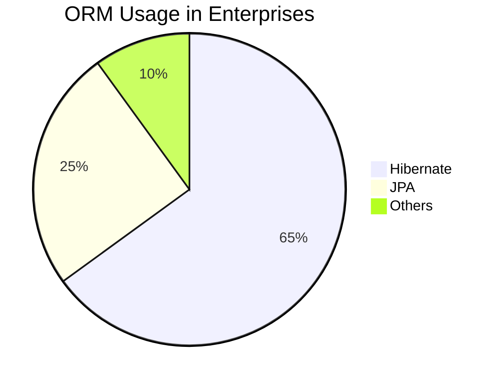
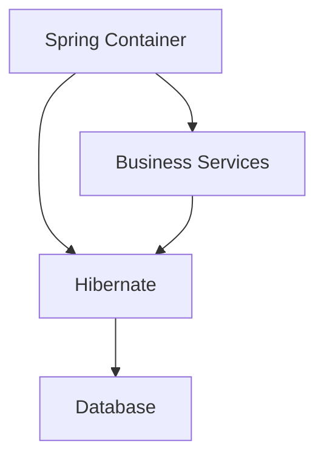
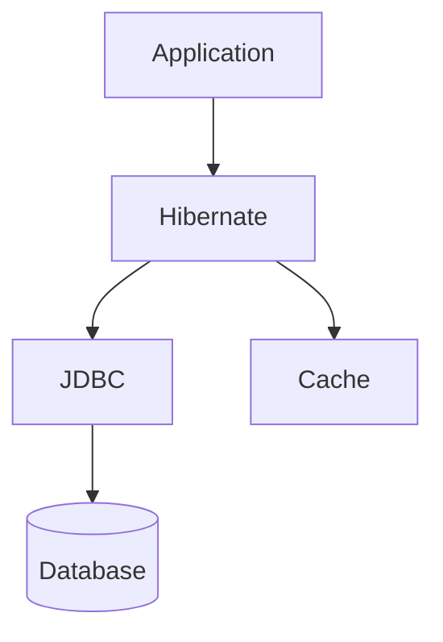
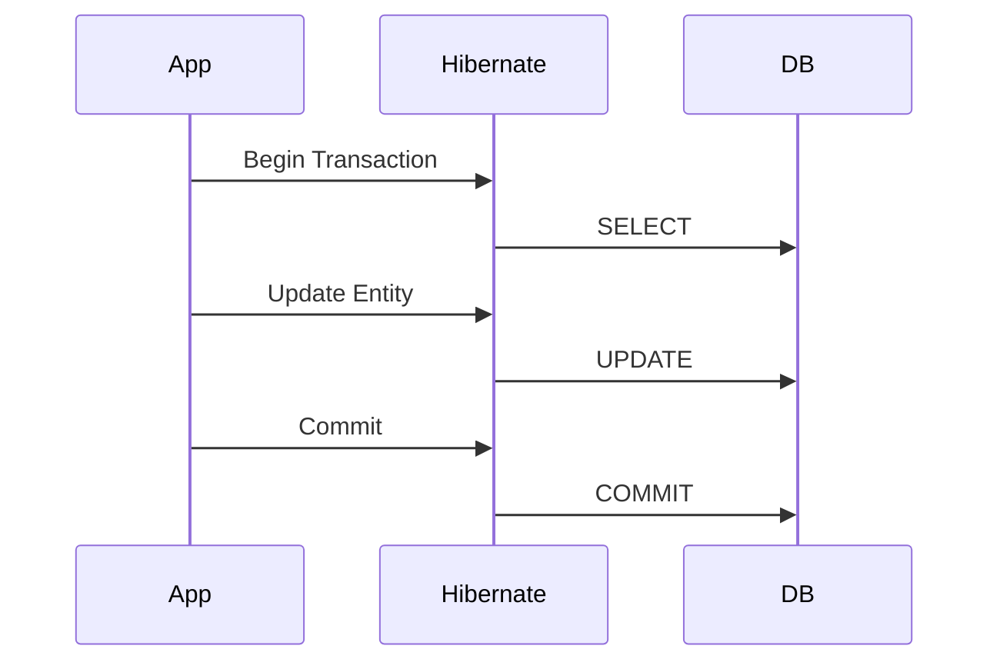

# **Spring + Hibernate: The Ultimate Interview Guide** 🚀

This comprehensive guide covers Spring and Hibernate integration with detailed explanations, industry best practices, and interview-focused content.

## Table of Contents
1. [Introduction to Spring & Hibernate](#1-introduction-to-spring--hibernate-)
2. [Core Architecture](#2-core-architecture-)
3. [Entity Mapping](#3-entity-mapping-)
4. [Repository Pattern](#4-repository-pattern-)
5. [Transaction Management](#5-transaction-management-)
6. [Performance Optimization](#6-performance-optimization-)
7. [Caching Strategies](#7-caching-strategies-)
8. [Best Practices](#8-best-practices-)
9. [Interview Q&A](#9-interview-qa-)
10. [Comparison Tables](#10-comparison-tables-)
11. [Visual Diagrams](#11-visual-diagrams-)

---

## 1. Introduction to Spring & Hibernate 🏗️

### Why Spring + Hibernate?


**Key Benefits:**
- 🚀 Rapid development
- 🔄 Object-relational mapping
- ⚡ Performance optimizations
- 🛡️ Transaction management
- 🔗 Database abstraction

**Industry Adoption:**
- Amazon (product catalog)
- Netflix (user preferences)
- Uber (trip data)
- Airbnb (booking system)

---

## 2. Core Architecture 🏛️

### Spring + Hibernate Integration


**Configuration Example:**
```java
@Configuration
@EnableTransactionManagement
public class HibernateConfig {

    @Bean
    public LocalSessionFactoryBean sessionFactory() {
        LocalSessionFactoryBean sessionFactory = new LocalSessionFactoryBean();
        sessionFactory.setDataSource(dataSource());
        sessionFactory.setPackagesToScan("com.example.entities");
        sessionFactory.setHibernateProperties(hibernateProperties());
        return sessionFactory;
    }

    @Bean
    public DataSource dataSource() {
        return new HikariDataSource(); // Connection pooling
    }

    private Properties hibernateProperties() {
        Properties props = new Properties();
        props.put("hibernate.dialect", "org.hibernate.dialect.MySQL8Dialect");
        props.put("hibernate.show_sql", true);
        props.put("hibernate.hbm2ddl.auto", "update");
        return props;
    }
}
```

---

## 3. Entity Mapping 🗄️

### JPA Annotations
```java
@Entity
@Table(name = "employees")
public class Employee {

    @Id
    @GeneratedValue(strategy = GenerationType.IDENTITY)
    private Long id;

    @Column(name = "full_name", nullable = false)
    private String name;

    @Enumerated(EnumType.STRING)
    private Department department;

    @OneToMany(mappedBy = "employee", cascade = CascadeType.ALL)
    private List<Task> tasks = new ArrayList<>();

    @CreationTimestamp
    private LocalDateTime createdAt;

    // Getters, setters, constructors
}
```

**Mapping Types:**
| Annotation | Purpose | Example |
|------------|---------|---------|
| `@Entity` | Marks class as entity | `@Entity` |
| `@Table` | Specifies table name | `@Table(name="users")` |
| `@Column` | Field-to-column mapping | `@Column(nullable=false)` |
| `@OneToMany` | One-to-many relationship | `@OneToMany(mappedBy="owner")` |
| `@ManyToOne` | Many-to-one relationship | `@ManyToOne(fetch=LAZY)` |

---

## 4. Repository Pattern 📚

### Spring Data JPA
```java
public interface EmployeeRepository extends JpaRepository<Employee, Long> {

    // Query Methods
    List<Employee> findByDepartment(Department department);

    // JPQL Query
    @Query("SELECT e FROM Employee e WHERE e.salary > :minSalary")
    List<Employee> findHighEarners(@Param("minSalary") BigDecimal salary);

    // Native Query
    @Query(value = "SELECT * FROM employees WHERE join_date > :date", 
           nativeQuery = true)
    List<Employee> findRecentHires(@Param("date") LocalDate date);
}
```

**Repository Types:**
| Interface | Purpose |
|-----------|---------|
| `CrudRepository` | Basic CRUD operations |
| `PagingAndSortingRepository` | CRUD + pagination/sorting |
| `JpaRepository` | JPA-specific extensions |

---

## 5. Transaction Management 💰

### Declarative Transactions
```java
@Service
public class EmployeeService {

    @Transactional
    public void promoteEmployee(Long empId, String newPosition) {
        Employee emp = employeeRepository.findById(empId)
                          .orElseThrow(() -> new EmployeeNotFoundException(empId));
        emp.setPosition(newPosition);
        auditService.logPromotion(empId, newPosition); // Also transactional
    }
}
```

**Transaction Propagation:**
| Propagation | Behavior |
|-------------|----------|
| `REQUIRED` (Default) | Join existing or create new |
| `REQUIRES_NEW` | Always new transaction |
| `NESTED` | Savepoint-based nested transaction |

---

## 6. Performance Optimization ⚡

### Fetch Strategies
```java
@Entity
public class Department {

    @OneToMany(mappedBy = "department", fetch = FetchType.LAZY)
    private List<Employee> employees;
}
```

**Optimization Techniques:**
- 🕵️ **Lazy Loading**: Load relationships on-demand
- 🏗️ **Eager Loading**: `@EntityGraph` for queries
- 🧩 **Batch Fetching**: `@BatchSize(size=10)`
- ✂️ **DTO Projection**: Select only needed fields

---

## 7. Caching Strategies 🗃️

### Second-Level Cache
```properties
# application.properties
spring.jpa.properties.hibernate.cache.use_second_level_cache=true
spring.jpa.properties.hibernate.cache.region.factory_class=org.hibernate.cache.ehcache.EhCacheRegionFactory
```

**Cache Levels:**
| Level | Scope | Configuration |
|-------|-------|---------------|
| 1st Level | Session | Enabled by default |
| 2nd Level | Application | Needs configuration |
| Query Cache | Query Results | `hibernate.cache.use_query_cache=true` |

---

## 8. Best Practices 💡

### Do's and Don'ts
- ✅ Use `FetchType.LAZY` for relationships
- ✅ Prefer constructor injection
- ✅ Implement `equals()` and `hashCode()` correctly
- ❌ Avoid `OpenSessionInView` anti-pattern
- ❌ Don't use Hibernate for batch processing

### Testing Strategy
```java
@DataJpaTest
@AutoConfigureTestDatabase(replace = Replace.NONE)
class EmployeeRepositoryTest {

    @Autowired
    private EmployeeRepository repository;

    @Test
    void shouldFindByDepartment() {
        List<Employee> result = repository.findByDepartment(Department.IT);
        assertThat(result).hasSize(5);
    }
}
```

---

## 9. Interview Q&A 💬

### Q1: Explain Hibernate SessionFactory vs Session
**A:**
- `SessionFactory`: Thread-safe, expensive to create (one per DB)
- `Session`: Lightweight, non-thread-safe (one per request/transaction)

### Q2: What is N+1 problem? How to fix?
**A:**
- **Problem**: 1 query for parent + N queries for children
- **Solutions**:
  ```java
  // 1. JOIN FETCH
  @Query("SELECT e FROM Employee e JOIN FETCH e.tasks")
  
  // 2. EntityGraph
  @EntityGraph(attributePaths = "tasks")
  List<Employee> findAllWithTasks();
  ```

### Q3: Difference between get() and load()?
**A:**
- `get()`: Immediate DB hit, returns null if not found
- `load()`: Proxy object, throws exception on access if not exists

### Q4: How to implement soft delete?
**A:**
```java
@Entity
@SQLDelete(sql = "UPDATE employees SET deleted = true WHERE id = ?")
@Where(clause = "deleted = false")
public class Employee {
    private boolean deleted = false;
}
```

### Q5: Explain Hibernate caching levels
**A:**
1. **First Level**: Session-scoped (enabled by default)
2. **Second Level**: Application-scoped (needs config)
3. **Query Cache**: Caches query results

### Q6: When to use JPA vs JDBC?
**A:**
- **JPA**: CRUD operations, complex object graphs
- **JDBC**: Batch processing, reports, stored procedures

### Q7: What is dirty checking?
**A:** Hibernate automatically detects and persists changes to managed entities:
```java
Employee emp = session.get(Employee.class, 1L);
emp.setSalary(newSalary); // Auto-updated on flush
```

### Q8: How to handle versioning?
**A:** Use `@Version` for optimistic locking:
```java
@Version
private Long version;
```

### Q9: Explain Spring's HibernateTemplate
**A:** Older helper class that:
- Simplified Hibernate data access
- Converted Hibernate exceptions to Spring's DAO exceptions
- Managed sessions
- **Now deprecated** in favor of direct `EntityManager`/`SessionFactory` usage

### Q10: How to implement audit logging?
**A:** Use Hibernate Envers:
```java
@Entity
@Audited
public class Employee {
    // Audited fields
}

// Query history
AuditReader reader = AuditReaderFactory.get(entityManager);
Employee oldVersion = reader.find(Employee.class, empId, revision);
```

---

## 10. Comparison Tables 📊

### ORM Solutions
| Feature | Hibernate | JPA | JDBC |
|---------|----------|-----|------|
| Abstraction | High | High | Low |
| Performance | Good | Good | Best |
| Learning Curve | Steep | Moderate | Easy |
| Use Case | Complex Domain | Standard CRUD | Raw SQL |

### Fetch Types
| Type | Load Time | DB Hits | Use Case |
|------|----------|---------|----------|
| EAGER | Immediate | 1+ | Small datasets |
| LAZY | On-access | N+1 | Large object graphs |

---

## 11. Visual Diagrams 📉

### Hibernate Architecture


### Transaction Flow


---

## Key Takeaways 🎯
1. 🏗️ **Spring** manages beans and transactions
2. 🗄️ **Hibernate** handles ORM and caching
3. ⚡ **Optimize** with lazy loading and batching
4. 🛡️ Use **transactions** for data integrity
5. 🧪 **Test** repositories with `@DataJpaTest`

**Pro Tip:** Always relate features to business needs:
- ORM → Faster development
- Caching → Better performance
- Transactions → Data consistency
- Repositories → Cleaner architecture

---

# **Hibernate vs JPA – The Ultimate Guide for Interview Preparation**

📊 **Hibernate** and **JPA (Java Persistence API)** are both used for **database interactions** in Java, but they serve different purposes. Understanding their differences is crucial for backend developers and database architects.

## **1. What is JPA?** 🏛️
**JPA (Java Persistence API)** is a **Java specification** for **ORM (Object-Relational Mapping)**. It defines a standard way to map Java objects to database tables.

🔹 **JPA is NOT an implementation** – It’s just a set of interfaces (`EntityManager`, `Entity`, `Repository`).  
🔹 **Popular JPA Implementations**:
- **Hibernate** (Most popular)
- **EclipseLink**
- **OpenJPA**

---

## **2. What is Hibernate?** 🚀
**Hibernate** is a **JPA implementation** + **additional features**. It’s a **full-fledged ORM framework** that goes beyond JPA.

🔹 **Why Hibernate?**
- Auto-generates SQL queries.
- Supports caching (1st & 2nd level).
- Lazy loading, dirty checking.

---

## **3. Key Differences: Hibernate vs JPA** ⚖️

| Feature | JPA | Hibernate |  
|---------|-----|----------|  
| **Type** | Specification (Interface) | Implementation (Library) |  
| **Vendor Lock-in** | No (Portable) | Yes (Hibernate-specific features) |  
| **Extra Features** | Only standard ORM | Caching, HQL, Criteria API, etc. |  
| **Performance** | Depends on implementation | Optimized (Lazy loading, batch fetching) |  
| **Usage** | `@Entity`, `EntityManager` | `SessionFactory`, `CriteriaBuilder` |  

---

## **4. When to Use JPA vs Hibernate?** 🤔

### **✅ Use JPA When:**
✔ You need **vendor neutrality** (can switch implementations).  
✔ Working in **strictly standardized environments** (e.g., banking).

### **✅ Use Hibernate When:**
✔ Need **advanced features** (caching, HQL, native SQL support).  
✔ Working in **performance-critical** applications (e.g., e-commerce).

### **❌ Avoid Hibernate If:**
- You need **lightweight JDBC** (microservices with simple queries).
- You **don’t need ORM** (direct SQL is better for analytics).

---

## **5. Industry Use Cases & Best Practices** 🏭

### **Real-World Examples**
| Industry | Use Case |  
|----------|----------|  
| **Banking** | JPA (Standard compliance) |  
| **E-commerce** | Hibernate (Performance + Caching) |  
| **Healthcare** | JPA (Audit logging with `@EntityListeners`) |  

### **Best Practices**
🔹 **Use JPA for portability** (if switching providers is needed).  
🔹 **Use Hibernate for complex queries** (HQL, Criteria API).  
🔹 **Avoid N+1 queries** (Use `JOIN FETCH` in Hibernate).

---

## **6. How Big Companies Use Them?** 🏢

### **Tech Giants & Their Choices**
- **Amazon** → Uses **Hibernate** (for complex queries in AWS).
- **Netflix** → Prefers **JPA + EclipseLink** (for standardization).
- **Uber** → Uses **Hibernate + Custom optimizations**.

---

## **7. Code Examples** 💻

### **Example 1: JPA (Standard) Entity**
```java
import javax.persistence.*;

@Entity
@Table(name = "employees")
public class Employee {

    @Id
    @GeneratedValue(strategy = GenerationType.IDENTITY)
    private Long id;

    @Column(name = "name")
    private String name;

    // Getters & Setters
}
```

### **Example 2: Hibernate (Extra Features)**
```java
import org.hibernate.annotations.Cache;
import org.hibernate.annotations.CacheConcurrencyStrategy;

@Entity
@Table(name = "products")
@Cache(usage = CacheConcurrencyStrategy.READ_WRITE) // Hibernate-specific caching
public class Product {

    @Id
    @GeneratedValue(strategy = GenerationType.IDENTITY)
    private Long id;

    @NaturalId // Hibernate-specific (immutable unique ID)
    private String sku;

    // Getters & Setters
}
```

### **Example 3: JPA Repository (Spring Data JPA)**
```java
import org.springframework.data.jpa.repository.JpaRepository;

public interface EmployeeRepository extends JpaRepository<Employee, Long> {
    // Auto-implemented CRUD methods
}
```

### **Example 4: Hibernate Native Query**
```java
@Repository
public class CustomProductRepository {

    @PersistenceContext
    private EntityManager entityManager;

    public List<Product> findExpensiveProducts() {
        return entityManager.createNativeQuery(
            "SELECT * FROM products WHERE price > 1000", Product.class)
            .getResultList();
    }
}
```

---

## **8. Interview Q&A** 🎤

### **Q1: What is the difference between JPA and Hibernate?**
**A:** JPA is a **specification**, while Hibernate is an **implementation** of JPA with extra features.

### **Q2: When should I use JPA instead of Hibernate?**
**A:** When you need **vendor neutrality** (e.g., switching between Hibernate/EclipseLink).

### **Q3: What are Hibernate’s advantages over plain JPA?**
**A:**  
✔ **Caching** (1st & 2nd level).  
✔ **HQL (Hibernate Query Language)**.  
✔ **Dirty checking** (auto-updates changed entities).

### **Q4: What is the N+1 problem in Hibernate?**
**A:** When Hibernate executes **1 query for parent + N queries for children** (fix with `JOIN FETCH`).

### **Q5: Can Hibernate work without JPA?**
**A:** Yes! Hibernate existed before JPA and can work standalone.

---

## **9. Summary Table** 📊

| Feature | JPA | Hibernate |  
|---------|-----|----------|  
| **Type** | Specification | Implementation |  
| **Portability** | High (Vendor-neutral) | Low (Hibernate-specific) |  
| **Caching** | Basic | Advanced (L1, L2, Query Cache) |  
| **Query Language** | JPQL | HQL + Criteria API |  
| **Best For** | Standard compliance | Performance & flexibility |  

---

## **Final Thoughts** 🎯
- **Use JPA** if you need **standardization**.
- **Use Hibernate** if you need **performance & advanced features**.
- **Avoid ORM** if you need **raw SQL speed** (e.g., analytics).

🚀 **Now you’re ready to answer any Hibernate/JPA interview question!**
