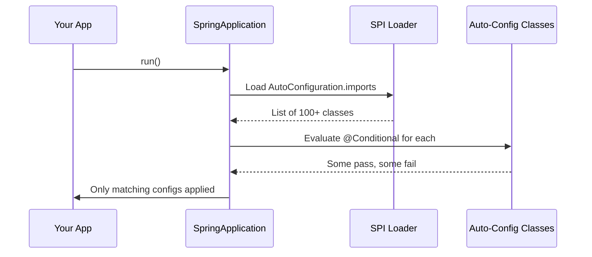

# 🔬 Spring Boot Internals: How Auto-Configuration REALLY Works 🪄

---

> **"Any sufficiently advanced technology is indistinguishable from magic."** — Arthur C. Clarke
>
> **"Spring Boot auto-configuration IS that magic. Let's peek behind the curtain."** — Every Curious Developer

---

## 🎯 Why Study Spring Boot Internals?

```
┌─────────────────────────────────────────────────────────────────────────┐
│                                                                         │
│  🧠 INTERVIEW TRUTH: "How does Spring Boot work under the hood?"        │
│     is asked in 90% of senior Java developer interviews.                │
│                                                                         │
│  Knowing internals separates:                                           │
│  Junior → "I annotate @SpringBootApplication and it works"              │
│  Senior → "Here's exactly what happens when Spring starts up..."        │
│                                                                         │
└─────────────────────────────────────────────────────────────────────────┘
```

---

## 📋 Table of Contents

1. [The Spring Boot Startup Sequence](#-the-spring-boot-startup-sequence)
2. [Auto-Configuration Deep Dive](#-auto-configuration-deep-dive)
3. [@SpringBootApplication Deconstructed](#-springbootapplication-deconstructed)
4. [Conditional Annotations Magic](#-conditional-annotations-magic)
5. [Spring Factories & SPI Mechanism](#-spring-factories--spi-mechanism)
6. [Embedded Server Internals](#-embedded-server-internals)
7. [Property Resolution Chain](#-property-resolution-chain)
8. [Creating Custom Auto-Configuration](#-creating-custom-auto-configuration)
9. [Interview Q&A](#-interview-qa)

---

## 🚀 The Spring Boot Startup Sequence

### What REALLY Happens When You Run `SpringApplication.run()`?

```
main() called
    │
    ▼
┌─────────────────────────────────────────┐
│ 1. Create SpringApplication instance    │  ← Detects web app type
│    - Determine web application type     │
│    - Load ApplicationContextInitializers│
│    - Load ApplicationListeners          │
│    - Determine main application class   │
└─────────────────┬───────────────────────┘
                  │
                  ▼
┌─────────────────────────────────────────┐
│ 2. Run SpringApplication               │
│    - Create & configure Environment     │  ← Load properties
│    - Print banner (the Spring logo 🍃)  │
│    - Create ApplicationContext          │
│    - Prepare context                    │
│    - Refresh context (THE BIG ONE!)     │  ← Beans created here!
│    - After refresh (runners called)     │
└─────────────────┬───────────────────────┘
                  │
                  ▼
┌─────────────────────────────────────────┐
│ 3. Context Refresh (BeanFactory work)   │
│    - Scan for @Component classes        │
│    - Process @Configuration classes     │
│    - Apply auto-configuration           │  ← THE MAGIC!
│    - Create all singleton beans         │
│    - Wire dependencies (DI)             │
│    - Call @PostConstruct methods         │
│    - Start embedded server              │
└─────────────────┬───────────────────────┘
                  │
                  ▼
    ✅ Application Ready!
```

### 🕐 Startup Timeline (Typical Spring Boot App)

```mermaid
gantt
    title Spring Boot Startup Timeline
    dateFormat X
    axisFormat %L ms
    
    section Bootstrap
    Create SpringApplication    :0, 50
    Load Environment           :50, 100
    
    section Context
    Component Scanning         :100, 300
    Auto-Configuration         :300, 600
    Bean Creation              :600, 900
    
    section Server
    Embedded Tomcat Start      :900, 1200
    Application Ready          :1200, 1250
```



---

## ⚙️ Auto-Configuration Deep Dive

### How Does Spring Boot "Know" What to Configure?

```
THE AUTO-CONFIGURATION ALGORITHM:

1. 📦 You add a dependency (e.g., spring-boot-starter-data-jpa)
2. 🔍 Spring Boot scans META-INF/spring/org.springframework.boot.autoconfigure.AutoConfiguration.imports
3. 🧪 Each auto-config class has @Conditional annotations
4. ✅ If conditions are met → beans are created automatically
5. ❌ If conditions fail → class is skipped silently

EXAMPLE: DataSourceAutoConfiguration
┌──────────────────────────────────────────────────────────────┐
│ @ConditionalOnClass(DataSource.class)     ← Is JDBC on classpath?
│ @ConditionalOnMissingBean(DataSource.class)← Did user define one?
│ @EnableConfigurationProperties(...)       ← Read properties
│                                                              
│ IF DataSource.class exists on classpath                      
│ AND user hasn't defined their own DataSource bean            
│ THEN → Create HikariDataSource with default settings         
└──────────────────────────────────────────────────────────────┘
```

### 🧩 The Auto-Configuration Priority Chain

```java
// Spring Boot's decision process for any auto-configured bean:

// Priority 1: User-defined beans ALWAYS win
@Bean
public DataSource myCustomDataSource() { ... } // ← This takes priority!

// Priority 2: Auto-configuration kicks in only if user didn't define it
@Configuration
@ConditionalOnMissingBean(DataSource.class) // ← Checks if user already defined one
public class DataSourceAutoConfiguration {
    @Bean
    public DataSource dataSource() { ... } // ← Only created if user didn't provide one
}
```

### 💡 Key Insight (Interview Gold!)
> **"Spring Boot's auto-configuration is OPINIONATED but NOT STUBBORN."**
> It provides smart defaults, but user-defined beans ALWAYS take precedence.

---

## 🔍 @SpringBootApplication Deconstructed

### One Annotation = Three Annotations Combined

```java
@SpringBootApplication  // This is actually 3 annotations in 1!
public class MyApp { ... }

// Equivalent to:
@SpringBootConfiguration    // → @Configuration (this class provides beans)
@EnableAutoConfiguration    // → Triggers auto-configuration magic
@ComponentScan              // → Scans current package + sub-packages for @Component
public class MyApp { ... }
```

### What Each Does:

| Annotation | Purpose | What Happens |
|-----------|---------|--------------|
| `@SpringBootConfiguration` | Marks this as a configuration source | Can define `@Bean` methods |
| `@EnableAutoConfiguration` | Triggers auto-config | Loads all auto-configuration classes |
| `@ComponentScan` | Finds your beans | Scans package tree for `@Component`, `@Service`, etc. |

### ⚠️ Common Gotcha
```java
// ❌ WRONG: App class in root, entity in different package tree
com.example.MyApp.java              // @SpringBootApplication here
com.other.package.UserService.java  // NOT scanned! Different package tree!

// ✅ RIGHT: Everything under same root package
com.example.MyApp.java              // @SpringBootApplication here
com.example.service.UserService.java // ✅ Scanned (sub-package)
com.example.repo.UserRepo.java      // ✅ Scanned (sub-package)
```

---

## 🧪 Conditional Annotations Magic

### The Building Blocks of Auto-Configuration

| Annotation | Condition | Use Case |
|-----------|-----------|----------|
| `@ConditionalOnClass` | Class exists on classpath | "If Kafka JAR is present..." |
| `@ConditionalOnMissingClass` | Class NOT on classpath | "If not using X..." |
| `@ConditionalOnBean` | Bean already exists | "If user defined a DataSource..." |
| `@ConditionalOnMissingBean` | Bean doesn't exist | "If user DIDN'T define one..." |
| `@ConditionalOnProperty` | Property has specific value | "If caching is enabled..." |
| `@ConditionalOnWebApplication` | It's a web app | "If running as web server..." |
| `@ConditionalOnExpression` | SpEL expression is true | Complex conditions |

### Real-World Example: How Redis Auto-Config Works

```java
@Configuration
@ConditionalOnClass(RedisConnectionFactory.class)  // Redis JAR on classpath?
@EnableConfigurationProperties(RedisProperties.class) // Read spring.redis.* props
@ConditionalOnProperty(prefix = "spring.redis", name = "enabled", 
                       havingValue = "true", matchIfMissing = true)
public class RedisAutoConfiguration {

    @Bean
    @ConditionalOnMissingBean(RedisConnectionFactory.class) // User didn't define one?
    public LettuceConnectionFactory redisConnectionFactory(RedisProperties props) {
        // Create with defaults from properties
        return new LettuceConnectionFactory(props.getHost(), props.getPort());
    }
    
    @Bean
    @ConditionalOnMissingBean(RedisTemplate.class)
    public RedisTemplate<String, Object> redisTemplate(RedisConnectionFactory factory) {
        RedisTemplate<String, Object> template = new RedisTemplate<>();
        template.setConnectionFactory(factory);
        return template;
    }
}
```

---

## 🏭 Spring Factories & SPI Mechanism

### How Spring Boot Discovers Auto-Configuration Classes

```
BEFORE Spring Boot 3.0:
  META-INF/spring.factories
  
AFTER Spring Boot 3.0:
  META-INF/spring/org.springframework.boot.autoconfigure.AutoConfiguration.imports

CONTENT (one class per line):
  org.springframework.boot.autoconfigure.jdbc.DataSourceAutoConfiguration
  org.springframework.boot.autoconfigure.web.servlet.WebMvcAutoConfiguration
  org.springframework.boot.autoconfigure.security.servlet.SecurityAutoConfiguration
  ... (100+ auto-configuration classes!)
```

### The Discovery Process



---

## 🌐 Embedded Server Internals

### How Tomcat Gets Embedded (No WAR deployment!)

```java
// Traditional: Deploy WAR → External Tomcat
// Spring Boot: Tomcat is INSIDE your JAR!

// The magic happens in:
@Configuration
@ConditionalOnClass(Tomcat.class)  // Is Tomcat on classpath?
@ConditionalOnWebApplication
public class EmbeddedTomcatAutoConfiguration {
    
    @Bean
    public TomcatServletWebServerFactory tomcatFactory() {
        TomcatServletWebServerFactory factory = new TomcatServletWebServerFactory();
        factory.setPort(8080);  // From server.port property
        return factory;
    }
}
```

### Server Selection Priority

```
If Tomcat on classpath → Use Tomcat (default with spring-boot-starter-web)
If Jetty on classpath  → Use Jetty
If Undertow on classpath → Use Undertow
If Netty on classpath → Use Netty (WebFlux)

To switch: exclude Tomcat, include alternative:
<dependency>
    <groupId>org.springframework.boot</groupId>
    <artifactId>spring-boot-starter-web</artifactId>
    <exclusions>
        <exclusion>
            <groupId>org.springframework.boot</groupId>
            <artifactId>spring-boot-starter-tomcat</artifactId>
        </exclusion>
    </exclusions>
</dependency>
<dependency>
    <groupId>org.springframework.boot</groupId>
    <artifactId>spring-boot-starter-jetty</artifactId>
</dependency>
```

---

## 🔧 Property Resolution Chain

### Where Does Spring Boot Look for Properties? (In Priority Order)

```
HIGHEST PRIORITY (wins if conflict):
  1. Command line arguments (--server.port=9090)
  2. SPRING_APPLICATION_JSON (inline JSON)
  3. ServletConfig/ServletContext parameters
  4. JNDI attributes
  5. Java System properties (-Dserver.port=9090)
  6. OS environment variables (SERVER_PORT=9090)
  7. Profile-specific properties (application-prod.yml)
  8. application.properties / application.yml
  9. @PropertySource annotations
  10. Default properties (SpringApplication.setDefaultProperties)
LOWEST PRIORITY
```

### 🎲 Quick Quiz: What Port Will the App Use?

```yaml
# application.yml
server:
  port: 8080

# application-prod.yml  
server:
  port: 9090

# Environment variable: SERVER_PORT=7070
# Command line: --server.port=6060
```

> <details>
> <summary>🔓 Answer</summary>
>
> **Port 6060** — Command line arguments have HIGHEST priority!
>
> Priority chain: 6060 (CLI) > 7070 (env var) > 9090 (profile) > 8080 (default)
> </details>

---

## 🛠️ Creating Custom Auto-Configuration

### Step-by-Step: Build Your Own Spring Boot Starter

```java
// Step 1: Create the configuration class
@Configuration
@ConditionalOnClass(MyLibrary.class)
@EnableConfigurationProperties(MyLibraryProperties.class)
public class MyLibraryAutoConfiguration {
    
    @Bean
    @ConditionalOnMissingBean
    public MyLibraryClient myLibraryClient(MyLibraryProperties props) {
        return new MyLibraryClient(props.getApiKey(), props.getBaseUrl());
    }
}

// Step 2: Create properties class
@ConfigurationProperties(prefix = "my.library")
public class MyLibraryProperties {
    private String apiKey;
    private String baseUrl = "https://api.mylibrary.com";
    // getters, setters
}

// Step 3: Register in META-INF/spring/
// org.springframework.boot.autoconfigure.AutoConfiguration.imports:
// com.mycompany.MyLibraryAutoConfiguration

// Step 4: Users just add dependency + properties:
// my.library.api-key=abc123
// That's it! Bean is auto-created! ✨
```

---

## 🎓 Interview Q&A

### Q1: "What happens when you run a Spring Boot application?"
**Senior Answer**: "SpringApplication.run() creates the application context, loads environment properties, performs component scanning, applies auto-configuration based on classpath and conditions, creates all singleton beans with dependency injection, starts the embedded web server, and calls any CommandLineRunners."

### Q2: "How does auto-configuration work?"
**Senior Answer**: "Spring Boot uses SPI mechanism to discover auto-configuration classes from META-INF files. Each class has @Conditional annotations that evaluate whether to activate. It creates beans only when conditions are met and the user hasn't already defined them. User beans always take precedence."

### Q3: "What's the difference between @SpringBootApplication and @EnableAutoConfiguration?"
**Answer**: "@SpringBootApplication is a convenience annotation combining @SpringBootConfiguration, @EnableAutoConfiguration, and @ComponentScan. @EnableAutoConfiguration alone only triggers auto-configuration without component scanning."

### Q4: "How would you debug auto-configuration issues?"
**Answer**: "Use `--debug` flag or set `debug=true` in properties. This prints the CONDITIONS EVALUATION REPORT showing which auto-configs were matched/not matched and WHY."

---

## 🎲 Boss Battle: The Debugging Challenge 🕵️

> **Scenario**: Your Spring Boot app starts but your custom `DataSource` bean is being ignored. Spring Boot keeps creating its own HikariCP DataSource. Your `@Bean` method never gets called.
>
> **Challenge**: What could be wrong? How do you fix it?
>
> <details>
> <summary>🔓 Click to reveal answer</summary>
>
> **Possible causes:**
> 1. ❌ Your `@Configuration` class is NOT in the component scan path
> 2. ❌ Your bean method returns a subtype that doesn't match the condition check
> 3. ❌ You're using `@Component` on config class (wrong lifecycle)
> 4. ❌ Profile mismatch (your bean is `@Profile("prod")` but running in dev)
>
> **Debugging steps:**
> 1. Add `--debug` to see auto-config evaluation report
> 2. Check if your class is in component scan package
> 3. Verify bean name matches what auto-config checks for
> 4. Add `@Primary` to your bean to force priority
>
> **Fix**: Ensure your `@Configuration` class is under the `@SpringBootApplication` package tree, and the `@Bean` method return type matches `DataSource.class`.
> </details>

---

*Remember: The more you understand how Spring Boot works internally, the faster you can debug issues and the more confident you'll be in interviews!* 🔬✨
