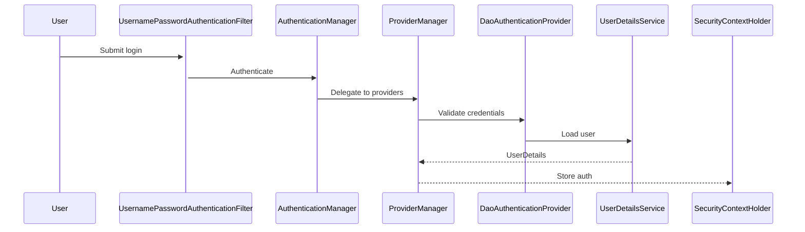

## Spring Security Authentication Flow: A Deep Dive for Interview Preparation 🔐 🛡️

Understanding how **Spring Security** works under the hood is crucial for backend developers and a frequently asked topic in technical interviews. The diagram you provided beautifully illustrates the authentication workflow in a typical Spring Security application. Let's break it down step by step with insights, component explanations, and best practices.

---

### 🔍 1. Incoming Request – The Journey Begins
When a user makes a request to a secured resource:
- The request first enters the **Filter Chain** of Spring Security.

---

### 🧱 2. Filters – First Line of Defense
Spring Security has a series of servlet filters that form the backbone of its security infrastructure:

#### a. `SecurityContextHolderFilter`
- Ensures that a `SecurityContext` is available for the current request.
- Stores authentication details (if any) in a thread-local storage (`SecurityContextHolder`).

#### b. `UsernamePasswordAuthenticationFilter`
- Intercepts login requests (typically `/login`).
- Extracts credentials from the request and builds an `Authentication` object.
- Passes this object to the **Authentication Manager**.

#### c. `ExceptionTranslationFilter`
- Catches `AccessDeniedException` and `AuthenticationException`.
- Redirects to error pages or sends appropriate HTTP error responses.

---

### 🧠 3. Authentication Manager – Delegator
The `AuthenticationManager` (usually implemented as `ProviderManager`) is responsible for delegating authentication logic to one or more **AuthenticationProviders**.

**Interview Question:**
> *"What happens if multiple `AuthenticationProvider`s are configured?"*  
**Answer:** `ProviderManager` iterates until one succeeds or all fail.

---

### 🔐 4. Authentication Providers – Pluggable Authentication
These components perform the actual authentication.

#### Common Implementations:
- `DaoAuthenticationProvider` – Uses a `UserDetailsService` to retrieve user info from a database or JDBC/LDAP/InMemory users.
- `OAuth2LoginAuthenticationProvider` – Handles OAuth2 logins / Social logins (Google/GitHub).
- `LdapAuthenticationProvider` – Connects to LDAP directories / Enterprise LDAP auth.

Each provider attempts to validate the credentials, and if one succeeds, authentication is considered successful.

---

**Java Example:**
```java
@Bean  
public AuthenticationProvider authProvider() {  
  DaoAuthenticationProvider provider = new DaoAuthenticationProvider();  
  provider.setUserDetailsService(userDetailsService());  
  provider.setPasswordEncoder(bCryptPasswordEncoder());  
  return provider;  
}  
```  

---

### 🔍 5. Password Encoder – Verifying Credentials
Before matching passwords:
- The raw password from the user is encoded.
- Compared to the encoded password stored in the database.
- Common encoders: `BCryptPasswordEncoder`, `PBKDF2PasswordEncoder`, etc.

**Interview Question:**
> *"Why is `BCrypt` preferred over `SHA-256` for passwords?"*  
**Answer:** BCrypt includes **salt + iterations**, resisting brute-force attacks.

---

### 🗃️ 6. UserDetailsService – User Data Abstraction
Responsible for loading user-specific data:

#### Implementations:
- `InMemoryUserDetailsManager` – For prototyping.
- `JdbcUserDetailsManager` – Retrieves users from a relational DB.
-  Custom `UserDetailsService` -  (e.g., MongoDB)

These services provide `UserDetails` objects to authentication providers.

**Interview Question:**
> *"How do you customize `UserDetailsService` for a NoSQL database?"*  
**Answer:** Override `loadUserByUsername()` to fetch users from NoSQL.

---

### 🔁 7. SecurityContextHolder – Holding Auth Info
If authentication is successful:
- The `SecurityContextHolder` is populated with the `Authentication` object.
- This makes user details available throughout the request lifecycle.

It uses **ThreadLocal** internally, which means data is scoped to the current thread/request.

---

**Flow:**


---

### 🧠 Key Takeaways for Interviews:
- Understand the **authentication flow** from request to database.
- Know the purpose and order of key **Spring Security filters**.
- Be able to explain what `AuthenticationManager` and `AuthenticationProvider` do.
- Describe how **password encoding** enhances security.
- Emphasize the role of `SecurityContextHolder` and why it uses `ThreadLocal`.

---

### 💡 Key Interview Questions

### **Q1: Explain the authentication flow in Spring Security.**
**Answer:**
1. User submits credentials → `UsernamePasswordAuthenticationFilter` intercepts.
2. `AuthenticationManager` delegates to `ProviderManager`.
3. `DaoAuthenticationProvider` calls `UserDetailsService`.
4. If valid, `SecurityContextHolder` stores the `Authentication` object.

### **Q2: How do you secure an API with JWT?**
**Answer:**
1. Add `JwtAuthenticationFilter` to validate tokens.
2. Configure `HttpSecurity` to permit `/login` but auth other endpoints:
```java
http.csrf().disable()  
   .authorizeRequests()  
   .antMatchers("/login").permitAll()  
   .anyRequest().authenticated()  
   .and()  
   .addFilter(new JwtAuthFilter(authenticationManager()));  
```  

### **Q3: What’s the difference between `Authentication` and `Principal`?**
**Answer:**
- **`Authentication`**: Holds credentials + granted authorities.
- **`Principal`**: The logged-in user (e.g., `UserDetails` instance).

---

### ✅ Best Practices in Industry:
- Always use a strong `PasswordEncoder` like BCrypt.
- Never hardcode credentials in code (use environment/config servers).
- Secure endpoints using method-level security (`@PreAuthorize`, `@Secured`).
- Prefer token-based auth (JWT, OAuth2) for stateless applications.

---

### 📌 Summary Table
| Component                         | Role                                       |
|----------------------------------|--------------------------------------------|
| Filters                          | Intercept and pre-process security logic   |
| AuthenticationManager            | Delegates auth requests to providers       |
| AuthenticationProvider           | Performs credential validation             |
| PasswordEncoder                  | Validates user passwords securely          |
| UserDetailsService               | Loads user data from storage               |
| SecurityContextHolder            | Maintains current user's security context  |

---

### Complete Spring Security Config with JWT, Custom User Details & Authorization** 🔐🚀

```java
@Configuration
@EnableWebSecurity
@EnableGlobalMethodSecurity(
    prePostEnabled = true,  // For @PreAuthorize
    securedEnabled = true,   // For @Secured
    jsr250Enabled = true    // For @RolesAllowed (JSR-250)
)
public class SecurityConfig extends WebSecurityConfigurerAdapter {

    // =========================================
    // 1. JWT CONFIGURATION
    // =========================================

    private static final String SECRET_KEY = "your-256-bit-secret";
    private static final long EXPIRATION_TIME = 864_000_000; // 10 days
    private static final String TOKEN_PREFIX = "Bearer ";
    private static final String HEADER_STRING = "Authorization";

    /**
     * Generates JWT token after successful authentication
     */
    public static String generateToken(UserDetails userDetails) {
        Map<String, Object> claims = new HashMap<>();
        claims.put("roles", userDetails.getAuthorities());
        
        return Jwts.builder()
                .setClaims(claims)
                .setSubject(userDetails.getUsername())
                .setIssuedAt(new Date(System.currentTimeMillis()))
                .setExpiration(new Date(System.currentTimeMillis() + EXPIRATION_TIME))
                .signWith(SignatureAlgorithm.HS256, SECRET_KEY)
                .compact();
    }

    /**
     * Validates JWT token and extracts user details
     */
    public static UserDetails validateToken(String token) {
        try {
            Claims claims = Jwts.parser()
                    .setSigningKey(SECRET_KEY)
                    .parseClaimsJws(token.replace(TOKEN_PREFIX, ""))
                    .getBody();

            String username = claims.getSubject();
            List<String> roles = claims.get("roles", List.class);

            return new org.springframework.security.core.userdetails.User(
                    username,
                    "", // Password not needed after auth
                    roles.stream().map(role -> new SimpleGrantedAuthority(role)).collect(Collectors.toList())
            );
        } catch (Exception e) {
            throw new RuntimeException("Invalid JWT token");
        }
    }

    // =========================================
    // 2. CUSTOM USER DETAILS SERVICE
    // =========================================

    @Service
    public static class CustomUserDetailsService implements UserDetailsService {

        // In production, inject your UserRepository here
        // @Autowired private UserRepository userRepository;

        @Override
        public UserDetails loadUserByUsername(String username) throws UsernameNotFoundException {
            // Mock database lookup - replace with actual DB call
            if ("admin".equals(username)) {
                return new org.springframework.security.core.userdetails.User(
                        "admin",
                        passwordEncoder().encode("admin123"),
                        Collections.singletonList(new SimpleGrantedAuthority("ROLE_ADMIN"))
                );
            } else if ("user".equals(username)) {
                return new org.springframework.security.core.userdetails.User(
                        "user",
                        passwordEncoder().encode("user123"),
                        Collections.singletonList(new SimpleGrantedAuthority("ROLE_USER"))
                );
            }
            throw new UsernameNotFoundException("User not found");
        }
    }

    @Autowired
    private CustomUserDetailsService userDetailsService;

    // =========================================
    // 3. SECURITY CONFIGURATION
    // =========================================

    @Bean
    public PasswordEncoder passwordEncoder() {
        return new BCryptPasswordEncoder();
    }

    @Bean
    @Override
    public AuthenticationManager authenticationManagerBean() throws Exception {
        return super.authenticationManagerBean();
    }

    @Override
    protected void configure(AuthenticationManagerBuilder auth) throws Exception {
        auth
            .userDetailsService(userDetailsService)
            .passwordEncoder(passwordEncoder());
    }

    @Override
    protected void configure(HttpSecurity http) throws Exception {
        http
            .csrf().disable()
            .sessionManagement().sessionCreationPolicy(SessionCreationPolicy.STATELESS)
            .and()
            .authorizeRequests()
                .antMatchers("/api/auth/**").permitAll()
                .antMatchers("/api/admin/**").hasRole("ADMIN")
                .antMatchers("/api/user/**").hasAnyRole("USER", "ADMIN")
                .anyRequest().authenticated()
            .and()
            .addFilter(new JwtAuthenticationFilter(authenticationManager()))
            .addFilter(new JwtAuthorizationFilter(authenticationManager()));
    }

    // =========================================
    // 4. JWT FILTERS IMPLEMENTATION
    // =========================================

    /**
     * Handles login requests and issues JWT tokens
     */
    public static class JwtAuthenticationFilter extends UsernamePasswordAuthenticationFilter {

        private final AuthenticationManager authenticationManager;

        public JwtAuthenticationFilter(AuthenticationManager authenticationManager) {
            this.authenticationManager = authenticationManager;
            setFilterProcessesUrl("/api/auth/login"); // Custom login endpoint
        }

        @Override
        public Authentication attemptAuthentication(HttpServletRequest req,
                                                  HttpServletResponse res) {
            String username = req.getParameter("username");
            String password = req.getParameter("password");

            return authenticationManager.authenticate(
                new UsernamePasswordAuthenticationToken(username, password)
            );
        }

        @Override
        protected void successfulAuthentication(HttpServletRequest req,
                                              HttpServletResponse res,
                                              FilterChain chain,
                                              Authentication auth) throws IOException {
            String token = generateToken((UserDetails) auth.getPrincipal());
            res.addHeader(HEADER_STRING, TOKEN_PREFIX + token);
            res.getWriter().write("{\"token\": \"" + token + "\"}");
        }
    }

    /**
     * Validates JWT tokens in incoming requests
     */
    public static class JwtAuthorizationFilter extends BasicAuthenticationFilter {

        public JwtAuthorizationFilter(AuthenticationManager authenticationManager) {
            super(authenticationManager);
        }

        @Override
        protected void doFilterInternal(HttpServletRequest req,
                                      HttpServletResponse res,
                                      FilterChain chain) throws IOException, ServletException {
            String header = req.getHeader(HEADER_STRING);

            if (header == null || !header.startsWith(TOKEN_PREFIX)) {
                chain.doFilter(req, res);
                return;
            }

            try {
                Authentication authentication = getAuthentication(req);
                SecurityContextHolder.getContext().setAuthentication(authentication);
                chain.doFilter(req, res);
            } catch (Exception e) {
                res.sendError(HttpServletResponse.SC_UNAUTHORIZED, "Invalid token");
            }
        }

        private Authentication getAuthentication(HttpServletRequest request) {
            String token = request.getHeader(HEADER_STRING);
            if (token != null) {
                UserDetails userDetails = validateToken(token);
                return new UsernamePasswordAuthenticationToken(
                    userDetails, null, userDetails.getAuthorities());
            }
            return null;
        }
    }
}
```
---

This architecture is robust, extensible, and widely adopted in the industry. Mastering it gives you a solid edge in Spring interviews and real-world application development! 🚀

---
### 📚 Further Reading
- [Spring Security Official Docs](https://spring.io/projects/spring-security)
- [JWT with Spring Security](https://www.baeldung.com/spring-security-oauth-jwt)
