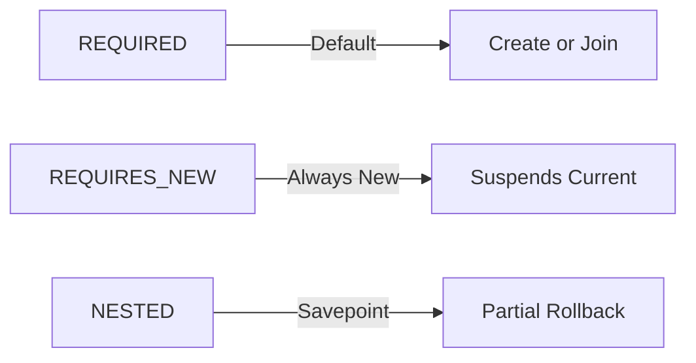
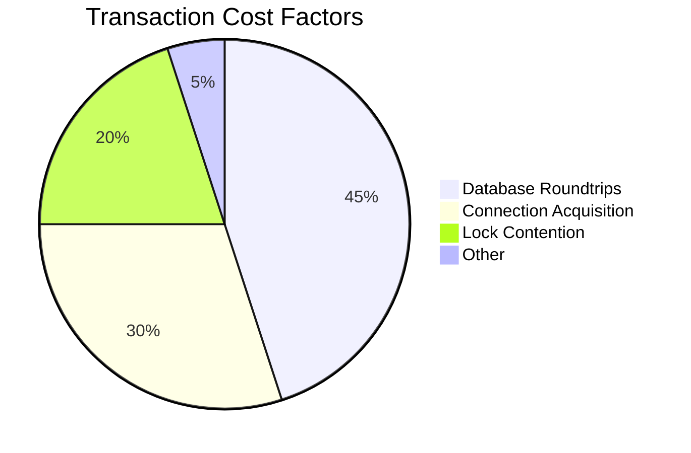
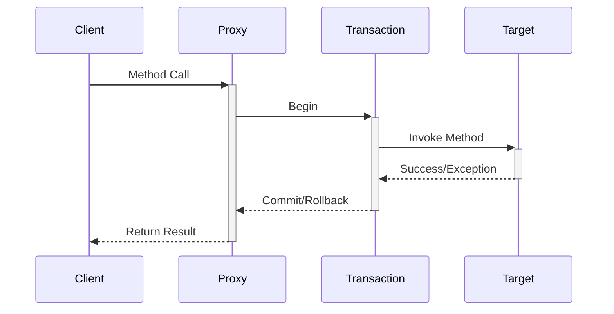
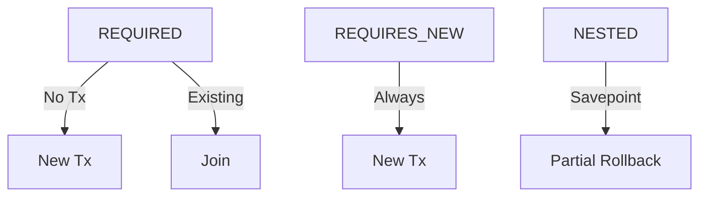

# **Spring Boot @Transactional - The Ultimate Guide** 🚀

This comprehensive guide covers everything about Spring's `@Transactional` annotation, from basic usage to advanced patterns, with interview-focused explanations and real-world examples.

## Table of Contents
1. [Core Concepts](#1-core-concepts)
2. [Annotation Configuration](#2-annotation-configuration)
3. [Propagation Behaviors](#3-propagation-behaviors)
4. [Isolation Levels](#4-isolation-levels)
5. [Best Practices](#5-best-practices)
6. [Common Pitfalls](#6-common-pitfalls)
7. [Performance Considerations](#7-performance-considerations)
8. [Interview Q&A](#8-interview-qa)
9. [Comparison Tables](#9-comparison-tables)
10. [Visual Diagrams](#10-visual-diagrams)

---

## 1. Core Concepts

### 1.1 What is @Transactional?
```mermaid
graph TD
    A[Business Method] --> B[@Transactional]
    B --> C[Transaction Begin]
    B --> D[Commit/Rollback]
```

**Key Features:**
- Declarative transaction management
- Wraps method in database transaction
- Automatic rollback on exceptions
- Integrates with Spring's transaction abstraction

### 1.2 Why Use Transactions?
```java
// Without transaction
void transferMoney(Account from, Account to, BigDecimal amount) {
    from.debit(amount);  // If this fails...
    to.credit(amount);   // Money is lost!
}

// With transaction
@Transactional
void transferMoney(Account from, Account to, BigDecimal amount) {
    from.debit(amount);
    to.credit(amount);  // Both succeed or both fail
}
```

---

## 2. Annotation Configuration

### 2.1 Basic Usage
```java
@Service
public class BankService {
    
    @Transactional
    public void transferFunds(Long fromId, Long toId, BigDecimal amount) {
        // Transactional logic
    }
}
```

### 2.2 Common Parameters
| Parameter | Purpose | Example |
|-----------|---------|---------|
| `propagation` | Transaction behavior | `REQUIRED` |
| `isolation` | Data visibility | `READ_COMMITTED` |
| `timeout` | Max duration (seconds) | `timeout=30` |
| `rollbackFor` | Custom rollback rules | `rollbackFor=BusinessException.class` |
| `readOnly` | Optimization hint | `readOnly=true` |

---

## 3. Propagation Behaviors

### 3.1 Propagation Types


**Common Scenarios:**
- `REQUIRED` (Default): Join existing or create new
- `REQUIRES_NEW`: Always new transaction (e.g., audit logs)
- `NESTED`: Savepoint-based nested transaction
- `MANDATORY`: Must have existing transaction

### 3.2 Code Example
```java
@Transactional(propagation = Propagation.REQUIRES_NEW)
public void logTransaction(Transaction tx) {
    // Always executes in new transaction
}
```

---

## 4. Isolation Levels

### 4.1 Isolation Spectrum
| Level | Dirty Reads | Non-Repeatable | Phantoms | Performance |
|-------|-------------|----------------|----------|-------------|
| `READ_UNCOMMITTED` | ✅ Possible | ✅ | ✅ | ⚡ Fastest |
| `READ_COMMITTED` | ❌ | ✅ | ✅ | ⚡⚡ |
| `REPEATABLE_READ` | ❌ | ❌ | ✅ | ⚡⚡⚡ |
| `SERIALIZABLE` | ❌ | ❌ | ❌ | 🐢 Slowest |

### 4.2 Practical Usage
```java
@Transactional(isolation = Isolation.REPEATABLE_READ)
public BigDecimal calculateTotalBalance(Long userId) {
    // Consistent reads during calculation
}
```

---

## 5. Best Practices

### 5.1 Do's and Don'ts
- ✅ Place `@Transactional` on service layer
- ✅ Use `readOnly=true` for queries
- ✅ Define explicit `rollbackFor`
- ❌ Avoid on private methods (proxy limitation)
- ❌ Don't catch exceptions silently

### 5.2 Performance Optimization
```java
@Repository
public interface AccountRepository extends JpaRepository<Account, Long> {
    
    @Transactional(readOnly = true)
    @Query("SELECT a.balance FROM Account a WHERE a.userId = :userId")
    BigDecimal findBalanceByUserId(@Param("userId") Long userId);
}
```

---

## 6. Common Pitfalls

### 6.1 Self-Invocation Problem
```java
@Service
public class OrderService {
    
    public void processOrder(Order order) {
        validateOrder(order);  // Bypasses proxy!
    }
    
    @Transactional
    private void validateOrder(Order order) {
        // Transaction won't work
    }
}
```

**Solution:** Extract to separate bean or use `AopContext.currentProxy()`

### 6.2 Exception Handling
```java
@Transactional(rollbackFor = {BusinessException.class, SQLException.class})
public void placeOrder(Order order) throws BusinessException {
    // Rollback on these exceptions
}
```

---

## 7. Performance Considerations

### 7.1 Transaction Overhead


**Optimization Tips:**
- Keep transactions short
- Avoid long-running transactions
- Use appropriate isolation levels
- Batch operations when possible

---

## 8. Interview Q&A

### Q1: How does @Transactional work under the hood?
**A:** Spring creates a proxy around the bean that:
1. Begins transaction before method
2. Commits if successful
3. Rolls back on unchecked exceptions
4. Uses ThreadLocal to track transactions

### Q2: Why is @Transactional not working?
**Common Causes:**
- Method is private/final
- Self-invocation within class
- Exception caught and not rethrown
- Wrong bean scope (prototype)
- Missing `@EnableTransactionManagement`

### Q3: Explain transaction propagation
**A:** Defines how transactions interact:
- `REQUIRED`: Default, join if exists
- `REQUIRES_NEW`: Always new transaction
- `NESTED`: Savepoint-based nested tx
- `MANDATORY`: Must have existing tx

### Q4: How to handle multiple data sources?
**A:** Use `@Transactional("accountsTransactionManager")` with:
```java
@Bean
@Primary
public PlatformTransactionManager primaryTxManager(DataSource dataSource) {
    return new DataSourceTransactionManager(dataSource);
}
```

### Q5: Difference between JDBC and JPA transactions?
**A:**
- **JDBC**: Connection-level
- **JPA**: EntityManager-level
- Spring unifies them via `PlatformTransactionManager`

### Q6: How to test transactions?
**A:** Use Spring test support:
```java
@SpringBootTest
@Transactional  // Rolls back after test
class OrderServiceTest {
    
    @Test
    void shouldRollbackOnFailure() {
        assertThrows(Exception.class, () -> service.placeOrder(invalidOrder));
        assertFalse(repository.existsById(invalidOrder.getId()));
    }
}
```

### Q7: When to use programmatic transactions?
**A:** When you need:
- Fine-grained control
- Multiple transaction managers
- Complex commit/rollback logic
```java
transactionTemplate.execute(status -> {
    // Manual control
});
```

### Q8: Explain savepoints
**A:** Partial rollback points within transaction:
```java
@Transactional
public void complexOperation() {
    // Part A
    TransactionAspectSupport.currentTransactionStatus().createSavepoint();
    try {
        // Part B
    } catch (Exception e) {
        status.rollbackToSavepoint();
    }
}
```

### Q9: How does @Async interact with @Transactional?
**A:** Transactions don't propagate to `@Async` methods. Solutions:
1. Begin new transaction in async method
2. Use `TransactionTemplate` programmatically
3. Reorganize workflow

### Q10: What is transaction synchronization?
**A:** Hook into transaction lifecycle:
```java
TransactionSynchronizationManager.registerSynchronization(
    new TransactionSynchronization() {
        @Override
        public void afterCommit() {
            // Post-commit logic
        }
    }
);
```

---

## 9. Comparison Tables

### Transaction Managers
| Manager | Use Case | Features |
|---------|----------|----------|
| `DataSourceTM` | JDBC | Simple, connection-based |
| `JpaTM` | JPA | EntityManager handling |
| `JtaTM` | XA | Distributed transactions |

### Propagation vs Isolation
| Aspect | Propagation | Isolation |
|--------|-------------|-----------|
| **Purpose** | Transaction boundaries | Data visibility |
| **Controls** | Transaction creation | Concurrent access |
| **Default** | REQUIRED | DEFAULT (DB-specific) |

---

## 10. Visual Diagrams

### Transaction Proxy


### Propagation Scenarios


---

## Key Takeaways
1. **Declarative > Programmatic** for most cases
2. **Understand propagation/isolation** tradeoffs
3. **Keep transactions short** for performance
4. **Test rollback behavior** explicitly
5. **Avoid common pitfalls** like self-invocation

**Pro Tip:** Always relate to ACID properties:
- Atomicity: All or nothing
- Consistency: Valid state transitions
- Isolation: Concurrent access control
- Durability: Survives crashes
