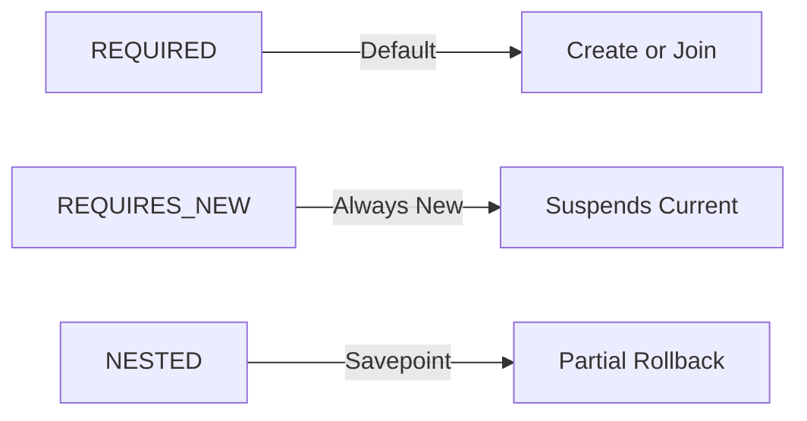
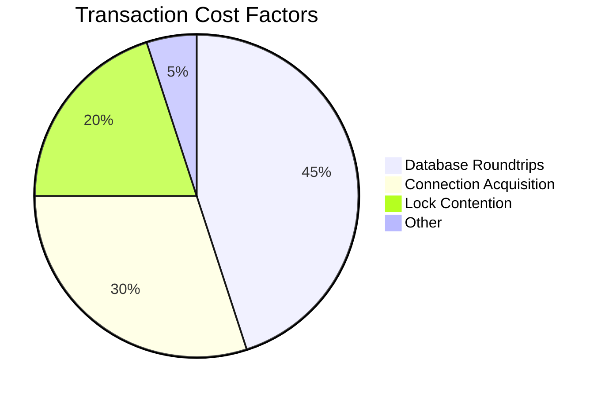
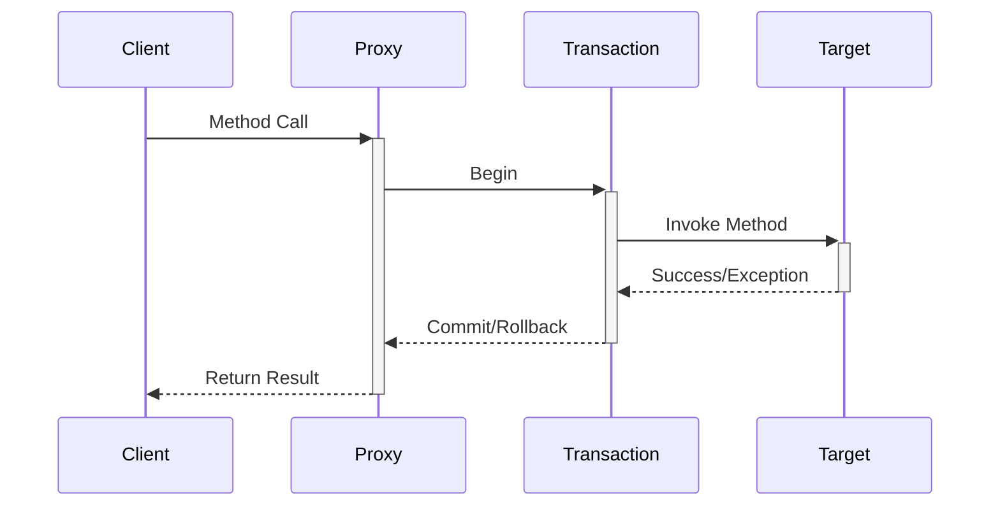
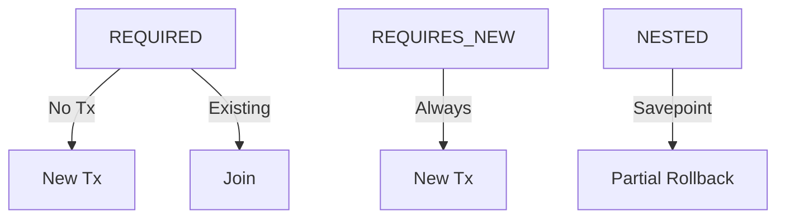

# **Spring Boot @Transactional - The Ultimate Guide** 🚀

This comprehensive guide covers everything about Spring's `@Transactional` annotation, from basic usage to advanced patterns, with interview-focused explanations and real-world examples.

## Table of Contents
1. [Core Concepts](#1-core-concepts)
2. [Annotation Configuration](#2-annotation-configuration)
3. [Propagation Behaviors](#3-propagation-behaviors)
4. [Isolation Levels](#4-isolation-levels)
5. [Best Practices](#5-best-practices)
6. [Common Pitfalls](#6-common-pitfalls)
7. [Performance Considerations](#7-performance-considerations)
8. [Interview Q&A](#8-interview-qa)
9. [Comparison Tables](#9-comparison-tables)
10. [Visual Diagrams](#10-visual-diagrams)

---

## 1. Core Concepts

### 1.1 What is @Transactional?
```mermaid
graph TD
    A[Business Method] --> B[@Transactional]
    B --> C[Transaction Begin]
    B --> D[Commit/Rollback]
```

**Key Features:**
- Declarative transaction management
- Wraps method in database transaction
- Automatic rollback on exceptions
- Integrates with Spring's transaction abstraction

### 1.2 Why Use Transactions?
```java
// Without transaction
void transferMoney(Account from, Account to, BigDecimal amount) {
    from.debit(amount);  // If this fails...
    to.credit(amount);   // Money is lost!
}

// With transaction
@Transactional
void transferMoney(Account from, Account to, BigDecimal amount) {
    from.debit(amount);
    to.credit(amount);  // Both succeed or both fail
}
```

---

## 2. Annotation Configuration

### 2.1 Basic Usage
```java
@Service
public class BankService {
    
    @Transactional
    public void transferFunds(Long fromId, Long toId, BigDecimal amount) {
        // Transactional logic
    }
}
```

### 2.2 Common Parameters
| Parameter | Purpose | Example |
|-----------|---------|---------|
| `propagation` | Transaction behavior | `REQUIRED` |
| `isolation` | Data visibility | `READ_COMMITTED` |
| `timeout` | Max duration (seconds) | `timeout=30` |
| `rollbackFor` | Custom rollback rules | `rollbackFor=BusinessException.class` |
| `readOnly` | Optimization hint | `readOnly=true` |

---

## 3. Propagation Behaviors

### 3.1 Propagation Types

```mermaid
graph LR
    A[REQUIRED] -->|Default| B[Create or Join]
    C[REQUIRES_NEW] -->|Always New| D[Suspends Current]
    E[NESTED] -->|Savepoint| F[Partial Rollback]
```

**Common Scenarios:**
- `REQUIRED` (Default): Join existing or create new
- `REQUIRES_NEW`: Always new transaction (e.g., audit logs)
- `NESTED`: Savepoint-based nested transaction
- `MANDATORY`: Must have existing transaction

### 3.2 Code Example
```java
@Transactional(propagation = Propagation.REQUIRES_NEW)
public void logTransaction(Transaction tx) {
    // Always executes in new transaction
}
```

---

## 4. Isolation Levels

### 4.1 Isolation Spectrum
| Level | Dirty Reads | Non-Repeatable | Phantoms | Performance |
|-------|-------------|----------------|----------|-------------|
| `READ_UNCOMMITTED` | ✅ Possible | ✅ | ✅ | ⚡ Fastest |
| `READ_COMMITTED` | ❌ | ✅ | ✅ | ⚡⚡ |
| `REPEATABLE_READ` | ❌ | ❌ | ✅ | ⚡⚡⚡ |
| `SERIALIZABLE` | ❌ | ❌ | ❌ | 🐢 Slowest |

### 4.2 Practical Usage
```java
@Transactional(isolation = Isolation.REPEATABLE_READ)
public BigDecimal calculateTotalBalance(Long userId) {
    // Consistent reads during calculation
}
```

---

## 5. Best Practices

### 5.1 Do's and Don'ts
- ✅ Place `@Transactional` on service layer
- ✅ Use `readOnly=true` for queries
- ✅ Define explicit `rollbackFor`
- ❌ Avoid on private methods (proxy limitation)
- ❌ Don't catch exceptions silently

### 5.2 Performance Optimization
```java
@Repository
public interface AccountRepository extends JpaRepository<Account, Long> {
    
    @Transactional(readOnly = true)
    @Query("SELECT a.balance FROM Account a WHERE a.userId = :userId")
    BigDecimal findBalanceByUserId(@Param("userId") Long userId);
}
```

---

## 6. Common Pitfalls

### 6.1 Self-Invocation Problem
```java
@Service
public class OrderService {
    
    public void processOrder(Order order) {
        validateOrder(order);  // Bypasses proxy!
    }
    
    @Transactional
    private void validateOrder(Order order) {
        // Transaction won't work
    }
}
```

**Solution:** Extract to separate bean or use `AopContext.currentProxy()`

### 6.2 Exception Handling
```java
@Transactional(rollbackFor = {BusinessException.class, SQLException.class})
public void placeOrder(Order order) throws BusinessException {
    // Rollback on these exceptions
}
```

---

## 7. Performance Considerations

### 7.1 Transaction Overhead

```mermaid
pie
    title Transaction Cost Factors
    "Database Roundtrips" : 45
    "Connection Acquisition" : 30
    "Lock Contention" : 20
    "Other" : 5
```

**Optimization Tips:**
- Keep transactions short
- Avoid long-running transactions
- Use appropriate isolation levels
- Batch operations when possible

---

## 8. Interview Q&A

### Q1: How does @Transactional work under the hood?
**A:** Spring creates a proxy around the bean that:
1. Begins transaction before method
2. Commits if successful
3. Rolls back on unchecked exceptions
4. Uses ThreadLocal to track transactions

### Q2: Why is @Transactional not working?
**Common Causes:**
- Method is private/final
- Self-invocation within class
- Exception caught and not rethrown
- Wrong bean scope (prototype)
- Missing `@EnableTransactionManagement`

### Q3: Explain transaction propagation
**A:** Defines how transactions interact:
- `REQUIRED`: Default, join if exists
- `REQUIRES_NEW`: Always new transaction
- `NESTED`: Savepoint-based nested tx
- `MANDATORY`: Must have existing tx

### Q4: How to handle multiple data sources?
**A:** Use `@Transactional("accountsTransactionManager")` with:
```java
@Bean
@Primary
public PlatformTransactionManager primaryTxManager(DataSource dataSource) {
    return new DataSourceTransactionManager(dataSource);
}
```

### Q5: Difference between JDBC and JPA transactions?
**A:**
- **JDBC**: Connection-level
- **JPA**: EntityManager-level
- Spring unifies them via `PlatformTransactionManager`

### Q6: How to test transactions?
**A:** Use Spring test support:
```java
@SpringBootTest
@Transactional  // Rolls back after test
class OrderServiceTest {
    
    @Test
    void shouldRollbackOnFailure() {
        assertThrows(Exception.class, () -> service.placeOrder(invalidOrder));
        assertFalse(repository.existsById(invalidOrder.getId()));
    }
}
```

### Q7: When to use programmatic transactions?
**A:** When you need:
- Fine-grained control
- Multiple transaction managers
- Complex commit/rollback logic
```java
transactionTemplate.execute(status -> {
    // Manual control
});
```

### Q8: Explain savepoints
**A:** Partial rollback points within transaction:
```java
@Transactional
public void complexOperation() {
    // Part A
    TransactionAspectSupport.currentTransactionStatus().createSavepoint();
    try {
        // Part B
    } catch (Exception e) {
        status.rollbackToSavepoint();
    }
}
```

### Q9: How does @Async interact with @Transactional?
**A:** Transactions don't propagate to `@Async` methods. Solutions:
1. Begin new transaction in async method
2. Use `TransactionTemplate` programmatically
3. Reorganize workflow

### Q10: What is transaction synchronization?
**A:** Hook into transaction lifecycle:
```java
TransactionSynchronizationManager.registerSynchronization(
    new TransactionSynchronization() {
        @Override
        public void afterCommit() {
            // Post-commit logic
        }
    }
);
```

---

## 9. Comparison Tables

### Transaction Managers
| Manager | Use Case | Features |
|---------|----------|----------|
| `DataSourceTM` | JDBC | Simple, connection-based |
| `JpaTM` | JPA | EntityManager handling |
| `JtaTM` | XA | Distributed transactions |

### Propagation vs Isolation
| Aspect | Propagation | Isolation |
|--------|-------------|-----------|
| **Purpose** | Transaction boundaries | Data visibility |
| **Controls** | Transaction creation | Concurrent access |
| **Default** | REQUIRED | DEFAULT (DB-specific) |

---

## 10. Visual Diagrams

### Transaction Proxy

```mermaid
sequenceDiagram
    Client->>+Proxy: Method Call
    Proxy->>+Transaction: Begin
    Transaction->>+Target: Invoke Method
    Target-->>-Transaction: Success/Exception
    Transaction-->>-Proxy: Commit/Rollback
    Proxy-->>-Client: Return Result
```

### Propagation Scenarios

```mermaid
graph TD
    A[REQUIRED] -->|No Tx| B[New Tx]
    A -->|Existing| C[Join]
    D[REQUIRES_NEW] -->|Always| E[New Tx]
    F[NESTED] -->|Savepoint| G[Partial Rollback]
```

---

## Key Takeaways
1. **Declarative > Programmatic** for most cases
2. **Understand propagation/isolation** tradeoffs
3. **Keep transactions short** for performance
4. **Test rollback behavior** explicitly
5. **Avoid common pitfalls** like self-invocation

**Pro Tip:** Always relate to ACID properties:
- Atomicity: All or nothing
- Consistency: Valid state transitions
- Isolation: Concurrent access control
- Durability: Survives crashes

---

## 🎮 Gamification: Level Up Challenges!

### 🎲 Challenge 1: The Self-Invocation Trap 🪤 (Interview Favorite!)

> **This code has a bug. The @Transactional on `processItems()` doesn't work! Why?**
> ```java
> @Service
> public class OrderService {
>     
>     public void processOrder(Order order) {
>         // ... some logic ...
>         processItems(order.getItems()); // Calling another method in SAME class!
>     }
>     
>     @Transactional  // 💀 THIS DOESN'T WORK!
>     public void processItems(List<Item> items) {
>         for (Item item : items) {
>             inventoryRepo.deduct(item);
>         }
>     }
> }
> ```
>
> <details>
> <summary>🔓 Click to reveal answer</summary>
>
> **THE TRAP**: Spring `@Transactional` works via **PROXY**. When you call a method from WITHIN the same class, it BYPASSES the proxy — so the annotation is completely ignored!
>
> ```
> External call:  Client → Proxy → @Transactional → Method  ✅
> Self call:      this.processItems() → Method (NO PROXY!)  ❌
> ```
>
> **Fixes:**
> 1. ✅ Move `processItems()` to a DIFFERENT service
> 2. ✅ Inject self: `@Autowired private OrderService self; self.processItems(...)`
> 3. ⚠️ Use `AopContext.currentProxy()` (hacky, not recommended)
>
> **This is the #1 most asked @Transactional question!** 🏆
> </details>

### 🎲 Challenge 2: Predict the Rollback Behavior 🔮

> **Scenario**: What happens in each case?
>
> ```java
> @Transactional
> public void case1() {
>     repo.save(entity);
>     throw new RuntimeException("Oops"); // Rollback? 🤔
> }
>
> @Transactional
> public void case2() {
>     repo.save(entity);
>     throw new IOException("File not found"); // Rollback? 🤔
> }
>
> @Transactional(rollbackFor = Exception.class)
> public void case3() {
>     repo.save(entity);
>     throw new IOException("File not found"); // Rollback? 🤔
> }
> ```
>
> <details>
> <summary>🔓 Click to reveal answer</summary>
>
> | Case | Rollback? | Why? |
> |------|-----------|------|
> | Case 1 | ✅ YES | RuntimeException → always rolls back by default |
> | Case 2 | ❌ NO! | Checked exceptions (IOException) do NOT trigger rollback by default! |
> | Case 3 | ✅ YES | `rollbackFor = Exception.class` catches ALL exceptions |
>
> **The Rule:**
> - `RuntimeException` + `Error` → Rollback ✅
> - Checked `Exception` → NO rollback ❌ (unless specified!)
>
> **Best Practice:** Always use `@Transactional(rollbackFor = Exception.class)` to be safe!
> </details>

### 🎲 Challenge 3: The Propagation Puzzle 🧩

> **What's the transaction behavior when calling nested services?**
> ```java
> @Service
> class ServiceA {
>     @Transactional(propagation = REQUIRED)     // Default
>     public void methodA() {
>         repo.save(entityA);
>         serviceB.methodB();  // What happens to B's transaction?
>     }
> }
>
> @Service  
> class ServiceB {
>     @Transactional(propagation = REQUIRES_NEW)
>     public void methodB() {
>         repo.save(entityB);
>         throw new RuntimeException("B failed!");
>     }
> }
> ```
>
> **Question**: Does entityA get saved? Does entityB get saved?
>
> <details>
> <summary>🔓 Click to reveal answer</summary>
>
> | Entity | Saved? | Why? |
> |--------|--------|------|
> | entityA | ❌ NO | RuntimeException propagates up to A, rolling back A's transaction |
> | entityB | ❌ NO | B's `REQUIRES_NEW` transaction rolled back due to its own exception |
>
> **Key Insight**: `REQUIRES_NEW` creates a separate transaction for B. B's rollback is independent. BUT the exception still propagates to A, causing A to rollback too!
>
> **To save entityA despite B's failure:**
> ```java
> @Transactional
> public void methodA() {
>     repo.save(entityA);
>     try {
>         serviceB.methodB();
>     } catch (RuntimeException e) {
>         log.warn("B failed, but A continues");
>     }
> }
> ```
> </details>

---

## 🏆 Achievement Unlocked!

```
┌──────────────────────────────────────────────────────────────┐
│  🗡️ ACHIEVEMENT: AOP Assassin Level 4                        │
│                                                              │
│  You now understand:                                         │
│  ✅ @Transactional internals (proxy-based)                   │
│  ✅ Propagation behaviors (REQUIRED, REQUIRES_NEW, etc.)     │
│  ✅ Isolation levels and their trade-offs                     │
│  ✅ Common pitfalls (self-invocation, checked exceptions)     │
│                                                              │
│  NEXT: → Spring Security                                     │
└──────────────────────────────────────────────────────────────┘
```

👉 **[Next: Spring Security →](./SpringSecurity.md)**  
👉 **[Back to Spring Boot Overview →](./README.md)**
