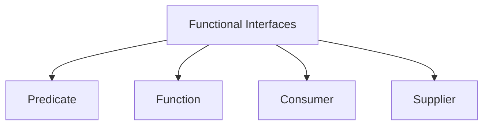
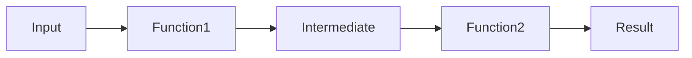
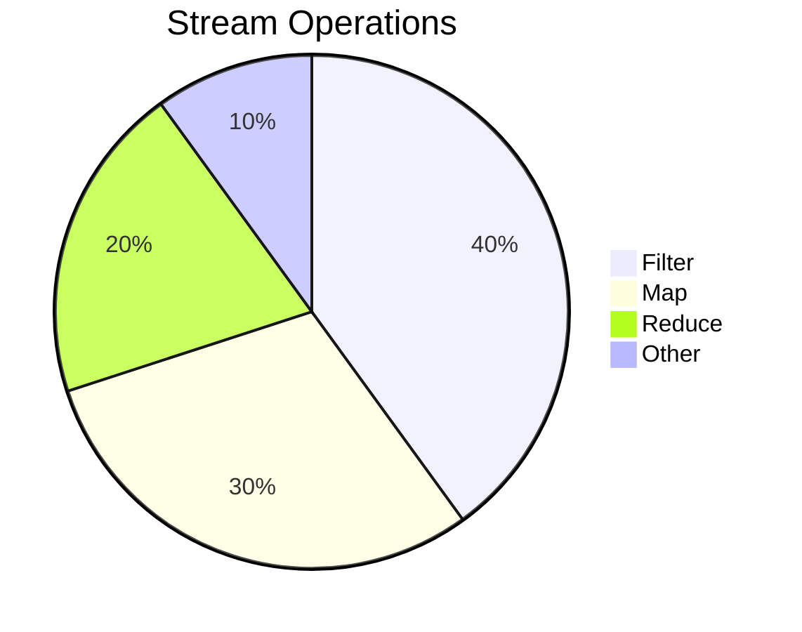

# **Functional Interfaces in Java: Predicate, Function, Consumer, and Supplier** 🚀

This comprehensive guide covers Java's core functional interfaces with practical examples, industry use cases, and interview-focused explanations.

## Table of Contents
1. [Functional Interfaces Overview](#1-functional-interfaces-overview)
2. [Predicate Deep Dive](#2-predicate-deep-dive)
3. [Function Deep Dive](#3-function-deep-dive)
4. [Consumer Deep Dive](#4-consumer-deep-dive)
5. [Supplier Deep Dive](#5-supplier-deep-dive)
6. [Industry Best Practices](#6-industry-best-practices)
7. [Performance Considerations](#7-performance-considerations)
8. [Interview Q&A](#8-interview-qa)
9. [Comparison Tables](#9-comparison-tables)
10. [Visual Diagrams](#10-visual-diagrams)

---

## 1. Functional Interfaces Overview

### 1.1 What is a Functional Interface?
```java
@FunctionalInterface
public interface MyFunctionalInterface {
    void execute(); // Single abstract method
    
    default void log() { // Can have defaults
        System.out.println("Logging");
    }
}
```
**Key Characteristics:**
- Single Abstract Method (SAM)
- Can have multiple default/static methods
- Annotation is optional but recommended

### 1.2 Java's Built-in Functional Interfaces


---

## 2. Predicate Deep Dive

### 2.1 Definition & Usage
```java
Predicate<String> isLong = s -> s.length() > 10;
boolean result = isLong.test("Hello World"); // true
```

**Common Methods:**
- `test(T t)`: Evaluates predicate
- `and()`, `or()`, `negate()`: Logical operations

### 2.2 Industry Example: Filtering Data
```java
List<Product> filtered = products.stream()
    .filter(p -> p.getPrice() > 100 && p.isInStock())
    .collect(Collectors.toList());
```

**Best Practices:**
- Keep predicates pure (no side effects)
- Compose complex predicates from simple ones
- Use method references when possible

---

## 3. Function Deep Dive

### 3.1 Definition & Usage
```java
Function<String, Integer> lengthMapper = String::length;
int len = lengthMapper.apply("Java"); // 4
```

**Common Methods:**
- `apply(T t)`: Applies function
- `andThen()`, `compose()`: Function chaining

### 3.2 Industry Example: Data Transformation
```java
List<String> names = employees.stream()
    .map(Employee::getName) // Function<Employee, String>
    .collect(Collectors.toList());
```

**Performance Tip:**  
For primitive operations, use specialized variants:
- `IntFunction`, `ToIntFunction`
- `DoubleFunction`, etc.

---

## 4. Consumer Deep Dive

### 4.1 Definition & Usage
```java
Consumer<String> printer = System.out::println;
printer.accept("Hello"); // Prints "Hello"
```

**Common Methods:**
- `accept(T t)`: Performs operation
- `andThen()`: Consumer chaining

### 4.2 Industry Example: Batch Processing
```java
transactions.forEach(tx -> {
    auditService.log(tx); // Consumer<Transaction>
    notificationService.alert(tx);
});
```

**Best Practice:**  
Avoid modifying external state in consumers when used in streams.

---

## 5. Supplier Deep Dive

### 5.1 Definition & Usage
```java
Supplier<LocalDate> dateSupplier = LocalDate::now;
LocalDate today = dateSupplier.get();
```

**Common Use Cases:**
- Lazy initialization
- Factory patterns
- Configuration providers

### 5.2 Industry Example: Caching
```java
public class Cache<T> {
    private Supplier<T> loader;
    
    public Cache(Supplier<T> loader) {
        this.loader = loader;
    }
    
    public T get() {
        return loader.get();
    }
}
```

---

## 6. Industry Best Practices

### 6.1 Do's and Don'ts
- ✅ Use method references where possible
- ✅ Compose small functions
- ❌ Avoid long lambda bodies (>3 lines)
- ❌ Don't mutate shared state

### 6.2 Functional Composition
```java
Predicate<String> isLong = s -> s.length() > 10;
Predicate<String> containsA = s -> s.contains("a");

Predicate<String> combined = isLong.and(containsA);
```

### 6.3 Exception Handling
```java
Function<String, Integer> safeParser = s -> {
    try {
        return Integer.parseInt(s);
    } catch (NumberFormatException e) {
        return 0;
    }
};
```

---

## 7. Performance Considerations

### 7.1 Lambda vs Anonymous Class
```java
// Lambda (better)
Function<String, Integer> f1 = s -> s.length();

// Anonymous class
Function<String, Integer> f2 = new Function<>() {
    public Integer apply(String s) {
        return s.length();
    }
};
```

**Key Points:**
- Lambdas are generally more efficient
- No additional class files generated
- Better JIT optimization

### 7.2 Primitive Specializations
```java
// Avoids boxing
IntFunction<String> intToString = i -> "Number: " + i;
ToIntFunction<String> stringLength = String::length;
```

---

## 8. Interview Q&A

### Q1: What makes an interface functional?
**A:** A functional interface has:
1. Exactly one abstract method (SAM)
2. Any number of default/static methods
3. Optional `@FunctionalInterface` annotation

### Q2: Difference between Predicate and Function?
**A:**
- `Predicate`: Takes input, returns boolean (`test()`)
- `Function`: Takes input, returns output (`apply()`)

### Q3: When to use Consumer vs Supplier?
**A:**
- `Consumer`: When you need to perform operations without returning (void)
- `Supplier`: When you need to provide values without inputs

### Q4: How to chain Functions?
**A:** Use `andThen()` and `compose()`:
```java
Function<Integer, String> intToStr = Object::toString;
Function<String, Integer> strToInt = Integer::parseInt;

Function<Integer, Integer> chain = intToStr.andThen(strToInt);
```

### Q5: Explain method references
**A:** Shorthand for lambdas:
```java
// Static method
Function<String, Integer> f1 = Integer::parseInt;

// Instance method
Consumer<String> f2 = System.out::println;

// Constructor 
Supplier<List<String>> f3 = ArrayList::new;
```

### Q6: Why use primitive functional interfaces?
**A:** To avoid boxing/unboxing overhead:
```java
IntPredicate isEven = i -> i % 2 == 0; // Better than Predicate<Integer>
```

### Q7: How to handle checked exceptions?
**A:** Either:
1. Wrap in unchecked exception
2. Create custom functional interface
```java
@FunctionalInterface
interface ThrowingFunction<T, R> {
    R apply(T t) throws Exception;
}
```

### Q8: What is the "effectively final" requirement?
**A:** Lambdas can only use:
- Final variables
- Effectively final (not modified after initialization)
```java
int count = 0;
list.forEach(e -> count++); // Compile error!
```

### Q9: Difference between and() and or() in Predicate?
**A:**
- `and()`: Logical AND (`p1.test() && p2.test()`)
- `or()`: Logical OR (`p1.test() || p2.test()`)

### Q10: Real-world use of Supplier?
**A:**
- Lazy initialization
- Factory pattern
- Configuration loading
```java
Supplier<Connection> connSupplier = () -> DriverManager.getConnection(url);
```

---

## 9. Comparison Tables

### Functional Interfaces Summary
| Interface | Method | Input | Output | Common Use |
|-----------|--------|-------|--------|------------|
| `Predicate<T>` | `test(T)` | T | boolean | Filtering |
| `Function<T,R>` | `apply(T)` | T | R | Transformation |
| `Consumer<T>` | `accept(T)` | T | void | Side effects |
| `Supplier<T>` | `get()` | None | T | Value generation |

### Method Reference Types
| Type | Syntax | Example |
|------|--------|---------|
| Static | `Class::method` | `Integer::parseInt` |
| Instance | `instance::method` | `System.out::println` |
| Arbitrary | `Class::method` | `String::length` |
| Constructor | `Class::new` | `ArrayList::new` |

---

## 10. Visual Diagrams

### Function Composition


### Predicate Filtering


---

## Key Takeaways
1. **Predicate**: Condition checking (`test()`)
2. **Function**: Data transformation (`apply()`)
3. **Consumer**: Side effects (`accept()`)
4. **Supplier**: Value generation (`get()`)
5. **Composition**: Build complex operations from simple ones

**Pro Tip:** Always consider:
- Readability vs conciseness
- Performance implications
- Proper exception handling
- Thread safety for shared state
