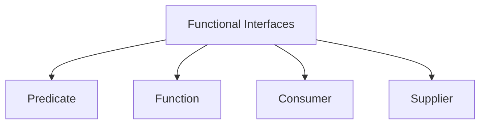
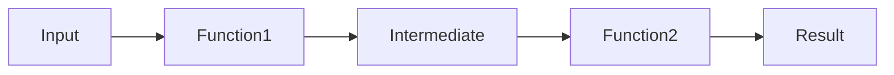
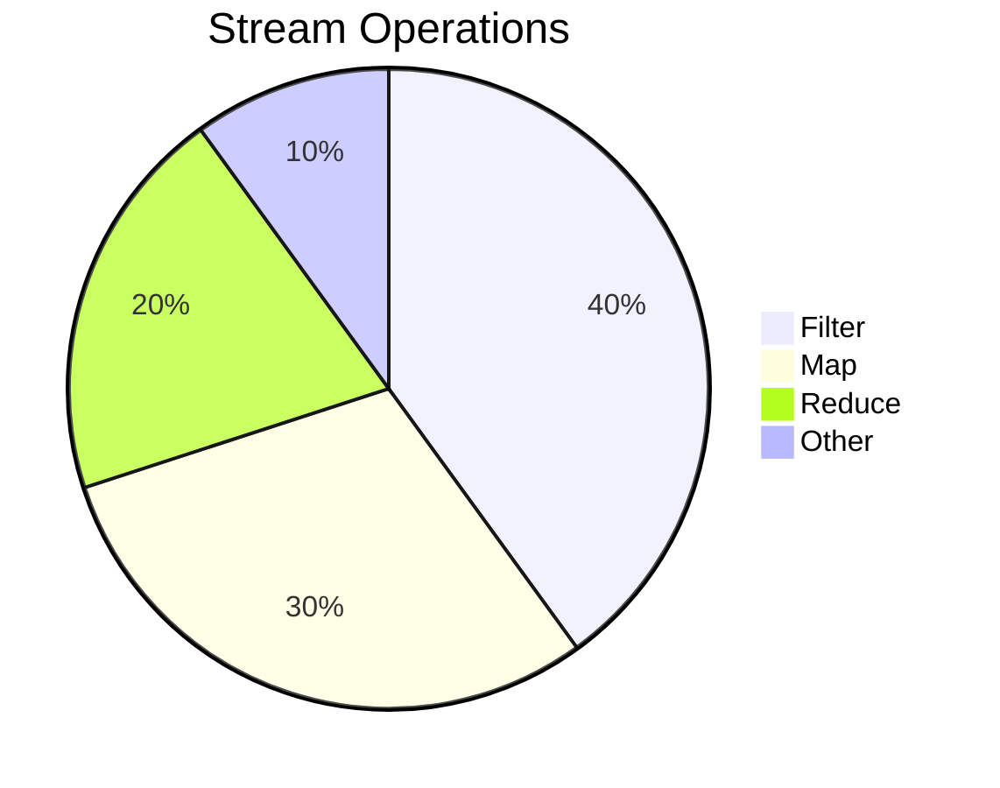

# **Functional Interfaces in Java: Predicate, Function, Consumer, and Supplier** 🚀

This comprehensive guide covers Java's core functional interfaces with practical examples, industry use cases, and interview-focused explanations.

## Table of Contents
1. [Functional Interfaces Overview](#1-functional-interfaces-overview)
2. [Predicate Deep Dive](#2-predicate-deep-dive)
3. [Function Deep Dive](#3-function-deep-dive)
4. [Consumer Deep Dive](#4-consumer-deep-dive)
5. [Supplier Deep Dive](#5-supplier-deep-dive)
6. [Industry Best Practices](#6-industry-best-practices)
7. [Performance Considerations](#7-performance-considerations)
8. [Interview Q&A](#8-interview-qa)
9. [Comparison Tables](#9-comparison-tables)
10. [Visual Diagrams](#10-visual-diagrams)

---

## 1. Functional Interfaces Overview

### 1.1 What is a Functional Interface?
```java
@FunctionalInterface
public interface MyFunctionalInterface {
    void execute(); // Single abstract method
    
    default void log() { // Can have defaults
        System.out.println("Logging");
    }
}
```

---

### **Purpose of `@FunctionalInterface`**:
The main purpose of this annotation is to ensure that the interface conforms to the rules of a functional interface. It is a compile-time check that guarantees the interface contains only one abstract method. This is essential because functional interfaces are intended to be used in contexts where **lambda expressions** or **method references** are used, such as **streams**, **parallel programming**, and **event handling**.

### **Why should we use it**:
- **Lambda Expression** support: Functional interfaces enable the use of lambda expressions in Java. By ensuring that your interface has only one abstract method, you can represent instances of the interface using lambda expressions, resulting in more concise and readable code.
- **Code clarity**: The `@FunctionalInterface` annotation makes the intent clear to other developers and tools that this interface is meant to represent a single functionality, i.e., an operation or action.
- **Compile-time safety**: Adding the `@FunctionalInterface` annotation ensures that the compiler enforces the rule that only one abstract method exists in the interface. Without this, someone might accidentally add more methods to the interface, breaking its "functional" nature.

### **When to use `@FunctionalInterface`**:
Use `@FunctionalInterface` whenever you are designing an interface that represents a **single operation**, typically where the interface is designed to work with **lambda expressions**. This is common in scenarios such as:
- **Callbacks** (e.g., event listeners or handlers)
- **Strategies** (e.g., functional patterns like predicates, comparators, or filters)
- **Stream operations** (e.g., transformation or filtering functions)

### **Why a Functional Interface Has Only One Method**:
- Functional interfaces are intended to represent a single function or behavior. In lambda expressions, you are passing a behavior, not an object with many methods. For example, you can pass a function that processes data (like a comparator or predicate), and that’s what the single method allows. This ensures clarity and enforces the functional programming paradigm in J

---

**Key Characteristics:**
- Single Abstract Method (SAM)
- Can have multiple default/static methods
- Annotation is optional but recommended


### 1.2 Java's Built-in Functional Interfaces


---

## 2. Predicate Deep Dive

### 2.1 Definition & Usage
```java
Predicate<String> isLong = s -> s.length() > 10;
boolean result = isLong.test("Hello World"); // true
```

**Common Methods:**
- `test(T t)`: Evaluates predicate
- `and()`, `or()`, `negate()`: Logical operations

### 2.2 Industry Example: Filtering Data
```java
List<Product> filtered = products.stream()
    .filter(p -> p.getPrice() > 100 && p.isInStock())
    .collect(Collectors.toList());
```

**Best Practices:**
- Keep predicates pure (no side effects)
- Compose complex predicates from simple ones
- Use method references when possible

---

## 3. Function Deep Dive

### 3.1 Definition & Usage
```java
Function<String, Integer> lengthMapper = String::length;
int len = lengthMapper.apply("Java"); // 4
```

**Common Methods:**
- `apply(T t)`: Applies function
- `andThen()`, `compose()`: Function chaining

### 3.2 Industry Example: Data Transformation
```java
List<String> names = employees.stream()
    .map(Employee::getName) // Function<Employee, String>
    .collect(Collectors.toList());
```

**Performance Tip:**  
For primitive operations, use specialized variants:
- `IntFunction`, `ToIntFunction`
- `DoubleFunction`, etc.

---

## 4. Consumer Deep Dive

### 4.1 Definition & Usage
```java
Consumer<String> printer = System.out::println;
printer.accept("Hello"); // Prints "Hello"
```

**Common Methods:**
- `accept(T t)`: Performs operation
- `andThen()`: Consumer chaining

### 4.2 Industry Example: Batch Processing
```java
transactions.forEach(tx -> {
    auditService.log(tx); // Consumer<Transaction>
    notificationService.alert(tx);
});
```

**Best Practice:**  
Avoid modifying external state in consumers when used in streams.

---

## 5. Supplier Deep Dive

### 5.1 Definition & Usage
```java
Supplier<LocalDate> dateSupplier = LocalDate::now;
LocalDate today = dateSupplier.get();
```

**Common Use Cases:**
- Lazy initialization
- Factory patterns
- Configuration providers

### 5.2 Industry Example: Caching
```java
public class Cache<T> {
    private Supplier<T> loader;
    
    public Cache(Supplier<T> loader) {
        this.loader = loader;
    }
    
    public T get() {
        return loader.get();
    }
}
```

---

## 6. Industry Best Practices

### 6.1 Do's and Don'ts
- ✅ Use method references where possible
- ✅ Compose small functions
- ❌ Avoid long lambda bodies (>3 lines)
- ❌ Don't mutate shared state

### 6.2 Functional Composition
```java
Predicate<String> isLong = s -> s.length() > 10;
Predicate<String> containsA = s -> s.contains("a");

Predicate<String> combined = isLong.and(containsA);
```

### 6.3 Exception Handling
```java
Function<String, Integer> safeParser = s -> {
    try {
        return Integer.parseInt(s);
    } catch (NumberFormatException e) {
        return 0;
    }
};
```

---

## 7. Performance Considerations

### 7.1 Lambda vs Anonymous Class
```java
// Lambda (better)
Function<String, Integer> f1 = s -> s.length();

// Anonymous class
Function<String, Integer> f2 = new Function<>() {
    public Integer apply(String s) {
        return s.length();
    }
};
```

**Key Points:**
- Lambdas are generally more efficient
- No additional class files generated
- Better JIT optimization

### 7.2 Primitive Specializations
```java
// Avoids boxing
IntFunction<String> intToString = i -> "Number: " + i;
ToIntFunction<String> stringLength = String::length;
```

---

## 8. Interview Q&A

### Q1: What makes an interface functional?
**A:** A functional interface has:
1. Exactly one abstract method (SAM)
2. Any number of default/static methods
3. Optional `@FunctionalInterface` annotation

### Q2: Difference between Predicate and Function?
**A:**
- `Predicate`: Takes input, returns boolean (`test()`)
- `Function`: Takes input, returns output (`apply()`)

### Q3: When to use Consumer vs Supplier?
**A:**
- `Consumer`: When you need to perform operations without returning (void)
- `Supplier`: When you need to provide values without inputs

### Q4: How to chain Functions?
**A:** Use `andThen()` and `compose()`:
```java
Function<Integer, String> intToStr = Object::toString;
Function<String, Integer> strToInt = Integer::parseInt;

Function<Integer, Integer> chain = intToStr.andThen(strToInt);
```

### Q5: Explain method references
**A:** Shorthand for lambdas:
```java
// Static method
Function<String, Integer> f1 = Integer::parseInt;

// Instance method
Consumer<String> f2 = System.out::println;

// Constructor 
Supplier<List<String>> f3 = ArrayList::new;
```

### Q6: Why use primitive functional interfaces?
**A:** To avoid boxing/unboxing overhead:
```java
IntPredicate isEven = i -> i % 2 == 0; // Better than Predicate<Integer>
```

### Q7: How to handle checked exceptions?
**A:** Either:
1. Wrap in unchecked exception
2. Create custom functional interface
```java
@FunctionalInterface
interface ThrowingFunction<T, R> {
    R apply(T t) throws Exception;
}
```

### Q8: What is the "effectively final" requirement?
**A:** Lambdas can only use:
- Final variables
- Effectively final (not modified after initialization)
```java
int count = 0;
list.forEach(e -> count++); // Compile error!
```

### Q9: Difference between and() and or() in Predicate?
**A:**
- `and()`: Logical AND (`p1.test() && p2.test()`)
- `or()`: Logical OR (`p1.test() || p2.test()`)

### Q10: Real-world use of Supplier?
**A:**
- Lazy initialization
- Factory pattern
- Configuration loading
```java
Supplier<Connection> connSupplier = () -> DriverManager.getConnection(url);
```

---

## 9. Comparison Tables

### Functional Interfaces Summary
| Interface | Method | Input | Output | Common Use |
|-----------|--------|-------|--------|------------|
| `Predicate<T>` | `test(T)` | T | boolean | Filtering |
| `Function<T,R>` | `apply(T)` | T | R | Transformation |
| `Consumer<T>` | `accept(T)` | T | void | Side effects |
| `Supplier<T>` | `get()` | None | T | Value generation |

### Method Reference Types
| Type | Syntax | Example |
|------|--------|---------|
| Static | `Class::method` | `Integer::parseInt` |
| Instance | `instance::method` | `System.out::println` |
| Arbitrary | `Class::method` | `String::length` |
| Constructor | `Class::new` | `ArrayList::new` |

---

## 10. Visual Diagrams

### Function Composition


### Predicate Filtering


---

## Key Takeaways
1. **Predicate**: Condition checking (`test()`)
2. **Function**: Data transformation (`apply()`)
3. **Consumer**: Side effects (`accept()`)
4. **Supplier**: Value generation (`get()`)
5. **Composition**: Build complex operations from simple ones

**Pro Tip:** Always consider:
- Readability vs conciseness
- Performance implications
- Proper exception handling
- Thread safety for shared state

---

# 🚀 **Real-World Applications of Java Functional Interfaces**

Functional interfaces are everywhere in modern Java development. Here are practical, real-world use cases across different domains:

## **1. Event Handling (GUI & Web)**
### **Swing/AWT Applications**
```java
// Traditional
button.addActionListener(new ActionListener() {
    public void actionPerformed(ActionEvent e) {
        System.out.println("Button clicked!");
    }
});

// With Lambda
button.addActionListener(e -> System.out.println("Button clicked!"));
```

### **Web Controllers (Spring)**
```java
@GetMapping("/users")
public ResponseEntity<List<User>> getUsers(
    @RequestParam(required = false) Predicate<User> filter) {
    
    List<User> users = userService.getAllUsers();
    if (filter != null) {
        users = users.stream().filter(filter).collect(Collectors.toList());
    }
    return ResponseEntity.ok(users);
}

// Client call: /users?filter=user->user.getAge()>18
```

## **2. Data Processing Pipelines**
### **ETL (Extract-Transform-Load)**
```java
Function<String, Customer> csvToCustomer = line -> {
    String[] parts = line.split(",");
    return new Customer(parts[0], parts[1], parts[2]);
};

List<Customer> customers = Files.lines(Paths.get("data.csv"))
                              .map(csvToCustomer)
                              .collect(Collectors.toList());
```

### **Data Validation**
```java
Predicate<String> isValidEmail = email -> 
    email.matches("^[A-Za-z0-9+_.-]+@(.+)$");

List<String> emails = Arrays.asList("test@example.com", "invalid");
List<String> validEmails = emails.stream()
                               .filter(isValidEmail)
                               .collect(Collectors.toList());
```

## **3. Business Rule Engines**
### **Dynamic Pricing Engine**
```java
BiFunction<Double, Customer, Double> pricingRule = (basePrice, customer) -> {
    if (customer.isPremium()) return basePrice * 0.9; // 10% discount
    if (customer.getAge() < 18) return basePrice * 0.8; // 20% youth discount
    return basePrice;
};

double finalPrice = pricingRule.apply(100.0, currentCustomer);
```

### **Fraud Detection**
```java
Predicate<Transaction> isFraudulent = transaction -> 
    transaction.getAmount() > 10_000 
    && transaction.getCountry().equals("Nigeria");

List<Transaction> suspicious = transactions.stream()
                                        .filter(isFraudulent)
                                        .collect(Collectors.toList());
```

## **4. Asynchronous Programming**
### **CompletableFuture Chaining**
```java
CompletableFuture.supplyAsync(() -> productService.getPrice(productId))
                .thenApply(price -> applyDiscount(price))
                .thenAccept(price -> notificationService.sendPriceAlert(price));
```

### **Retry Mechanism**
```java
Function<Integer, Boolean> retryOperation = attempt -> {
    try {
        return externalService.call();
    } catch (Exception e) {
        return attempt < 3; // Retry if less than 3 attempts
    }
};

// Using in a stream
IntStream.range(0, 3)
         .filter(retryOperation::apply)
         .findFirst();
```

## **5. Configuration & Customization**
### **Plugin Architecture**
```java
interface DataExporter {
    void export(Data data);
}

Map<String, DataExporter> exporters = Map.of(
    "CSV", data -> Files.write(Paths.get("out.csv"), data.toString().getBytes()),
    "JSON", data -> objectMapper.writeValue(new File("out.json"), data)
);

// Usage
exporters.get(format).export(data);
```

### **Dynamic Sorting**
```java
Map<String, Comparator<Product>> sortStrategies = Map.of(
    "price", Comparator.comparing(Product::getPrice),
    "name", Comparator.comparing(Product::getName),
    "rating", Comparator.comparing(Product::getRating).reversed()
);

List<Product> products = //...;
products.sort(sortStrategies.get(sortBy));
```

## **6. Testing & Mocking**
### **Parameterized Tests (JUnit 5)**
```java
@ParameterizedTest
@MethodSource("provideTestCases")
void testDiscountCalculation(Function<Order, Double> discountStrategy, 
                           double expected) {
    Order order = new Order(100.0);
    assertEquals(expected, discountStrategy.apply(order));
}

private static Stream<Arguments> provideTestCases() {
    return Stream.of(
        Arguments.of((Function<Order, Double>) o -> o.getAmount() * 0.1, 10.0),
        Arguments.of(o -> o.getAmount() * 0.2, 20.0)
    );
}
```

### **Mocking with Behavior Verification**
```java
@Test
void testNotificationService() {
    Consumer<String> mockNotifier = mock(Consumer.class);
    userService.setNotifier(mockNotifier);
    
    userService.register("new@user.com");
    
    verify(mockNotifier).accept("new@user.com");
}
```

## **7. Resource Management**
### **AutoCloseable Wrapper**
```java
Function<Path, List<String>> safeFileReader = path -> {
    try (Stream<String> lines = Files.lines(path)) {
        return lines.collect(Collectors.toList());
    } catch (IOException e) {
        throw new UncheckedIOException(e);
    }
};

List<String> content = safeFileReader.apply(Paths.get("data.txt"));
```

### **Database Transaction Template**
```java
@FunctionalInterface
interface TransactionCallback<T> {
    T execute(Connection conn) throws SQLException;
}

public <T> T executeInTransaction(TransactionCallback<T> callback) {
    try (Connection conn = dataSource.getConnection()) {
        conn.setAutoCommit(false);
        try {
            T result = callback.execute(conn);
            conn.commit();
            return result;
        } catch (SQLException e) {
            conn.rollback();
            throw e;
        }
    }
}

// Usage
executeInTransaction(conn -> {
    try (PreparedStatement stmt = conn.prepareStatement("...")) {
        // execute queries
    }
});
```

## **Key Takeaways**
1. **Predicates** are ideal for filtering/validation scenarios
2. **Functions** enable data transformation pipelines
3. **Consumers** handle side-effects like logging/notifications
4. **Suppliers** are perfect for lazy initialization
5. **Custom functional interfaces** create domain-specific contracts

These patterns are used extensively in:
- **Spring Framework** (WebMVC, Spring Data)
- **Java Streams API**
- **Reactive Programming** (Project Reactor)
- **Testing Libraries** (JUnit, Mockito)
- **Cloud-Native Applications** (AWS Lambda, Azure Functions)

Would you like me to dive deeper into any specific application area?
