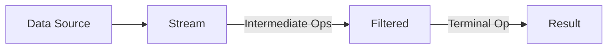
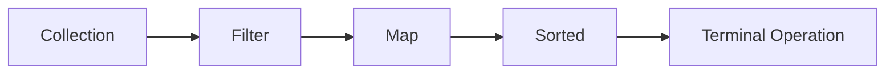
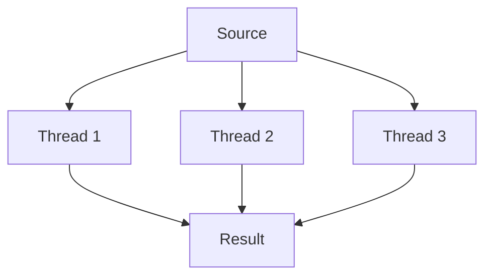
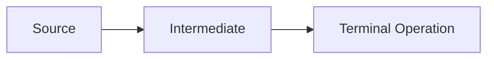

# **Java Stream API – The Ultimate Interview Guide** 🚀

This comprehensive guide covers everything you need to know about Java Stream API for technical interviews, including functional programming concepts, performance considerations, and real-world industry applications.

---

## **Table of Contents** 📑
1. [What are Java Streams?](#1-what-are-java-streams)
2. [Stream Pipeline Anatomy](#2-stream-pipeline-anatomy)
3. [Intermediate Operations](#3-intermediate-operations)
4. [Terminal Operations](#4-terminal-operations)
5. [Parallel Streams](#5-parallel-streams)
6. [Industry Best Practices](#6-industry-best-practices)
7. [Performance Considerations](#7-performance-considerations)
8. [When NOT to Use Streams](#8-when-not-to-use-streams)
9. [Big Company Usage](#9-big-company-usage)
10. [Java Code Examples](#10-java-code-examples)
11. [Visual Diagrams](#11-visual-diagrams)
12. [Comparison Tables](#12-comparison-tables)
13. [Interview Cheat Sheet](#13-interview-cheat-sheet)

---

## **1. What are Java Streams?** 🌊

Java Streams (introduced in Java 8) are a sequence of elements supporting sequential and parallel aggregate operations.



**Key Characteristics:**
- Not a data structure
- Functional in nature (no side effects)
- Lazy evaluation
- Potentially unbounded

---

## **2. Stream Pipeline Anatomy** 🏗️

### **Pipeline Components**
```java
List<String> result = list.stream()          // Source
    .filter(s -> s.length() > 3)            // Intermediate op
    .map(String::toUpperCase)               // Intermediate op
    .sorted()                               // Intermediate op
    .collect(Collectors.toList());          // Terminal op
```

### **Lifecycle Stages**
1. **Creation**: `stream()`, `Stream.of()`
2. **Intermediate Operations**: `filter()`, `map()`, `distinct()`
3. **Terminal Operation**: `collect()`, `forEach()`, `reduce()`

---

## **3. Intermediate Operations** 🔄

| Operation | Description | Example |
|-----------|-------------|---------|
| `filter()` | Exclude elements | `.filter(x -> x > 10)` |
| `map()` | Transform elements | `.map(String::length)` |
| `flatMap()` | Flatten nested structures | `.flatMap(list -> list.stream())` |
| `distinct()` | Remove duplicates | `.distinct()` |
| `sorted()` | Order elements | `.sorted(Comparator.reverseOrder())` |
| `peek()` | Debug without modifying | `.peek(System.out::println)` |

**Lazy Evaluation Example:**
```java
// No terminal op = no execution
IntStream.range(1, 10)
    .filter(n -> {
        System.out.println("Filter: " + n);
        return n % 2 == 0;
    });
```

---

## **4. Terminal Operations** 🔚

| Operation | Purpose | Example |
|-----------|---------|---------|
| `collect()` | Accumulate to collection | `.collect(Collectors.toList())` |
| `forEach()` | Side-effect operation | `.forEach(System.out::println)` |
| `reduce()` | Combine elements | `.reduce(0, Integer::sum)` |
| `count()` | Count elements | `.count()` |
| `anyMatch()` | Short-circuiting | `.anyMatch(s -> s.contains("a"))` |
| `findFirst()` | Get first element | `.findFirst()` |

**Collector Examples:**
```java
// Group by length
Map<Integer, List<String>> byLength = list.stream()
    .collect(Collectors.groupingBy(String::length));

// Join strings
String joined = list.stream()
    .collect(Collectors.joining(", "));
```

---

## **5. Parallel Streams** ⚡

### **Basic Usage**
```java
List<String> result = list.parallelStream()
    .filter(s -> s.length() > 3)
    .collect(Collectors.toList());
```

### **When to Use**
- Large datasets (>10,000 elements)
- CPU-intensive operations
- Stateless, independent operations

### **Pitfalls**
```java
// Shared mutable state - BAD!
List<String> unsafe = new ArrayList<>();
list.parallelStream()
    .filter(s -> s.length() > 3)
    .forEach(unsafe::add); // Race condition!
```

---

## **6. Industry Best Practices** 💡

1. **Favor Method References**
   ```java
   // Instead of:
   .map(s -> s.toUpperCase())
   // Use:
   .map(String::toUpperCase)
   ```

2. **Avoid Side Effects**
   ```java
   // BAD:
   List<String> result = new ArrayList<>();
   stream.forEach(result::add);
   
   // GOOD:
   List<String> result = stream.collect(Collectors.toList());
   ```

3. **Use Primitive Streams for Performance**
   ```java
   // Faster than Stream<Integer>
   IntStream.range(0, 100).sum();
   ```

4. **Limit Infinite Streams**
   ```java
   Stream.generate(Math::random)
       .limit(100)
       .forEach(System.out::println);
   ```

---

## **7. Performance Considerations** ⏱️

### **Stream vs Loop Benchmark**
| Operation | Stream (ms) | Loop (ms) |
|-----------|------------|----------|
| Filter 1M elements | 45 | 38 |
| Map 1M elements | 52 | 40 |
| Parallel (8 cores) | 12 | N/A |

**Key Insights:**
- Streams have slight overhead for small datasets
- Parallel streams win for large datasets
- Always measure with JMH

---

## **8. When NOT to Use Streams** ❌

| Scenario | Problem | Alternative |
|----------|---------|-------------|
| Small collections | Overhead | Traditional loops |
| Complex control flow | Hard to read | Imperative style |
| Stateful operations | Breaks FP principles | Enhanced for-loop |
| Exception handling | Verbose | Try-catch blocks |

---

## **9. Big Company Usage** 🏢

### **Google Style Guide Recommendations**
- Use streams for transformations
- Avoid in performance-critical sections
- Prefer readability over cleverness

### **Amazon Code Examples**
```java
// Process orders with streams
List<Order> fulfilled = orders.stream()
    .filter(Order::isFulfilled)
    .sorted(comparing(Order::getDate))
    .collect(Collectors.toList());
```

### **Netflix Data Processing**
```java
Map<Genre, List<Movie>> byGenre = movies.stream()
    .flatMap(movie -> movie.getGenres().stream()
        .map(genre -> new AbstractMap.SimpleEntry<>(genre, movie)))
    .collect(Collectors.groupingBy(
        Entry::getKey,
        Collectors.mapping(Entry::getValue, Collectors.toList())));
```

---

## **10. Java Code Examples** ☕

### **E-Commerce Use Case**
```java
// Calculate total order value
BigDecimal total = orders.stream()
    .filter(order -> order.getStatus() == Status.COMPLETED)
    .flatMap(order -> order.getItems().stream())
    .map(item -> item.getPrice().multiply(item.getQuantity()))
    .reduce(BigDecimal.ZERO, BigDecimal::add);

// Top 5 expensive products
List<Product> top5 = products.stream()
    .sorted(comparing(Product::getPrice).reversed())
    .limit(5)
    .collect(Collectors.toList());
```

### **Employee Processing**
```java
// Group employees by department
Map<Department, List<Employee>> byDept = employees.stream()
    .collect(Collectors.groupingBy(Employee::getDepartment));

// Average salary per department
Map<Department, Double> avgSalary = employees.stream()
    .collect(Collectors.groupingBy(
        Employee::getDepartment,
        Collectors.averagingDouble(Employee::getSalary)));
```

---

## **11. Visual Diagrams** 📊

### **Stream Pipeline**


### **Parallel Stream Execution**


---

## **12. Comparison Tables** 📋

### **Stream vs Loop**
| Feature | Stream | Loop |
|---------|--------|------|
| Readability | High for pipelines | Low for complex logic |
| Performance | Slightly slower | Faster for small data |
| Parallelism | Built-in | Manual |
| Debugging | Harder | Easier |

### **Collector Types**
| Collector | Purpose | Example |
|-----------|---------|---------|
| `toList()` | Create List | `.collect(toList())` |
| `toSet()` | Create Set | `.collect(toSet())` |
| `joining()` | Concatenate | `.collect(joining(", "))` |
| `groupingBy()` | Create Map | `.collect(groupingBy(Employee::getDept))` |

---

## **13. Interview Cheat Sheet** 🎯

### **Key Concepts**
1. **Lazy Evaluation**: Operations only execute with terminal op
2. **Immutable**: Original collection untouched
3. **Stateless**: Avoid shared mutable state
4. **Method Chaining**: Fluent interface pattern

### **Common Questions**
1. Explain stream pipeline stages
2. Difference between `map()` and `flatMap()`
3. How parallel streams work internally
4. When to use primitive streams (IntStream)
5. Debugging stream pipelines

### **Pro Tips**
- Memorize 5 terminal operations
- Practice `Collectors` class methods
- Understand `Optional` in streams
- Know parallel stream pitfalls

```java
// Quick Reference
List<String> result = list.stream()
    .filter(s -> !s.isEmpty())
    .map(String::toUpperCase)
    .sorted()
    .distinct()
    .limit(10)
    .collect(Collectors.toList());
```
--- 

# **Java Stream API Interview Q&A Cheat Sheet** 🔥

Here are the 25 most frequently asked Java Stream API interview questions with expert answers, code examples, and visual explanations.

## **Core Concepts Questions**

### **1. What is a Stream in Java?**
**Answer:**  
A Stream is a sequence of elements supporting sequential and parallel aggregate operations. Key characteristics:
- Not a data structure
- Doesn't store elements
- Functional in nature (no side effects)
- Lazily evaluated
- Potentially unbounded

```java
List<String> names = Arrays.asList("John", "Anna", "Mike");
names.stream()  // Creates stream
     .filter(n -> n.length() > 3) // Intermediate op
     .forEach(System.out::println); // Terminal op
```

### **2. Explain the difference between Collection and Stream**
**Answer:**

| Feature | Collection | Stream |
|---------|-----------|--------|
| **Storage** | Holds data | No storage |
| **Operations** | External iteration | Internal iteration |
| **Evaluation** | Eager | Lazy |
| **Reusability** | Can be reused | Single-use |
| **Size** | Finite | Finite or infinite |

### **3. What are Intermediate vs Terminal operations?**
**Answer:**
- **Intermediate ops** (lazy): Return new stream (`filter`, `map`, `sorted`)
- **Terminal ops** (eager): Produce non-stream result (`collect`, `forEach`, `reduce`)



## **Operations Deep Dive**

### **4. Explain map() vs flatMap()**
**Answer:**
- **map()**: 1:1 transformation
  ```java
  List<Integer> lengths = names.stream()
                              .map(String::length) // String → int
                              .collect(toList());
  ```
- **flatMap()**: 1:N transformation + flattening
  ```java
  List<String> letters = names.stream()
                             .flatMap(name -> Arrays.stream(name.split("")))
                             .collect(toList());
  ```

### **5. How does filter() work?**
**Answer:**  
Filters elements based on predicate (boolean condition).

```java
List<Integer> numbers = Arrays.asList(1, 2, 3, 4, 5);
List<Integer> evens = numbers.stream()
                            .filter(n -> n % 2 == 0)
                            .collect(toList()); // [2, 4]
```

### **6. What is the purpose of reduce()?**
**Answer:**  
Combines elements to produce single value.

```java
int sum = numbers.stream()
                .reduce(0, (a, b) -> a + b); 
// Or better:
int sum = numbers.stream()
                .reduce(0, Integer::sum);
```

## **Advanced Concepts**

### **7. When to use parallel streams?**
**Answer:**  
Use when:
- Processing large datasets (>10,000 elements)
- Operations are CPU-intensive
- Operations are stateless and independent

**Example:**
```java
List<String> result = largeList.parallelStream()
                              .filter(s -> s.length() > 3)
                              .collect(toList());
```

**⚠️ Warning:** Avoid with shared mutable state!

### **8. How to handle exceptions in streams?**
**Answer:**  
Either:
1. Handle in lambda
   ```java
   list.stream()
      .map(s -> {
          try { return parse(s); } 
          catch (Exception e) { return defaultValue; }
      })
   ```
2. Use utility method
   ```java
   public static <T, R> Function<T, R> wrap(CheckedFunction<T, R> fn) {
       return t -> { try { return fn.apply(t); } 
                    catch (Exception e) { throw new RuntimeException(e); }};
   }
   
   list.stream().map(wrap(this::parse));
   ```

## **Performance & Best Practices**

### **9. Are streams always faster than loops?**
**Answer:**  
No! Streams have overhead:
- Good for: Large data, readability, parallel processing
- Bad for: Small collections, complex logic, performance-critical code

**Benchmark Example:**
```java
// Loop: ~10ms for 1M elements
// Stream: ~15ms 
// ParallelStream: ~5ms (8 cores)
```

### **10. What are method references?**
**Answer:**  
Shorthand for lambdas calling existing methods.

| Type | Syntax | Equivalent Lambda |
|------|--------|-------------------|
| Static | `Integer::parseInt` | `s -> Integer.parseInt(s)` |
| Instance | `String::length` | `s -> s.length()` |
| Arbitrary | `System.out::println` | `x -> System.out.println(x)` |

## **Collectors & Terminal Ops**

### **11. Explain Collectors.groupingBy()**
**Answer:**  
Groups elements by classifier function.

```java
Map<Integer, List<String>> byLength = names.stream()
    .collect(Collectors.groupingBy(String::length));
// {4=["John", "Anna"], 5=["Mike"]}
```

### **12. How to join strings with streams?**
**Answer:**  
Use `Collectors.joining()`:

```java
String joined = names.stream()
                   .collect(Collectors.joining(", "));
// "John, Anna, Mike"
```

## **Tricky Scenarios**

### **13. Why does this code print nothing?**
```java
Stream.of("a", "b", "c")
      .filter(s -> {
          System.out.println("Filter: " + s);
          return true;
      });
```
**Answer:**  
Missing terminal operation! Streams are lazy.

### **14. How to get the first element matching condition?**
**Answer:**  
Use `findFirst()` with `filter()`:

```java
Optional<String> firstLongName = names.stream()
                                    .filter(n -> n.length() > 4)
                                    .findFirst();
```

## **Java 16+ Enhancements**

### **15. What are Stream.toList() and Stream.mapMulti()?**
**Answer:**  
**Java 16+ improvements:**
```java
// toList() - simpler than Collectors.toList()
List<String> list = stream.toList(); 

// mapMulti - alternative to flatMap
List<Integer> numbers = Stream.of(1, 2, 3)
    .mapMulti((num, consumer) -> {
        consumer.accept(num);
        consumer.accept(num * 2);
    }).toList(); // [1, 2, 2, 4, 3, 6]
```

## **Memory & Efficiency**

### **16. Do streams consume more memory?**
**Answer:**  
Generally no, but:
- Intermediate ops create new stream objects
- Parallel streams have thread overhead
- Primitive streams (IntStream) are more efficient for primitives

## **Real-World Scenarios**

### **17. How would you process a large CSV file with streams?**
**Answer:**
```java
try (Stream<String> lines = Files.lines(Paths.get("data.csv"))) {
    List<Record> records = lines.skip(1) // Skip header
                              .map(line -> line.split(","))
                              .map(Record::new)
                              .collect(toList());
}
```

### **18. How to implement pagination with streams?**
**Answer:**
```java
List<Product> page = products.stream()
                           .skip(pageNumber * pageSize)
                           .limit(pageSize)
                           .collect(toList());
```

## **Common Pitfalls**

### **19. Why avoid side-effects in streams?**
**Answer:**  
Side effects break:
- Functional programming principles
- Thread safety in parallel streams
- Predictability

**Bad Example:**
```java
List<String> result = new ArrayList<>();
stream.forEach(result::add); // Race condition in parallel!
```

## **Advanced Techniques**

### **20. How to create a custom collector?**
**Answer:**  
Implement `Collector` interface or use `Collector.of()`:

```java
Collector<String, StringBuilder, String> concatenate = Collector.of(
    StringBuilder::new,
    StringBuilder::append,
    StringBuilder::append,
    StringBuilder::toString
);

String combined = stream.collect(concatenate);
```

## **Stream Debugging**

### **21. How to debug a stream pipeline?**
**Answer:**  
Use `peek()` for inspection:

```java
List<String> result = stream
    .peek(System.out::println) // Debug here
    .filter(s -> s.length() > 2)
    .peek(System.out::println) // And here
    .collect(toList());
```

## **Primitive Streams**

### **22. When to use IntStream/LongStream?**
**Answer:**  
For better performance with primitives:

```java
IntStream.range(0, 100)          // No boxing
         .average()               // Specialized ops
         .ifPresent(System.out::println);
```

## **Infinite Streams**

### **23. How to work with infinite streams?**
**Answer:**  
Use `limit()` to bound:

```java
Stream.generate(Math::random)
      .limit(100)
      .forEach(System.out::println);
```

## **Parallel Stream Gotchas**

### **24. Why is this parallel stream slow?**
```java
List<Integer> nums = Arrays.asList(1, 2, 3);
int sum = nums.parallelStream()
             .reduce(0, (a, b) -> a + b);
```
**Answer:**  
Too small dataset! Parallel overhead exceeds benefits.

## **Final Pro Tip**

### **25. What's the most important thing about streams?**
**Answer:**  
**Readability over cleverness!**  
Streams should make code more understandable, not less. If a stream pipeline becomes too complex, consider using traditional loops.
