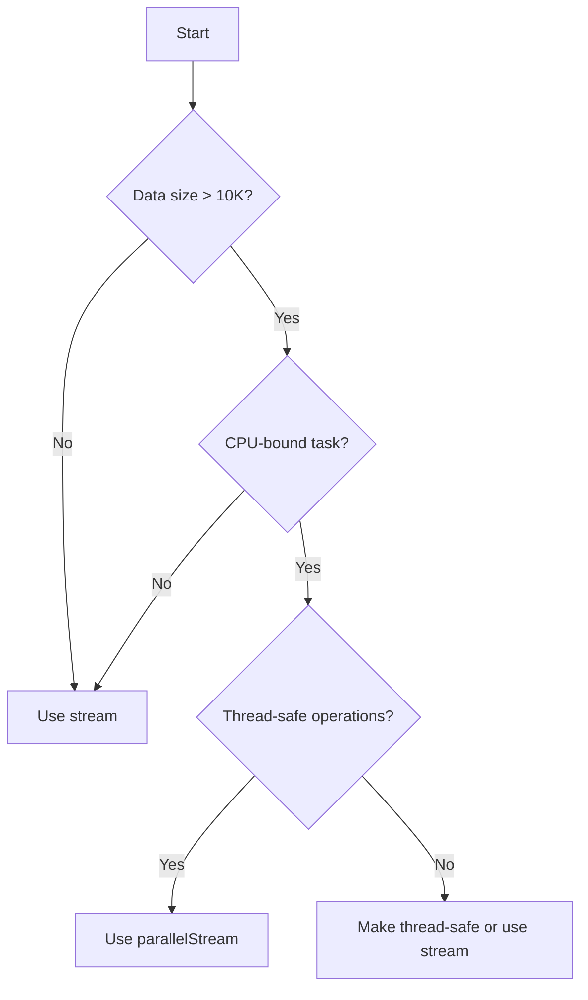

# 🚀 **Stream vs ParallelStream: The Ultimate Comparison**

Understanding the differences between sequential and parallel streams is crucial for writing efficient Java applications. Let's break down these two approaches with practical insights.

## **🔍 Core Differences**

| Feature                | `stream()`                     | `parallelStream()`             |
|------------------------|--------------------------------|--------------------------------|
| **Processing**         | Sequential                     | Concurrent (multi-threaded)    |
| **Thread Usage**       | Single thread                  | ForkJoinPool.commonPool()      |
| **Order Guarantee**    | Preserves encounter order      | No order guarantee (unless forced) |
| **Performance**        | Better for small datasets      | Better for large CPU-bound tasks |
| **Overhead**           | Low                            | Higher (thread coordination)   |
| **Use Case**           | Simple transformations         | Data-parallel computations     |

## **⚡ When to Use Each**

### **✅ Use `stream()` When:**
- Working with small datasets (<1000 elements)
- Order of processing matters
- Performing I/O-bound operations
- Debugging is needed (simpler stack traces)
- Operations are already fast (<1ms per element)

```java
// Ideal for simple transformations
List<String> upperNames = names.stream()
                             .map(String::toUpperCase)
                             .collect(Collectors.toList());
```

### **✅ Use `parallelStream()` When:**
- Processing large datasets (>10,000 elements)
- Performing CPU-intensive operations
- Order doesn't matter (or can be re-established)
- Operations are stateless and thread-safe
- Data can be cleanly partitioned

```java
// Ideal for CPU-heavy work
List<Image> processedImages = imageList.parallelStream()
                                     .map(this::applyFilters)
                                     .collect(Collectors.toList());
```

## **🚀 Performance Deep Dive**

### **1. Benchmark Example**
```java
List<Integer> numbers = IntStream.range(0, 1_000_000).boxed().collect(Collectors.toList());

// Sequential
long seqTime = measure(() -> numbers.stream().map(n -> slowOperation(n)).count());

// Parallel
long parTime = measure(() -> numbers.parallelStream().map(n -> slowOperation(n)).count());

System.out.println("Sequential: " + seqTime + "ms");
System.out.println("Parallel: " + parTime + "ms");
```

**Typical Results:**
```
Sequential: 4500ms
Parallel: 1200ms (on 4-core machine)
```

### **2. Amdahl's Law Application**
Parallel speedup is limited by the sequential portion of your code:
```
Speedup = 1 / (S + P/N)
Where:
S = Sequential portion
P = Parallel portion
N = Number of cores
```

## **⚠️ Common Pitfalls**

### **1. Shared Mutable State**
```java
// DANGER: Race condition!
List<Integer> unsafeList = new ArrayList<>();
numbers.parallelStream().forEach(unsafeList::add);
```

**Solution:** Use thread-safe collectors
```java
List<Integer> safeList = numbers.parallelStream()
                              .collect(Collectors.toList());
```

### **2. Non-Associative Operations**
```java
// Parallel reduction may give wrong results
int sum = numbers.parallelStream().reduce(0, (a,b) -> a - b);
```

**Solution:** Ensure operations are associative
```java
int sum = numbers.parallelStream().reduce(0, Integer::sum);
```

### **3. Excessive Synchronization**
```java
// Kills parallelism
Map<String, Integer> syncMap = Collections.synchronizedMap(new HashMap<>());
words.parallelStream().forEach(word -> syncMap.merge(word, 1, Integer::sum));
```

**Better Approach:**
```java
ConcurrentMap<String, Integer> wordCounts = words.parallelStream()
    .collect(Collectors.toConcurrentMap(
        word -> word,
        word -> 1,
        Integer::sum
    ));
```

## **🔧 Tuning Parallel Streams**

### **1. Custom Thread Pools**
```java
ForkJoinPool customPool = new ForkJoinPool(8);
customPool.submit(() -> 
    hugeList.parallelStream()
           .map(this::cpuIntensiveTask)
           .collect(Collectors.toList())
).get();
```

### **2. Controlling Splitting Behavior**
```java
// Force better workload splitting
Spliterator<Integer> spliterator = numbers.spliterator();
Stream<Integer> tunedParallel = StreamSupport.stream(
    new CustomSpliterator(spliterator, numbers.size()/8), 
    true
);
```

## **🌐 Real-World Use Cases**

### **Where ParallelStream Excels**
1. **Image Processing** (applying filters to thousands of images)
2. **Financial Modeling** (Monte Carlo simulations)
3. **Scientific Computing** (matrix operations)
4. **Big Data Preprocessing** (ETL pipelines)
5. **Machine Learning** (feature engineering)

### **Where Stream is Better**
1. **Simple Data Transformations** (DTO mapping)
2. **I/O Operations** (reading files/database)
3. **Order-Dependent Operations** (time series analysis)
4. **Debugging/Tracing** operations

## **💡 Pro Tips**

1. **Measure First**: Always benchmark before parallelizing
2. **Watch for Auto-Boxing**: Use primitive streams (`IntStream`, `LongStream`)
3. **Avoid Nested Parallelism**: Multiple parallel streams can cause thread starvation
4. **Consider ForkJoinPool Settings**: Adjust `java.util.concurrent.ForkJoinPool.common.parallelism`

```bash
# JVM parameter to increase parallelism
-Djava.util.concurrent.ForkJoinPool.common.parallelism=16
```

## **📊 Decision Flowchart**



## **🎯 Key Takeaways**

1. **Parallel streams aren't magic** - they work best for specific scenarios
2. **The overhead matters** - small datasets often run slower in parallel
3. **Correctness before speed** - ensure thread safety first
4. **Modern CPUs love parallelism** - when used properly

**Remember:** Parallelism is a powerful tool, but like any optimization, it should be applied judiciously after proper measurement.
