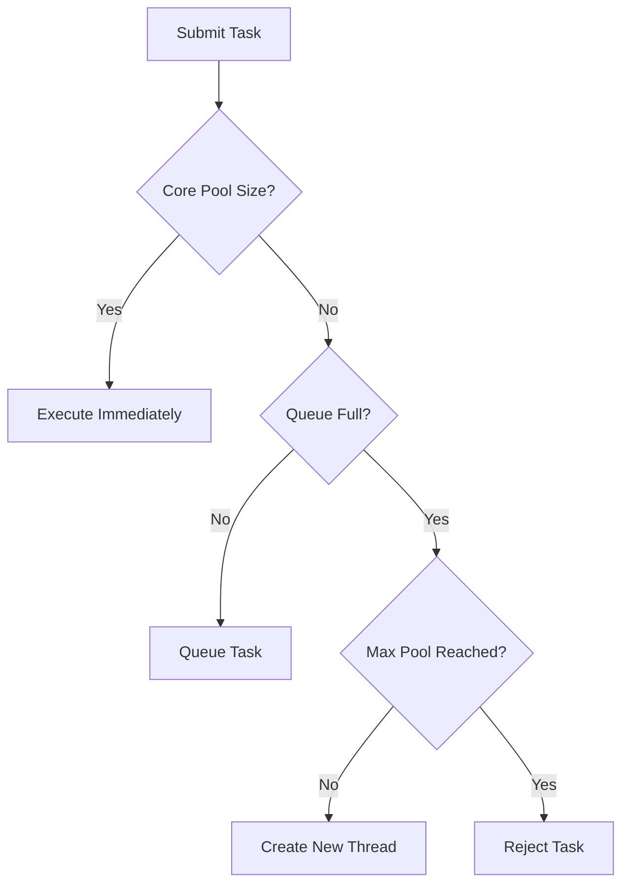

# 🚀 **The Ultimate Guide to ThreadPoolExecutor in Java: Interview Mastery & Beyond**

Welcome to this **comprehensive deep-dive** into Java's `ThreadPoolExecutor` – the powerhouse behind **efficient thread management** in concurrent applications. This guide is designed to help you **ace interviews** and **build high-performance systems** with **real-world examples**, **best practices**, and **industry insights**.

---

## **📌 Table of Contents**
1. [**What is ThreadPoolExecutor?**](#-what-is-threadpoolexecutor)
2. [**Why Use ThreadPoolExecutor?**](#-why-use-threadpoolexecutor)
3. [**Core Components & Architecture**](#-core-components--architecture)
4. [**ThreadPoolExecutor Parameters Explained**](#-threadpoolexecutor-parameters-explained)
5. [**Types of Queues in ThreadPoolExecutor**](#-types-of-queues-in-threadpoolexecutor)
6. [**Rejection Policies**](#-rejection-policies)
7. [**ThreadPoolExecutor vs. Executors Factory Methods**](#-threadpoolexecutor-vs-executors-factory-methods)
8. [**Best Practices**](#-best-practices)
9. [**Industry Use Cases**](#-industry-use-cases)
10. [**Interview Q&A**](#-interview-qa)
11. [**Conclusion**](#-conclusion)

---

## **🔍 What is ThreadPoolExecutor?**

`ThreadPoolExecutor` is a **flexible, customizable thread pool implementation** in Java that provides **fine-grained control** over:  
✔ **Thread lifecycle** (creation, reuse, termination)  
✔ **Task queueing** (bounded/unbounded queues)  
✔ **Resource management** (max threads, keep-alive time)  
✔ **Rejection handling** (when pool is overloaded)

🔹 **Analogy**: Imagine a **call center** (thread pool) with:
- **Agents** (threads)
- **Call queue** (task queue)
- **Manager** (rejection policy)

---

## **🎯 Why Use ThreadPoolExecutor?**

### **✅ Advantages**
✔ **Performance**: Reuses threads (avoids `new Thread()` overhead).  
✔ **Scalability**: Handles **thousands of tasks** efficiently.  
✔ **Control**: Customize **pool size, queue type, and rejection policies**.  
✔ **Resource Management**: Prevents **OOM errors** with bounded queues.

### **❌ Disadvantages**
✔ **Complex Configuration**: Requires tuning (vs. simple `Executors.newFixedThreadPool()`).  
✔ **Debugging Challenges**: Harder to trace than single-threaded apps.

🔹 **When NOT to Use?**
- For **trivial tasks** (use `CompletableFuture` instead).
- When **simplicity** is prioritized (use `Executors` factory methods).

---

## **⚙️ Core Components & Architecture**

### **1. ThreadPoolExecutor Workflow**


### **2. Key Parameters**
| Parameter              | Description                                                                 |
|------------------------|-----------------------------------------------------------------------------|
| **corePoolSize**       | Minimum threads kept alive (even if idle).                                  |
| **maximumPoolSize**    | Maximum threads allowed.                                                    |
| **keepAliveTime**      | Time idle threads (beyond corePoolSize) stay alive before termination.      |
| **workQueue**          | Holds tasks before execution (e.g., `LinkedBlockingQueue`).                 |
| **threadFactory**      | Customizes thread creation (naming, daemon status, etc.).                   |
| **rejectedExecutionHandler** | Handles tasks when pool is saturated (e.g., `AbortPolicy`).          |

---

## **📊 ThreadPoolExecutor Parameters Explained**

### **1. corePoolSize vs. maximumPoolSize**
- **corePoolSize**: Threads always kept alive (e.g., `10`).
- **maximumPoolSize**: Max threads during peak load (e.g., `50`).

🔹 **Example (Custom ThreadPoolExecutor):**
```java
ThreadPoolExecutor executor = new ThreadPoolExecutor(
    5,                      // corePoolSize
    20,                     // maximumPoolSize
    60,                     // keepAliveTime (seconds)
    TimeUnit.SECONDS,
    new LinkedBlockingQueue<>(100),  // Task queue (capacity: 100)
    Executors.defaultThreadFactory(),
    new ThreadPoolExecutor.AbortPolicy()  // Reject policy
);
```

### **2. keepAliveTime**
- **Idle threads** beyond `corePoolSize` are terminated after this period.
- **Set to 0**: Immediate termination (aggressive cleanup).

---

## **🛒 Types of Queues in ThreadPoolExecutor**

| Queue Type                  | Behavior                                      | Use Case                     |
|-----------------------------|-----------------------------------------------|------------------------------|
| **LinkedBlockingQueue**     | Unbounded (or bounded) FIFO queue.            | Stable workloads (no rejects).|
| **ArrayBlockingQueue**      | Bounded FIFO queue.                           | Prevents OOM (fixed capacity).|
| **SynchronousQueue**        | Direct handoff (no queueing).                 | High-throughput, short tasks. |
| **PriorityBlockingQueue**   | Tasks executed by priority (not FIFO).        | Priority-based scheduling.    |

🔹 **Example (SynchronousQueue):**
```java
// Creates new threads if all core threads are busy (no queueing).
new ThreadPoolExecutor(
    5, 10, 60, TimeUnit.SECONDS,
    new SynchronousQueue<>()
);
```

---

## **🚫 Rejection Policies**

| Policy                   | Behavior                                      | When to Use?                |
|--------------------------|-----------------------------------------------|-----------------------------|
| **AbortPolicy**          | Throws `RejectedExecutionException`.          | Default (fail fast).        |
| **CallerRunsPolicy**     | Executes task in submitter’s thread.          | Backpressure mechanism.     |
| **DiscardPolicy**        | Silently drops the task.                      | Best-effort tasks.          |
| **DiscardOldestPolicy**  | Drops oldest queued task, retries new one.    | Fresh tasks > stale tasks.  |

🔹 **Example (Custom Rejection Policy):**
```java
executor.setRejectedExecutionHandler((task, executor) -> {
    log.warn("Task rejected! Retrying in 5 seconds...");
    try {
        Thread.sleep(5000);
        executor.submit(task);  // Retry
    } catch (InterruptedException e) {
        Thread.currentThread().interrupt();
    }
});
```

---

## **🔀 ThreadPoolExecutor vs. Executors Factory Methods**

| Factory Method           | Underlying Implementation                    | Limitations                  |
|--------------------------|---------------------------------------------|------------------------------|
| `newFixedThreadPool(n)`  | `ThreadPoolExecutor` with fixed `n` threads. | Unbounded queue (OOM risk).  |
| `newCachedThreadPool()`  | `ThreadPoolExecutor` with `SynchronousQueue`. | Unlimited threads (OOM risk).|
| `newSingleThreadExecutor()` | `ThreadPoolExecutor` with 1 thread.       | Unbounded queue.             |

🔹 **Best Practice**:  
✅ **Prefer `ThreadPoolExecutor`** for production (explicit control).  
✅ **Use `Executors`** for prototyping/quick tasks.

---

## **🏆 Best Practices**

✅ **Tune `corePoolSize`** based on CPU cores (`Runtime.getRuntime().availableProcessors()`).  
✅ **Use bounded queues** to prevent OOM (e.g., `new ArrayBlockingQueue<>(1000)`).  
✅ **Monitor thread pools** (JMX, Micrometer metrics).  
✅ **Graceful shutdown**:
```java
executor.shutdown();
if (!executor.awaitTermination(60, TimeUnit.SECONDS)) {
    executor.shutdownNow();
}
```
✅ **Name threads** for debugging:
```java
ThreadFactory namedThreadFactory = new ThreadFactoryBuilder()
    .setNameFormat("worker-%d")
    .build();
```

---

## **🏢 Industry Use Cases**

| Company       | Use Case                          | Implementation              |
|---------------|-----------------------------------|-----------------------------|
| **Netflix**   | API request processing            | Custom `ThreadPoolExecutor` with `PriorityBlockingQueue`. |
| **Uber**      | Real-time ride matching           | Bounded queues + `CallerRunsPolicy`. |
| **Airbnb**    | Concurrent search indexing        | `ForkJoinPool` for parallelism. |

---

## **💡 Interview Q&A**

### **Q1: What happens when both queue and maxPoolSize are full?**
✅ The **rejection policy** (e.g., `AbortPolicy`) kicks in.

### **Q2: How to choose between `LinkedBlockingQueue` and `SynchronousQueue`?**
✅ **`LinkedBlockingQueue`**: For steady workloads (tasks can wait).  
✅ **`SynchronousQueue`**: For high-throughput, short-lived tasks.

### **Q3: Why avoid `Executors.newCachedThreadPool()` in production?**
✅ It creates **unlimited threads**, risking OOM errors under load.

### **Q4: How to handle thread pool tuning for CPU-bound vs. I/O-bound tasks?**
✅ **CPU-bound**: Set `corePoolSize = CPU cores`.  
✅ **I/O-bound**: Set `corePoolSize` higher (e.g., `2 * CPU cores`).

---

## **🎯 Conclusion**

Mastering `ThreadPoolExecutor` is **critical** for building **scalable, resilient Java applications**.

**🚀 Key Takeaways:**  
✔ **Customize pool size, queue, and rejection policies** for your workload.  
✔ **Always use bounded queues** in production.  
✔ **Monitor and tune** thread pools dynamically.  
✔ **Prefer `ThreadPoolExecutor`** over `Executors` for fine-grained control.

**Now go crush those concurrency interview questions!** 💪

---

**📢 Liked this guide?**  
👉 **Share** with fellow developers!  
👉 **Comment** your thread pool experiences!  
👉 **Follow** for more Java deep-dives! 🚀

#Java #Concurrency #ThreadPoolExecutor #InterviewPrep #TechBlog
